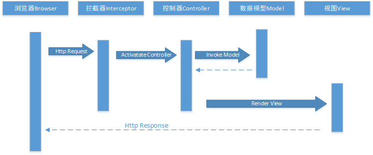

<!-- TOC -->

- [Filter筛选器的执行](#filter筛选器的执行)
    - [AuthorizeAttribute](#authorizeattribute)
        - [接口含义](#接口含义)
        - [简单验证是否登录](#简单验证是否登录)
    - [ActionFilterAttribute](#actionfilterattribute)
        - [接口含义](#接口含义-1)
        - [简单权限设计与实现](#简单权限设计与实现)

<!-- /TOC -->
<a id="markdown-filter筛选器的执行" name="filter筛选器的执行"></a>
# Filter筛选器的执行

ASP.NET-MVC的筛选器是一种基于AOP(面向方面编程)的设计，我们将一些非业务的逻辑实现在相应的筛选器，并以一种横切( Crosscutting)的方式应用到对应的 Action 方法上。



在Action方法执行前后，这些筛选器会自动执行。 ASP.NETMVC 提供了 AuthorizationFilter、ActionFilter、ResultFilter和ExceptionFilter这四种筛选器，它们对应着四个接口IAuthorizationFilter、IActionFilter、IResultFilter 和 IExceptionFilter。

经常应用在用户权限验证、系统日志、异常处理、缓存等功能上。

| Filter类型 | 接口 | MVC默认实现 | Description |
|---|---|---|---|
|Authorize|IAuthorizationFilter|AuthorizeAttribute|最先执行，在其他类型的filter和action方法前执行|
|ActionFilter|IActionFilter|ActionFilterAttribute|在action方法执行前和执行后执行|
|Result|IResultFilter|ActionFilterAttribute|在result执行前和执行后执行|
|Exception|IExceptionFilter|HandleErrorAttribute|在抛出异常时执行，（异常发生在action/result/filter）|

**先后顺序**
IAuthorizationFilter -> IActionFilter - >IResultFilter ->IExceptionFilter

<a id="markdown-authorizeattribute" name="authorizeattribute"></a>
## AuthorizeAttribute
是所有Filter类型第一个执行的Filter，在Action调用前执行，需要实现IAuthorizationFilter接口。

我们可以通过使用控制器上或者控制器内部特定操作上的Authorize操作过滤器来实现，甚至可以为整个应用程序全局使用Authorize操作过滤器。Authorize Attribute是ASP.NET MVC自带的默认授权过滤器，可用来限制用户对操作方法的访问。将该特性应用于整个控制器，就可以快速将其应用于控制器中的每个方法。

MSDN: 
> https://msdn.microsoft.com/zh-cn/library/system.web.mvc.authorizeattribute(v=vs.118).aspx

在控制器或方法上使用Authorize特性：
```cs
[Authorize]
public class TestController : Controller
{
    ......
}
```

<a id="markdown-接口含义" name="接口含义"></a>
### 接口含义
``` cs
//请求Action前调用
public virtual void OnAuthorization(AuthorizationContext filterContext);

//是否允许该用户通过验证，返回布尔值，OnAuthorization会调用到该方法
protected virtual bool AuthorizeCore(HttpContextBase httpContext);

//身份验证未通过时执行，即AuthorizeCore方法返回false时调用
protected virtual void HandleUnauthorizedRequest(AuthorizationContext filterContext);
```

<a id="markdown-简单验证是否登录" name="简单验证是否登录"></a>
### 简单验证是否登录

方案一，通过Session判断用户是否已经登录，并重写HandleUnauthorizedRequest方法实现跳转
```cs
/// <summary>
/// 自定义验证授权特性
/// </summary>
public class CustomeAuthorize : AuthorizeAttribute
{
    /// <summary>
    /// 处理未能授权的 HTTP 请求。
    /// 当验证没有通过的时候所执行方法
    /// </summary>
    /// <param name="filterContext"></param>
    protected override void HandleUnauthorizedRequest(AuthorizationContext filterContext)
    {
        //重定向到登录页
        filterContext.Result = new RedirectResult("/Login/SignInView");
    }

    /// <summary>
    /// 由OnAuthorization调用，是否允许该用户通过验证
    /// </summary>
    /// <param name="httpContext"></param>
    /// <returns></returns>
    protected override bool AuthorizeCore(HttpContextBase httpContext)
    {
        bool isLogin = HttpContext.Current.Session["CurUser"] != null;
        return isLogin;
    }
}
```

方案二，通过Session判断用户是否已经登录,重写OnAuthorization和AuthorizeCore
```cs
/// <summary>
/// 自定义验证授权特性
/// </summary>
public class CustomeAuthorize : AuthorizeAttribute
{
    public override void OnAuthorization(AuthorizationContext filterContext)
    {
        base.OnAuthorization(filterContext);

        var statusResult = filterContext.Result as HttpStatusCodeResult;

        //通过AuthorizeCore验证，判断验证状态
        if (statusResult != null && statusResult.StatusCode == 401)
        {
            //重定向到登录页
            filterContext.Result = new RedirectResult("/Login/SignInView");
        }
    }

    /// <summary>
    /// 由OnAuthorization调用，是否允许该用户通过验证
    /// </summary>
    /// <param name="httpContext"></param>
    /// <returns></returns>
    protected override bool AuthorizeCore(HttpContextBase httpContext)
    {
        bool isLogin = HttpContext.Current.Session["CurUser"] != null;
        return isLogin;
    }
}
```

在控制器中的调用示例：
```cs
/// <summary>
/// 主页控制器
/// 添加在类前面的 [CustomeAuthorize] 特性标签表示该特性对控制器内所有Action均有作用
/// 同样的，我们也可以将 [CustomeAuthorize] 特性标签添加在Action方法的前面
/// </summary>
[CustomeAuthorize]
public class HomeController : Controller
{
    /// <summary>
    /// 主页
    /// </summary>
    /// <returns></returns>
    public ActionResult Index()
    {
        return View();
    }

    /// <summary>
    /// 结合类前 [CustomeAuthorize] 特性标签，如果有Action需要实现匿名访问，即忽略验证
    /// 则需要添加该特性标签 [AllowAnonymous]
    /// </summary>
    /// <returns></returns>
    [AllowAnonymous]
    public ActionResult AnyoneView()
    {
        return View();
    }
}
```

<a id="markdown-actionfilterattribute" name="actionfilterattribute"></a>
## ActionFilterAttribute

MSDN:
> https://msdn.microsoft.com/zh-cn/library/system.web.mvc.actionfilterattribute(v=vs.118).aspx


<a id="markdown-接口含义-1" name="接口含义-1"></a>
### 接口含义
``` cs
//执行Action后调用
public virtual void OnActionExecuted(ActionExecutedContext filterContext);

//执行Action前调用，但是在Authorization OnAuthorization方法后调用
public virtual void OnActionExecuting(ActionExecutingContext filterContext);

//在执行操作结果后
public virtual void OnResultExecuted(ResultExecutedContext filterContext);

//在返回执行操作结果前
public virtual void OnResultExecuting(ResultExecutingContext filterContext);
```
<a id="markdown-简单权限设计与实现" name="简单权限设计与实现"></a>
### 简单权限设计与实现
通过用户表的Roles字段，和自定义特性的角色设置，简单达到可配置化的权限管理，修改用户角色字段即可控制用户是否具有访问某Action的权限。

用户表结构如下：

列名 | 数据类型 | 说明
---|------|---
id | int | 唯一标识
zh_name | varchar(20) | 中文名称
name | varchar(20) | 登录ID
pwd | varchar(20) | 登录密码
roles | varchar(50) | 该用户角色，多个角色用逗号分隔

用户表对应的实体类：
```cs
/// <summary>
/// 用户实体
/// </summary>
public class User
{
    /// <summary>
    /// 唯一标识
    /// </summary>
    public int ID { get; set; }
    /// <summary>
    /// 中文昵称，此属性名称需要与数据库对应
    /// </summary>
    public string Zh_Name { get; set; }
    /// <summary>
    /// 登录用户名
    /// </summary>
    public string Name { get; set; }
    /// <summary>
    /// 登录密码
    /// </summary>
    public string Pwd { get; set; }
    /// <summary>
    /// 角色
    /// </summary>
    public string Roles { get; set; }
}
```

BLL层中保存上下文对象，即Session中对象
```cs
/// <summary>
/// 当前上下文对象
/// </summary>
public class ContextObjects
{
    /// <summary>
    /// 当前用户对象（ASP.NET版本设计）,需要当前BLL层引入System.Web.dll
    /// 用户登录时设置该属性，对Session["CurUser"]操作的一个简单封装
    /// </summary>
    public static User CurrentUser
    {
        get
        {
            return HttpContext.Current.Session["CurUser"] as User;
        }
        set
        {
            HttpContext.Current.Session["CurUser"] = value;
        }
    }
}
```

自定义Action过滤器，通过重写Action调用前的方法OnActionExecuting实现动态权限的验证，示例如下：
``` cs
public class CustomActionFilterAttribute : ActionFilterAttribute
{
    /// <summary>
    /// 角色名称
    /// 多个角色使用英文逗号（,）分隔
    /// </summary>
    public string Roles { get; set; }

    public override void OnActionExecuting(ActionExecutingContext filterContext)
    {
        base.OnActionExecuting(filterContext);

        //登录页面不做权限判断
        RouteValueDictionary routeDic = filterContext.RouteData.Values;

        if (routeDic["controller"].ToString().ToLower().Equals("login")
            && routeDic["action"].ToString().ToLower().Equals("signinview"))
        {
            return;
        }

        //当前未登录，重定向到登录页
        if (HttpContext.Current.Session["CurUser"] == null)
        {
            filterContext.Result = new RedirectResult("/Login/SignInView");
            return;
        }

        //是否具有访问权限，默认为false
        bool isAuthorize = false;

        //已登录用户，判断权限
        //ContextObjects.CurrentUser.Roles 当登录时从数据库读取
        if (!string.IsNullOrEmpty(ContextObjects.CurrentUser.Roles))
        {
            //特性中配置的角色
            string[] requireRoles = Roles.Split(',');

            //当前用户所具有的角色
            string[] userRoles = ContextObjects.CurrentUser.Roles.Split(',');

            //判断是否有匹配角色
            foreach (string rRole in requireRoles)
            {
                if (userRoles.Contains(rRole)) { isAuthorize = true; break; }
            }
        }

        if (!isAuthorize)
        {
            ContentResult content = new ContentResult();
            content.Content = "对不起，您无访问权限！";
            //content.Content = @"<script type='text/javascript'>alert('对不起，您无访问权限！');</script>";
            filterContext.Result = content;
        }
    }
}
```

Controller中的调用示例：
```cs
/// <summary>
/// 主页控制器
/// </summary>
[CustomeAuthorize]
[CustomActionFilter(Roles = "admin")]
public class HomeController : Controller
{
    /// <summary>
    /// 主页
    /// </summary>
    /// <returns></returns>
    public ActionResult Index()
    {
        return View();
    }
}
```
