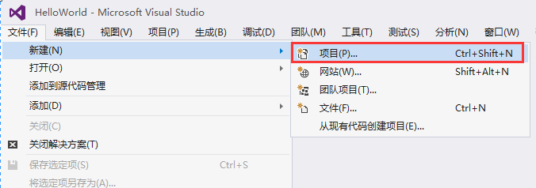
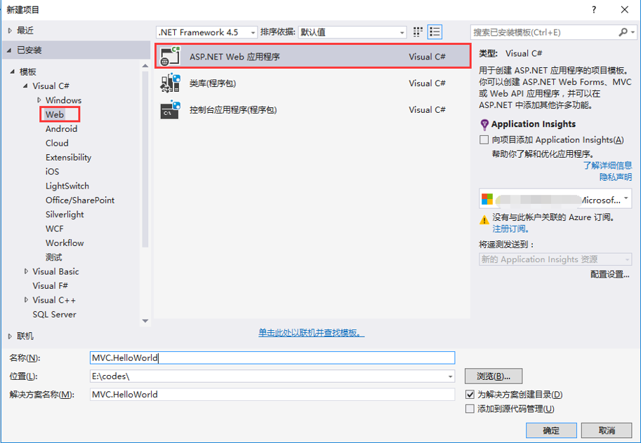
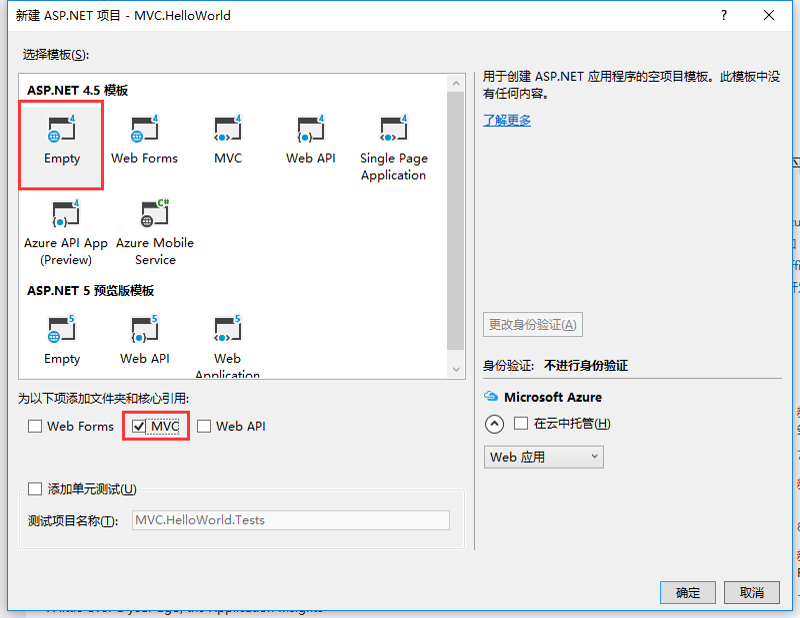
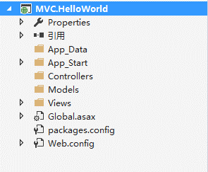
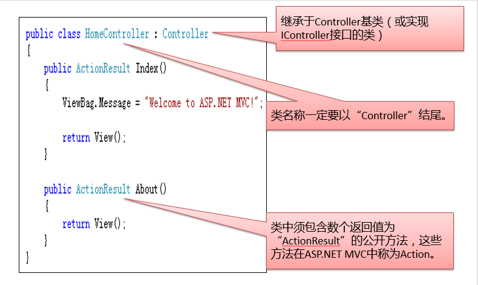
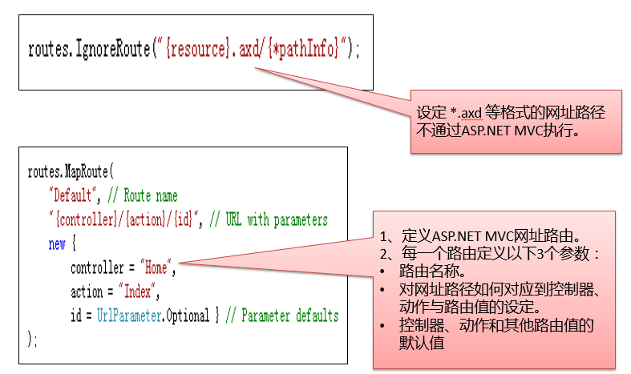

<!-- TOC -->

- [创建第一个ASP.NET MVC项目](#创建第一个aspnet-mvc项目)
    - [启动Visual Studio 2015，依次选择“文件” -> “新建项目”选项，如图所示：](#启动visual-studio-2015依次选择文件---新建项目选项如图所示)
    - [在窗口中选择“ASP.NET Web 应用程序”选项，如图所示：](#在窗口中选择aspnet-web-应用程序选项如图所示)
    - [在窗口中选择“Empty”模板，勾选“MVC”，如图所示：](#在窗口中选择empty模板勾选mvc如图所示)
    - [自动创建的标准目录结构](#自动创建的标准目录结构)
    - [控制器](#控制器)
    - [网址路由](#网址路由)

<!-- /TOC -->

# 创建第一个ASP.NET MVC项目

## 启动Visual Studio 2015，依次选择“文件” -> “新建项目”选项，如图所示：

## 在窗口中选择“ASP.NET Web 应用程序”选项，如图所示：

## 在窗口中选择“Empty”模板，勾选“MVC”，如图所示：

## 自动创建的标准目录结构

* App_Data：用于存储数据库文件或其他数据文件，如XML等；
* App_Start：包含访问控制器和动作的路由定义；
* Controllers：包含响应用户请求的控制器；
* Models：绑定到View的数据，并非MVC模式中的Model；
* Views：视图，HTML代码；

## 控制器

## 网址路由

