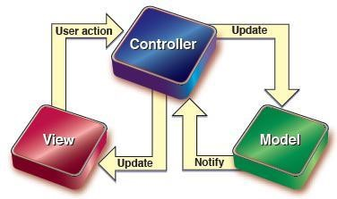

<!-- TOC -->

- [ASP.NET MVC](#aspnet-mvc)
    - [什么是MVC？](#什么是mvc)
        - [Model-数据模型](#model-数据模型)
        - [View-视图](#view-视图)
        - [Controller-控制器](#controller-控制器)
    - [关联性](#关联性)
        - [Controller与View的关联性](#controller与view的关联性)
        - [View与Model的关联性](#view与model的关联性)
        - [Model与Controller的关联性](#model与controller的关联性)
    - [独立性](#独立性)
        - [Controller与View之间的独立性](#controller与view之间的独立性)
        - [View与Model之间的独立性](#view与model之间的独立性)
        - [Model与Controller之间的独立性](#model与controller之间的独立性)
    - [优点](#优点)
        - [分解关注点与可维护性](#分解关注点与可维护性)
        - [易于测试的架构](#易于测试的架构)
    - [开发观念！](#开发观念)
        - [以习惯取代配置](#以习惯取代配置)

<!-- /TOC -->

# ASP.NET MVC

## 什么是MVC？
MVC将软件开发过程切割成3个主要单元：

### Model-数据模型
Model负责所有与数据有关的任务：
* 定义数据结构
* 临时存贮数据
* 进行数据格式验证
* 定义与验证业务逻辑规则
* 对数据进行加工和处理

### View-视图
View负责所有与用户有关的接口

输出：
* 决定要使用哪一种用户接口，如HTML、XML、JSON等。
* 负责控制页面的版式、字体、颜色与各种显示方式。
* 将Controller传送的数据显示在页面上，而数据内容则要参考Model的定义。
* 参考Model定义的数据格式来定义数据显示方式。

输入：
* 负责将数据送回Controller。
* HTML窗口通过GET方式或POST方式送回数据。
* 决定数据应该传送到哪一个Controller的Action中。
* 决定数据传送的方式，如GET、POST。
* 决定前端的数据验证，例如验证字段是否邮件。

### Controller-控制器

* 决定系统运作的流程。
* 负责填充Model中的数据。
* 决定应该显示哪个View。

## 关联性

### Controller与View的关联性
* 当Controller为主动角色时，由Controller决定要显示哪一个View。
* 当View为主动角色时，由View决定要将数据送回哪一个Controller 的哪一个Action。

### View与Model的关联性
* View比较主动，Model是从数据提供者的角度出发。
* View的数据是从Controller传来，结构却由Model定义。

### Model与Controller的关联性
* Controller永远处于主动角色，操作Model。
* Model仅为Controller提供数据的存贮空间。

## 独立性

### Controller与View之间的独立性
* 当View尚未被创建时，可以先编写Controller程序
* Controller 大多主动挑选View来显示。

### View与Model之间的独立性
* View大多参考Model里所定义的类，但不是绝对的。View不需要Model也能够运作。

### Model与Controller之间的独立性
* 在仅显示静态页面而且不需要调用任何动态数据的情况下，Controller不需要Model的数据。

## 优点

### 分解关注点与可维护性
* 数据逻辑M、控制逻辑C、展现逻辑V，由不同人员来专注完成
* 保持逻辑之间的松耦合

### 易于测试的架构
* ASP.NET MVC优先考虑测试的特性，可以通过各种测试框架，如Visual Studio、Unit Test、Nunit等，方便在项目中实施测试驱动开发（TDD）

## 开发观念！

### 以习惯取代配置
以习惯取代配置”是一种软件设计范例，其主要目的是缩短开发人员在设计架构时的决策时间，减少软件过度设计而导致的过于复杂的情况，通过约定俗成的开发习惯让同一团队中的开发人员可以共享同一套开发模式。

ASP.NET MVC就合理利用“以习惯取代配置”思想的开发框架。通过MVC设计模式的常见规则将开发框架切割成Model、View、Controller这3个部分，明确定义开发人员必须按照特定的“习惯”来开发程序。
