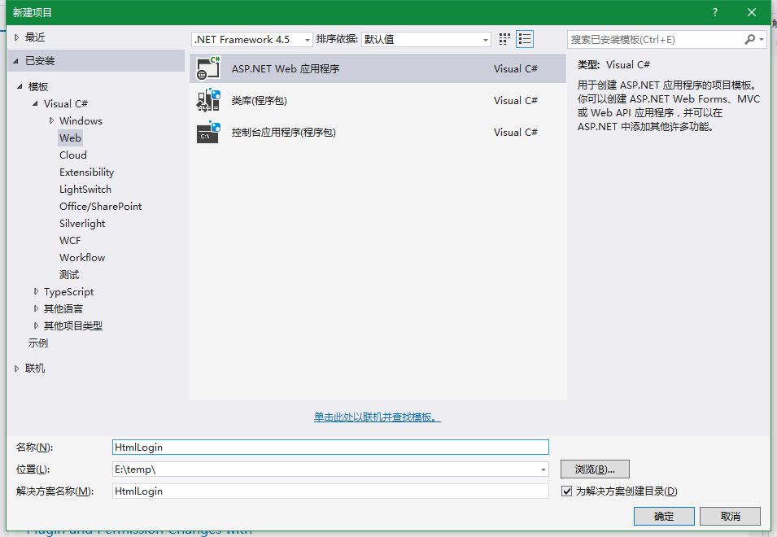
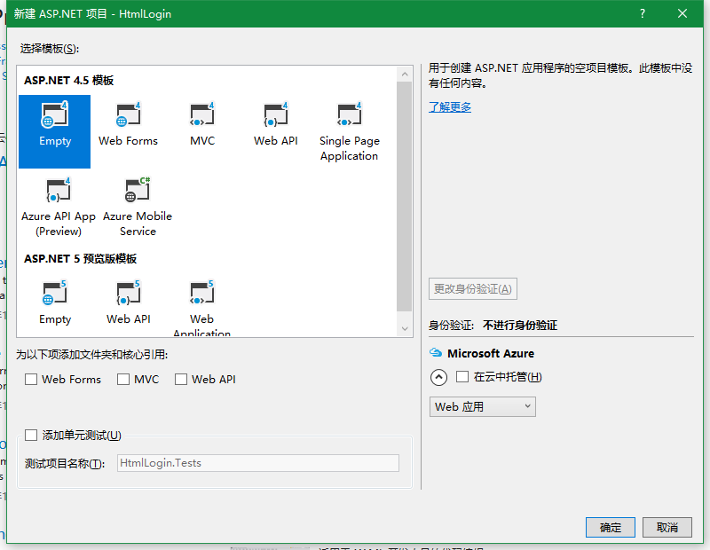
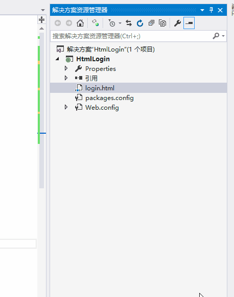
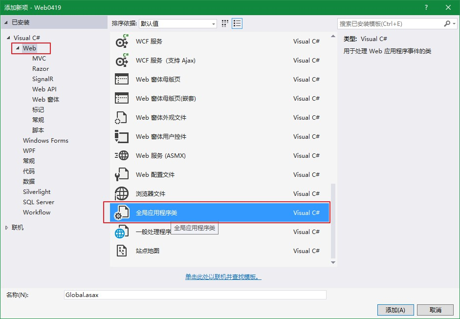
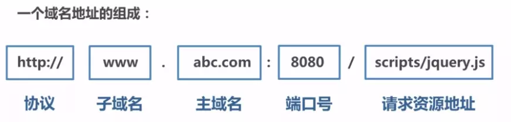
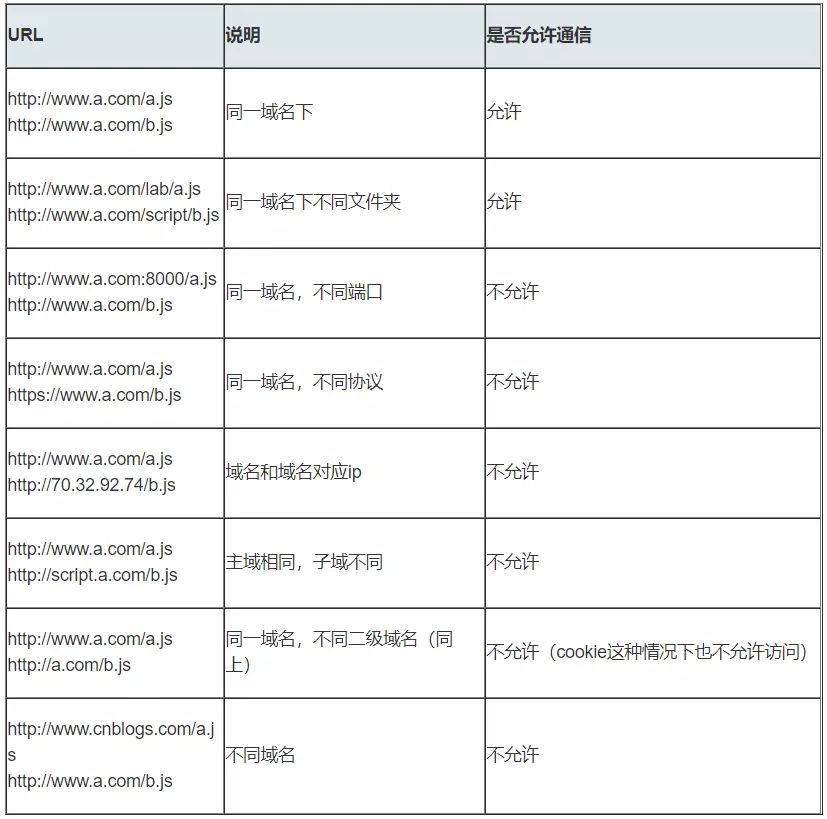
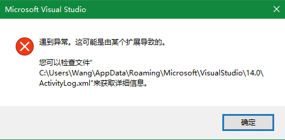

<!-- TOC -->

- [ASP.NET基础](#aspnet基础)
    - [ASP.NET静态网页实现简单登录跳转](#aspnet静态网页实现简单登录跳转)
    - [状态管理](#状态管理)
        - [数据缓存](#数据缓存)
            - [Session](#session)
            - [Application](#application)
            - [Cache](#cache)
            - [Cookie](#cookie)
            - [js.cookie](#jscookie)
        - [数据传递问题](#数据传递问题)
            - [Request](#request)
            - [Response](#response)
    - [Ajax](#ajax)
        - [构造函数](#构造函数)
        - [方法open()](#方法open)
        - [方法send()](#方法send)
        - [方法setRequestHeader()](#方法setrequestheader)
        - [使用XMLHttpRequest对象来发送一个Ajax请求](#使用xmlhttprequest对象来发送一个ajax请求)
    - [JSON](#json)
        - [对象和JSON格式互相转换](#对象和json格式互相转换)
            - [Newtonsoft.Json(推荐)](#newtonsoftjson推荐)
            - [System.Runtime.Serialization](#systemruntimeserialization)
    - [跨域](#跨域)
        - [一般处理程序-CORS](#一般处理程序-cors)
        - [JSONP](#jsonp)
        - [和风天气调用](#和风天气调用)
        - [心知天气调用跨域案例](#心知天气调用跨域案例)
    - [疑难杂症](#疑难杂症)
        - [CompositionFailedException](#compositionfailedexception)

<!-- /TOC -->
<a id="markdown-aspnet基础" name="aspnet基础"></a>
# ASP.NET基础

<a id="markdown-aspnet静态网页实现简单登录跳转" name="aspnet静态网页实现简单登录跳转"></a>
## ASP.NET静态网页实现简单登录跳转
新建Web应用程序，如下图：



选择Empty空模板，如下图：



添加Login.html文件并设为起始页，如下图：



Login.html内容如下：
```html
<form>
	<fieldset>
		<label for="txtName">用户名：</label>
		<input type="text" id="txtName" name="name" />
	</fieldset>
	<fieldset>
		<label for="txtPwd">密码：</label>
		<input type="password" id="txtPwd" name="pwd" />
	</fieldset>
	<fieldset>
		<input type="submit" value="登录" />
	</fieldset>
</form>
```

以上，即可以通过开始执行(ctrl+f5)通过浏览器查看该页面。

实现后台的验证功能，通过一般处理程序，接收form表单的提交。新建一般处理程序(HomeHandler.ashx)，结构如下：
```cs
/// <summary>
/// HomeHandler 的摘要说明
/// </summary>
public class HomeHandler : IHttpHandler
{
	/// <summary>
	/// 处理http请求
	/// </summary>
	/// <param name="context"></param>
	public void ProcessRequest(HttpContext context)
	{
		context.Response.ContentType = "text/plain";
		context.Response.Write("Hello World");
	}

	/// <summary>
	/// 是否重用该处理程序，即多个请求是否访问的一个实例
	/// 获取一个值，该值指示其他请求是否可以使用 IHttpHandler 实例。
	/// 如果 IHttpHandler 实例可再次使用，则为 true；否则为 false。 
	/// 默认为false即可
	/// </summary>
	public bool IsReusable
	{
		get
		{
			return false;
		}
	}
}
```

修改上述Login.html中form的action为对应的处理程序，如下：
```html
<form id="form1" action="/HomeHandler.ashx" method="post">
```

修改HomeHandler.ashx一般处理程序的ProcessRequest方法，内容如下：

```cs
/// <summary>
/// 处理http请求
/// </summary>
/// <param name="context"></param>
public void ProcessRequest(HttpContext context)
{
	//修改返回响应的类型，按照html进行解析
	context.Response.ContentType = "text/html";

	//Request["xxx"]中的xxx对应表单中元素的name属性，而不是id属性！
	string name = context.Request["name"];
	string pwd = context.Request["pwd"];

	if (name == "admin" && pwd == "1")
	{
		context.Response.Write("<script>alert('登录成功！');</script>");
	}
	else
	{
		context.Response.Write("<script>alert('用户名或密码错误！');</script>");
	}
}
```

通过表单提交，即可进行再后台进行验证登录是否成功。以上，就是一个简单的登录demo。

拓展，可以添加另外一个页面Index.html，实现验证成功后跳转到另一个静态页面，在验证成功后添加如下跳转代码：
```cs
context.Server.Transfer("Index.html");
```

对于一个一般处理程序，可能需要处理多个请求，比如登录请求，注册请求等，为了方便方法的调用，我们采用反射的方式进行方法的调用

针对上面的案例，修改如下：
```cs
public void ProcessRequest(HttpContext context)
{
	// 获取方法名称，需要在form表单action属性同步进行修改
	string method = context.Request.PathInfo.Substring(1);

	//根据前端方法名称反射获取当前Handler类的方法
	MethodInfo methodInfo = this.GetType().GetMethod(method);

	// 手动进行调用
	if(methodInfo != null)
	{
		methodInfo.Invoke(this, new object[] { context });
	}
}

/// <summary>
/// 方法名和form表单action拼接的方法名保持一致
/// 反射进行调用
/// </summary>
/// <param name="context"></param>
public void Login(HttpContext context)
{
	context.Response.ContentType = "text/html";
	string name = context.Request["name"];
	string pwd = context.Request["pwd"];

	if (name == "admin" && pwd == "1")
	{
		context.Server.Transfer("Home.html");
	}
	else
	{
		context.Response.Write("<script>alert('用户名或密码错误');</script>");
		context.Server.Transfer("Login.html");
	}
}
```

并修改上述Login.html中form的action为对应的处理程序增加/Login方法名，如下：

```html
<form id="form1" action="/HomeHandler.ashx/Login" method="post">
```

但是上面这种方案会有一个问题，表单提交就会发生跳转，无论验证成功与否。这个问题后面会讲到。。。

<a id="markdown-状态管理" name="状态管理"></a>
## 状态管理
在开发互联网程序时，不可避免的几个问题需要解决：
1. 程序数据有些是某个用户独享，而有些是所有用户共享，这块如何设计？
2. 用户在浏览器中输入的数据如何传递给服务器，在服务器中又该如何存储管理？

所谓“状态管理”，是指使用ASP.NET中的ViewState、Cookie、Session和Application等对象实现页面数据缓存和传递的技术。

在ASP.NET中，状态管理会被划分为两大类：


可以说状态管理对象依附在内置对象而工作的。下面是这些内置对象的常见属性和方法：

```cs
Context
	.Cache["key"]
	.Session["key"]
	.Request
		.Cookies["key"]			//获取客户端的cookie值
		.QueryString["key"]		//收集 http get请求传递的数据
		.Form["key"]			//收集 http post 请求传递的数据
	.Server
		.Transfer(string url)	//终止当前页，执行一个新页
		.UrlEncode(string str)	//对字符串进行URL编码
		.UrlDecode(string str)	//对字符串进行URL解码并返回结果
	.Response
		.Cookies["key"]			//设置发送给客户端的Cookie值
		.Redirect(string url)	//重定向到另一个URL
		.Write(string str)		//将数据以超文本格式发送到浏览器上
```

其中：
1. Request：HTTP请求对象，用于收集从客户端传递而来的信息。
2. Response：HTTP响应对象，用于收集服务器端的信息，并发送到浏览器。
3. Context：当前上下文对象，封装了与当前页关联的信息。

<a id="markdown-数据缓存" name="数据缓存"></a>
### 数据缓存

方法 | 信息量大小 | 作用域和保存时间 | 应用范围 | 保存位置
---|-------|----------|------|-----
Application | 任意大小 | 整个应用程序的生命周期 | 整个应用程序/所有用户 | 服务器端
Cache | 任意大小 | 可以根据需要设定 | 整个应用程序/所有用户 | 服务器端
Session | 小量,简单的数据 | 用户活动时间+一段延迟时间(一般为20分钟) | 单个用户 | 服务器端
Cookie | 小量,简单的数据 | 可以根据需要设定 | 单个用户 | 客户端
隐藏域 | 小量,简单的数据 | 一个Web页面的生命期 | 单个用户 | 客户端
查询字符串 | 小量,简单的数据 | 直到下次页面跳转请求 | 单个用户 | 客户端

可以在全局应用程序类(Global.asax)中进行数据缓存的模拟。

<a id="markdown-session" name="session"></a>
#### Session

要想在.ashx中引用 session 必须 using System.Web.SessionState ，继承IReadOnlySessionState/IRequiresSessionState

IReadOnlySessionState,为只读的session 不可以修改

IRequiresSessionState ，可以修改。

单用户数据独享时使用，属于会话级别对象；

允许通过将对象存储在 Web 服务器的内存中在整个用户会话过程中保持任何对象；

每个用户的Session对象是通过SessionID来识别的，该SessionID默认是由客户端的Cookie来存储并传输的。

Session可以保存任何类型的值，包括类的实例：`Session["UserName"] = " jack ";`
```cs
//存放信息
Session["key"]="value";
//读取数据
string UserName = Session["key"].ToString();

// Outside of Web Forms page class, use HttpContext.Current.
HttpContext context = HttpContext.Current;
context.Session["FirstName"] = firstName;
firstName = (string)(context.Session["FirstName"]);
```

设置session过期时间
```xml
<configuration>
    <system.web>
	  <!--设置会话过期时间，timeout单位为分钟-->
      <sessionState timeout="1"></sessionState>
      <compilation debug="true" targetFramework="4.5" />
      <httpRuntime targetFramework="4.5" />
    </system.web>
</configuration>
```

<a id="markdown-application" name="application"></a>
#### Application
多用户数据共享时使用，属于应用程序级别对象；用它保存的数据会在一个应用内多个用户信息共享，并在服务器运行期间持久保存该数据。

服务器一关闭，Application对象就自动消失。允许共享 ASP.NET 应用程序内多个会话和请求之间的全局信息。

在服务器内存中存储数量较少又独立于用户请求的数据：`Application["key"] = value ;`

```cs
Application.Lock();//同步,避免同时写入

Application["CurrentGuests"] =(int)Application["CurrentGuests"]+ 1;//总在线用户数
Application["AllGuests"] =(int)Application["AllGuests"]+ 1;//访问网站的总用户数

Application.UnLock();//同步结束
```

考虑多用户的情况，我们使用Application进行记录在线用户数，

需要处理所有的客户端请求，添加【全局应用程序类】：



```cs
public class Global : System.Web.HttpApplication
{
	/// <summary>
	/// 网站启动的时候会被调用
	/// </summary>
	/// <param name="sender"></param>
	/// <param name="e"></param>
	protected void Application_Start(object sender, EventArgs e) { }

	/// <summary>
	/// 某一个session启动的时候会被调用
	/// </summary>
	/// <param name="sender"></param>
	/// <param name="e"></param>
	protected void Session_Start(object sender, EventArgs e) { }

	/// <summary>
	/// 当一个请求过来的时候会被调用,html静态文件是iis直接把文件给到浏览器
	/// 不经过asp.net引擎处理,所以不会调用Application_BeginRequest方法
	/// </summary>
	/// <param name="sender"></param>
	/// <param name="e"></param>
	protected void Application_BeginRequest(object sender, EventArgs e) { }

	/// <summary>
	/// 当安全模块已经建立了当前用户的标识后执行。
	/// </summary>
	/// <param name="sender"></param>
	/// <param name="e"></param>
	protected void Application_AuthenticateRequest(object sender, EventArgs e) { }

	/// <summary>
	/// 当web应用程序发生错误的时候会被调用
	/// </summary>
	/// <param name="sender"></param>
	/// <param name="e"></param>
	protected void Application_Error(object sender, EventArgs e) { }

	/// <summary>
	/// 当session结束的时候会被调用,如session超时,设置session 20分钟过期,到了这时间就被调用
	/// 只有进程内session,也就是InProc(默认模式)过期的时候才会调用Session_End,进程外session不会调用此方法
	/// </summary>
	/// <param name="sender"></param>
	/// <param name="e"></param>
	protected void Session_End(object sender, EventArgs e) { }

	/// <summary>
	/// 当web应用程序退出的时候会被调用
	/// </summary>
	/// <param name="sender"></param>
	/// <param name="e"></param>
	protected void Application_End(object sender, EventArgs e) { }
}
```

前面说到的记录在线用户数，就需要使用`Application_Start`事件，`Session_Start`事件和`Session_End`事件

在`Application_Start`程序启动时将计数归零，`Session_Start`和`Session_End`会话开始和结束的时候分别做加减。

<a id="markdown-cache" name="cache"></a>
#### Cache
Cache对象用于在HTTP请求间保存页面或数据。该对象的使用可以极大地提高整个应用程序的效率。

常用于将频繁访问的大量服务器资源存储在内存中，

当用户发出相同的请求后服务器不再次处理而是将Cache中保存的信息返回给用户，节省了服务器处理请求的时间。

其生存期依赖于该应用程序的生存期。

当重新启动应用程序时，将重新创建其Cache对象的实例。使用Cache对象保存信息的代码如下。

```cs
//存放信息
context.Cache["nameID"]="0001";
//存放信息
context.Cache.Insert("nameID","0001");
//读取信息
string NameID = context.Cache["nameID"].ToString();
```

<a id="markdown-cookie" name="cookie"></a>
#### Cookie
Cookie 提供了一种在 Web 应用程序中存储用户特定信息的方法。

例如，当用户访问您的站点时，您可以使用 Cookie 存储用户首选项或其他信息。

当该用户再次访问您的网站时，应用程序便可以检索以前存储的信息。

```cs
/*
cookie的设置方式一
*/
context.Response.Cookies["name"] = name;
context.Response.Cookies["pwd"] = pwd;

context.Response.Cookies["name"].Expires = DateTime.Now.AddHours(1);//设置过期时间为1小时
context.Response.Cookies["pwd"].Expires = DateTime.Now.AddMinutes(1);//设置过期时间为1分钟

/*
cookie的设置方式二
*/
HttpCookie hcookie = new HttpCookie("CurAdmin");
hcookie.Value = "zhangsan";
//30s后过期
hcookie.Expires = DateTime.Now.AddSeconds(30);
context.Response.Cookies.Add(hcookie);

/*
cookie的读取
*/
if (context.Request.Cookies["name"] != null)
{
	string userName = context.Request.Cookies["name"].Value;
}

/*
不能直接删除用户计算机中的 Cookie。
但是，可以通过将 Cookie 的到期日期设置为过去的日期，让用户的浏览器来删除 Cookie。
当用户下一次向设置该 Cookie 的域或路径内的页发出请求时，浏览器将确定该 Cookie 已到期并将其移除。
*/
if (context.Request.Cookies["CurUser"] != null)
{
    HttpCookie myCookie = new HttpCookie("CurUser");
    myCookie.Expires = DateTime.Now.AddDays(-1d);
    context.Response.Cookies.Add(myCookie);
}
```

```js
//js读取cookie
document.cookie;
```

<a id="markdown-jscookie" name="jscookie"></a>
#### js.cookie
A simple, lightweight JavaScript API for handling browser cookies

github开源项目，封装了cookie操作的API。

github:https://github.com/js-cookie/js-cookie

Basic Usage基本使用：
```js
//Create a cookie, valid across the entire site:
Cookies.set('name', 'value');

//Create a cookie that expires 7 days from now, valid across the entire site:
Cookies.set('name', 'value', { expires: 7 });

//Create an expiring cookie, valid to the path of the current page:
Cookies.set('name', 'value', { expires: 7, path: '' });

//Read cookie:
Cookies.get('name'); // => 'value'
Cookies.get('nothing'); // => undefined

//Read all visible cookies:
Cookies.get(); // => { name: 'value' }

//Delete cookie:
Cookies.remove('name');

//Delete a cookie valid to the path of the current page:
Cookies.set('name', 'value', { path: '' });
Cookies.remove('name'); // fail!
Cookies.remove('name', { path: '' }); // removed!
```

对象的保存，需要进行JSON格式的转换：
```js
Cookies.set('stu', JSON.stringify({ name:"lucy",age:12 }));

Cookies.get(); // => { stu: "{"name":"lucy","age":12}" }
Cookies.get('stu'); // => '{"name":"lucy","age":12}'
JSON.parse(Cookies.get('stu')); // => {name: "lucy", age: 12}
```

<a id="markdown-数据传递问题" name="数据传递问题"></a>
### 数据传递问题

<a id="markdown-request" name="request"></a>
#### Request
请求对象，用来从客户端取得信息，包括浏览器种类、用户输入表单的数据、Cookies中的数据等信息。

当客户端发出请求执行asp.net程序时，CLR会将客户端的请求信息包含在Request对象中。

可以通过Request.<Collection>方式来使用该对象，其中Collection包括四种集合：

1. QueryString：收集请求url地址中"?"号后面的数据
2. Form：收集post方法传递的数据
3. Cookies：获取客户端的Cookie值
4. ServerVariables：获得环境变量值

<a id="markdown-response" name="response"></a>
#### Response
响应对象，用于将服务器端的信息发送到浏览器，包括：
1. 将服务器端的数据用超文本的格式发送到浏览器上：Response.Write(“js脚本或html脚本”);
2. 重定向浏览器到另一个URL：Response.Redirect(“url”, true);
3. 设置Cookie的值：Response.Cookies.Add(cookie);

<a id="markdown-ajax" name="ajax"></a>
## Ajax
ajax是一种技术方案，但并不是一种新技术。

它依赖的是现有的CSS/HTML/Javascript，而其中最核心的依赖是浏览器提供的XMLHttpRequest对象。

使用 XMLHttpRequest（XHR）对象可以与服务器交互。

可以从URL获取数据，而无需让整个的页面刷新。

这允许网页在不影响用户的操作的情况下更新页面的局部内容。


<a id="markdown-构造函数" name="构造函数"></a>
### 构造函数
`XMLHttpRequest()`该构造函数用于初始化一个 XMLHttpRequest 对象。

```js
var xhr = new XMLHttpRequest();
```

<a id="markdown-方法open" name="方法open"></a>
### 方法open()
`XMLHttpRequest.open()` 方法初始化一个请求。该方法要从JavaScript代码使用；

```js
/*
method：要使用的HTTP方法，比如「GET」、「POST」、「PUT」、「DELETE」、等。对于非HTTP(S) URL被忽略。
url：一个DOMString表示要向其发送请求的URL。
async 可选：一个可选的布尔参数，默认为true，表示要不要异步执行操作。如果值为false，send()方法直到收到答复前不会返回。如果true，已完成事务的通知可供事件监听器使用。
user 可选：可选的用户名用于认证用途；默认为null。
password 可选：可选的密码用于认证用途，默认为null。
*/
xhrReq.open(method, url, [async, user, password]);
```

<a id="markdown-方法send" name="方法send"></a>
### 方法send()
`XMLHttpRequest.send()` 方法用于发送 HTTP 请求。

如果是异步请求（默认为异步请求），则此方法会在请求发送后立即返回；

如果是同步请求，则此方法直到响应到达后才会返回。

`XMLHttpRequest.send()` 方法接受一个可选的参数，其作为请求主体；

如果请求方法是 GET 或者 HEAD，则应将请求主体设置为 null。

<a id="markdown-方法setrequestheader" name="方法setrequestheader"></a>
### 方法setRequestHeader()
XMLHttpRequest.setRequestHeader() 是设置HTTP请求头部的方法。

- 此方法必须在  open() 方法和 send()   之间调用。

- 方法的第一个参数 header 大小写不敏感，即可以写成content-type。

- Content-Type的默认值与具体发送的数据类型有关。

需要注意的是，xhr.send(data)中data参数的数据类型会影响请求头部content-type的默认值：
* 如果data是 Document 类型，同时也是HTML Document类型，则content-type默认值为text/html;charset=UTF-8;否则为application/xml;charset=UTF-8；
* 如果data是 DOMString 类型，content-type默认值为text/plain;charset=UTF-8；
* 如果data是 FormData 类型，content-type默认值为multipart/form-data; boundary=[xxx]
* 如果data是其他类型，则不会设置content-type的默认值

通常在post请求时，将参数以键值对方式传递(name1=value1&name2=value2)，将【content-type】设置为:
```js
//发送合适的请求头信息
xhr.setRequestHeader("Content-type", "application/x-www-form-urlencoded");
```

<a id="markdown-使用xmlhttprequest对象来发送一个ajax请求" name="使用xmlhttprequest对象来发送一个ajax请求"></a>
### 使用XMLHttpRequest对象来发送一个Ajax请求

原生js的ajax请求流程：

```js
1）创建XMLHttpRequest对象
	var req = new XMLHttpRequest();

2）发送AJAX请求
	GET请求：
	req.open('GET', '/Handlers/AjaxHandler.ashx?username=zhangsan&sex=boy');
	req.send(null);
	------------------------------------------------------------
	POST请求：
	req.open('POST', '/Handlers/AjaxHandler.ashx');
	// 发送合适的请求头信息，必不可少！
	req.setRequestHeader('Content-Type', 'application/x-www-form-urlencoded');
	req.send('username=zhangsan&sex=boy');

3）接收AJAX响应
	req.onreadystatechange = function () {
		if (req.readyState == XMLHttpRequest.DONE && req.status == 200) {
			alert('响应消息的正文内容：' + req.responseText);
		}
	};
	
	其中，readyState可以取如下值：
	0 (未初始化，XMLHttpRequest对象已经创建，但尚未初始化，还没有调用open方法)
	1 (已经调用send方法，正在发送HTTP请求) 
	2 (send方法调用结束，已经接收到全部HTTP响应消息) 
	3 (正在解析响应内容，但状态和响应头还不可用) 
	4 (完成)

	status 返回了XMLHttpRequest 响应中的数字状态码,status码是标准的HTTP status codes
	1**	信息，服务器收到请求，需要请求者继续执行操作
	2**	成功，操作被成功接收并处理
	3**	重定向，需要进一步的操作以完成请求
	4**	客户端错误，请求包含语法错误或无法完成请求
	5**	服务器错误，服务器在处理请求的过程中发生了错误
```

get请求：
```js
var xhr = 
```

原生js封装ajax流程：
```js
//调用示例
myAjax({
	url: '/Handler/HomeHandler.ashx/Add',
	type: 'POST',
	data: {
		name: name,
		pwd: pwd
	},
	success: function (data) {
		if (data == 'true') {
			alert('注册成功');
		} else {
			alert('未注册成功');
		}
	},
	error: function (err) {
		alert('请求发生异常');
		console.error(err);
	}
});

/*
参数说明：
option = {
	url:'',//请求的地址
	type:'POST',//请求类型 POST或GET
	data:{},//传输的数据
	success:function(data){},//成功响应后的回调函数
	error:function(err){},//失败后的回调函数
}
*/
function myAjax(option) {
	//1、创建XMLHttpRequest对象
	var req = new XMLHttpRequest();

	//默认为GET方式
	option.type = option.type || "GET";

	//2、发送AJAX请求
	if (option.type == "GET") {
		req.open('GET', option.url, true);
		req.send(null);
	} else {
		req.open('POST', option.url, true);
		req.setRequestHeader('Content-Type', 'application/x-www-form-urlencoded');
		req.send(formatParams(option.data));
	}

	//3、接收AJAX响应
	/*
	其中，readyState可以取如下值：
	0 (未初始化，XMLHttpRequest对象已经创建，但尚未初始化，还没有调用open方法)
	1 (已经调用send方法，正在发送HTTP请求)
	2 (send方法调用结束，已经接收到全部HTTP响应消息)
	3 (正在解析响应内容，但状态和响应头还不可用)
	4 (完成)
	*/
	req.onreadystatechange = function () {
		if (req.readyState == XMLHttpRequest.DONE && req.status == 200) {
			option.success(req.response);
		} else if (req.readyState == XMLHttpRequest.DONE) {
			option.error(req.response);
		}
	}
}
		
//格式化参数
function formatParams(data) {
	var arr = [];
	for (var name in data) {
		// encodeURIComponent方法在编码单个URIComponent（指请求参数）应当是最常用的，它可以将参数中的中文、特殊字符进行转义，而不会影响整个URL。
		arr.push(encodeURIComponent(name) + "=" + encodeURIComponent(data[name]));
	}
	arr.push(("v=" + Math.random()).replace(".", ""));
	return arr.join("&");
}
```

[escape()、encodeURI()、encodeURIComponent()区别详解](http://www.cnblogs.com/qiantuwuliang/archive/2009/07/19/1526687.html)

<a id="markdown-json" name="json"></a>
## JSON
JSON(JavaScript Object Notation)是一种轻量级的数据交换格式，易于人阅读和编写，同时也易于机器解析和生成。它可以构建以下两种结构：
1. “名称/值”对的集合
2. 值的有序列表（数组）

JSON在大多数的情况下作为AJAX的数据交换格式而不是XML。因为JSON有一些明显的优点：
1. 语法更简单，数据传输量更少
2. Javascript解码JSON数据容易并且效率高

[JSON标准](http://www.json.org.cn/)

关于JSON格式：
1. key值必须由引号包含；例如推荐使用`{"name":"jack"}`格式，不要使用`{name:"jack"}`
2. value部分，除数值和布尔值必须也要用引号包含；

在JavaScript中提供了JSON对象，帮助我们将js对象转换为json字符串或者是将json字符串转换为js对象。
```js
//将js对象转换为字符串
JSON.stringify({name:'jack',age:12});// '{"name":"jack","age":12}'

//将js数组转换为字符串
JSON.stringify(['jack','lucy','smith']);// '["jack","lucy","smith"]'

//将复杂对象转换为字符串 -> '{"region":"芜湖市","citys":["镜湖区","弋江区","鸠江区","三山区"]}'
JSON.stringify({region:'芜湖市',citys:['镜湖区','弋江区','鸠江区','三山区']});

//将字符串转换为对象
JSON.parse('{"id":123,"userid":"coder1"}');// {id: 123, userid: "coder1"}
```

<a id="markdown-对象和json格式互相转换" name="对象和json格式互相转换"></a>
### 对象和JSON格式互相转换

<a id="markdown-newtonsoftjson推荐" name="newtonsoftjson推荐"></a>
#### Newtonsoft.Json(推荐)
使用第三方 Newtonsoft.Json.net进行序列化和反序列化：

Serialize JSON
```cs
Product product = new Product();
product.Name = "Apple";
product.Expiry = new DateTime(2008, 12, 28);
product.Sizes = new string[] { "Small" };

string json = JsonConvert.SerializeObject(product);
// {
//   "Name": "Apple",
//   "Expiry": "2008-12-28T00:00:00",
//   "Sizes": [
//     "Small"
//   ]
// }
```

Deserialize JSON
```cs
string json = @"{
  'Name': 'Bad Boys',
  'ReleaseDate': '1995-4-7T00:00:00',
  'Genres': [
    'Action',
    'Comedy'
  ]
}";

Movie m = JsonConvert.DeserializeObject<Movie>(json);

string name = m.Name;
// Bad Boys
```

Newtonsoft默认序列化会带来一个问题，时间格式中默认会有一个【T】，可以通过修改时间格式解决：
```cs
JsonConvert.SerializeObject(list, new IsoDateTimeConverter() { DateTimeFormat = "yyyy-MM-dd HH:mm:ss" });
```

<a id="markdown-systemruntimeserialization" name="systemruntimeserialization"></a>
#### System.Runtime.Serialization
使用.NET提供的功能，需要添加System.Runtime.Serialization.dll引用
```cs
/// <summary>
/// C#对象 转换成 JSON字符串
/// </summary>
/// <param name="item">C#对象</param>
/// <returns>JSON字符串</returns>
public static string ToJson(object item)
{
	DataContractJsonSerializer serializer = new DataContractJsonSerializer(item.GetType());
	using (MemoryStream ms = new MemoryStream())
	{
		serializer.WriteObject(ms, item);
		string str = Encoding.UTF8.GetString(ms.ToArray());
		// 将其中的 "" 转化成“-”
		str = str.Replace("\"\"", "\"-\"");
		// 替换Json的Date字符串
		string p = @"\\/Date\((\d+)\+\d+\)\\/";
		MatchEvaluator matchEvaluator = new MatchEvaluator(delegate (Match m)
		{
			return new DateTime(1970, 1, 1).AddMilliseconds(long.Parse(m.Groups[1].Value))
				.ToLocalTime().ToString("yyyy-MM-dd HH:mm:ss");
		});
		Regex reg = new Regex(p);
		str = reg.Replace(str, matchEvaluator);

		return str;
	}
}
```

如需将对象进行序列化操作，需要针对类添加特性标记。

无法序列化类型“xxxxx”。

请考虑将其标以 DataContractAttribute 特性，并将其所有要序列化的成员标以 DataMemberAttribute 特性。

如果类型为集合，则请考虑将其标以 CollectionDataContractAttribute 特性。

```cs
/// <summary>
/// 后端处理返回前端数据的封装
/// 包含操作成功标记，以及相应的文本信息
/// </summary>
[DataContract]
public class ResultState
{
	public ResultState(bool status, string msg)
	{

		Status = status;
		Message = msg;
	}
	[DataMember]
	public bool Status { get; set; }
	[DataMember]
	public string Message { get; set; }
}
```

<a id="markdown-跨域" name="跨域"></a>
## 跨域
同源策略是一种约定，它是浏览器最核心也最基本的安全功能，如果缺少了同源策略，浏览器很容易受到XSS、CSRF等攻击。

所谓同源是指"协议+域名+端口"三者相同，即便两个不同的域名指向同一个ip地址，也非同源。



同源策略限制内容有：
* Cookie、LocalStorage、IndexedDB 等存储性内容
* DOM 节点
* AJAX 请求发送后，结果被浏览器拦截了

但是有三个标签是允许跨域加载资源：
* ``
* `<link href=XXX>`
* `<script src=XXX>`

当协议、子域名、主域名、端口号中任意一个不相同时，都算作不同域。不同域之间相互请求资源，就算作"跨域"。

常见跨域场景如下图所示：



跨域并不是请求发不出去，请求能发出去，服务端能收到请求并正常返回结果，只是结果被浏览器拦截了。

<a id="markdown-一般处理程序-cors" name="一般处理程序-cors"></a>
### 一般处理程序-CORS

有【Student】类如下：
```cs
class Student
{
	public Student(int score) { Score = score; }
	public int Score { get; set; }
	public string Judge
	{
		get
		{
			if (Score < 60) { return "未通过"; }
			else { return "已通过"; }
		}
	}
}
```

一般处理程序【HomeHandler】，根据请求参数分数返回学生对象
```cs
public void ProcessRequest(HttpContext context)
{
	int score = int.Parse(context.Request["score"]);
	Student s = new Student(score);
	context.Response.Write(Newtonsoft.Json.JsonConvert.SerializeObject(s));
}
```

发布网站，通过url进行访问：
```url
http://localhost:9001/HomeHandler.ashx?score=90
// output: {"Score":90,"Judge":"已通过"}
```

创建新的项目，模拟跨域访问
```js
$.ajax({
	url: 'http://localhost:9001/HomeHandler.ashx',
	dataType: 'json',
	data: { score: 90 },
	method: 'post',
}).done(function (resp) {
	console.log(resp);
}).fail(function (err) {
	console.error(err);
}).always(function (resp) {
	console.info('finish');
});

/*
抛出异常信息如下：
Access to XMLHttpRequest at 'http://localhost:9001/HomeHandler.ashx' 
from origin 'http://localhost:59399' has been blocked by CORS policy: 
No 'Access-Control-Allow-Origin' header is present on the requested resource.
*/
```

可以通过修改一般处理程序允许跨域访问，修改【ProcessRequest】方法：
```cs
public void ProcessRequest(HttpContext context)
{
	// 允许跨域访问
	context.Response.AddHeader("Access-Control-Allow-Origin", "*");

	int score = int.Parse(context.Request["score"]);
	Student s = new Student(score);
	context.Response.Write(Newtonsoft.Json.JsonConvert.SerializeObject(s));
}
```

新增【Access-Control-Allow-Origin】设置，原请求即可以正常访问。

以上是通过修改后台方法实现，较为简单。

<a id="markdown-jsonp" name="jsonp"></a>
### JSONP
JSONP是JSON with Padding的略称。

它是一个非官方的协议，它允许在服务器端集成Script tags返回至客户端，

通过javascript callback的形式实现跨域访问（这仅仅是JSONP简单的实现形式）。

在上述案例中，修改一般处理程序【HomeHandler】如下：
```cs
public void ProcessRequest(HttpContext context)
{
	// 参数中指定的回调函数名
	string callback = context.Request["callback"];
	int score = int.Parse(context.Request["score"]);

	Student s = new Student(score);
	string jsonStr = Newtonsoft.Json.JsonConvert.SerializeObject(s);
	
	context.Response.ContentType = "application/json";
	// 返回形式：callback(data)，即在客户端进行调用
	context.Response.Write($"{callback}({jsonStr})");
}
```

前端以jquery封装ajax为例进行jsonp调用：
```js
$.ajax({
	url: 'http://localhost:9001/HomeHandler.ashx',
	dataType: 'jsonp',
	jsonpCallback: 'getResult',
	data: { score: 90 },
	method: 'post',
}).done(function (resp) {
	console.log(resp);
}).fail(function (err) {
	console.error(err);
}).always(function (resp) {
	console.info('finish');
});

function getResult(data) {
	debugger;
}
```

创建一个回调函数，然后在远程服务上调用这个函数并且将JSON 数据形式作为参数传递，完成回调。

<a id="markdown-和风天气调用" name="和风天气调用"></a>
### 和风天气调用

[和风天气](https://dev.heweather.com/)

可以跨域访问：
```js
$.ajax({
	url: 'https://free-api.heweather.net/s6/weather/now',
	dataType: 'json',
	method: 'post',
	data: {
		key: '5a731c7828654c36b2cdca90c38058b1',
		location: 'wuhu'
	}
}).done(function (resp) {
	console.log(resp);
}).fail(function (err) {
	console.error(err);
});
```

<a id="markdown-心知天气调用跨域案例" name="心知天气调用跨域案例"></a>
### 心知天气调用跨域案例

[心知天气](https://www.seniverse.com/)

无法直接跨域访问：
```js
$.ajax({
	url: 'https://api.seniverse.com/v3/weather/now.json',
	dataType: 'json',
	method: 'post',
	data: {
		key: 'SdkANqWkZKziScAnm',
		location: 'wuhu'
	}
}).done(function (resp) {
	console.log(resp);
}).fail(function (err) {
	console.error(err);
});

/*
抛出异常信息：

Access to XMLHttpRequest at 'https://api.seniverse.com/v3/weather/now.json' 
from origin 'http://localhost:59399' has been blocked by CORS policy: 
No 'Access-Control-Allow-Origin' header is present on the requested resource.
*/
```

在一般处理程序中可以实现如下封装：
```cs
public class WeatherHandler : IHttpHandler
{
	public void ProcessRequest(HttpContext context)
	{
		// 查询天气的城市
		string location = context.Request["location"];
		// 基本url
		string baseUrl = "https://api.seniverse.com/v3/weather/now.json";
		// 个人账户的key值
		string key = "SdkANqWkZKziScAnm";
		// 拼接天气查询url
		string url = $"{baseUrl}?key={key}&location={location}";

		// 模拟请求调用
		HttpWebRequest req = (HttpWebRequest)WebRequest.Create(url);
		req.Method = "GET";
		HttpWebResponse res = (HttpWebResponse)req.GetResponse();
		string jsonStr = string.Empty;
		using (Stream stream = res.GetResponseStream())
		{
			StreamReader sr = new StreamReader(stream, Encoding.UTF8);
			jsonStr = sr.ReadToEnd();
		}
		context.Response.Write(jsonStr);
	}

	public bool IsReusable
	{
		get
		{
			return false;
		}
	}
}
```

前端直接进行调用接口：
```js
$.getJSON('/WeatherHandler.ashx?location=wuhu', function (data) {
	console.log(data);
});
```

<a id="markdown-疑难杂症" name="疑难杂症"></a>
## 疑难杂症
<a id="markdown-compositionfailedexception" name="compositionfailedexception"></a>
### CompositionFailedException



参考 
[Javascript and css intellisense not working](https://connect.microsoft.com/VisualStudio/feedback/details/1288784/javascript-and-css-intellisense-not-working)

由 Microsoft 在 2015/5/14 於 14:17 公佈
Giacomo,

Would you please try the following:

1. Exit Visual Studio
2. Delete the following folder 

%LOCALAPPDATA%\Microsoft\VisualStudio\14.0\ComponentModelCache

That folder is hidden by default, so you may need to change Windows Explorer settings in order to see it (you can follow steps similar to http://windows.microsoft.com/en-us/windows/show-hidden-files#show-hidden-files=windows-7).

3. Re-start Visual Studio and see if the issue is resolved. 

I would appreciate if you would let us know if that resolved your issue.

Thanks,
Alex Gavrilov
由 Microsoft 在 2015/4/29 於 8:04 公佈
Thank you for your feedback, we are currently reviewing the issue you have submitted. If you require immediate assistance with this issue, please contact product support at http://support.microsoft.com/ph/1117.


---

参考引用：

[99%的人理解错 HTTP 中 GET 与 POST 的区别](https://www.oschina.net/news/77354/http-get-post-different)

[XMLHttpRequest](https://developer.mozilla.org/zh-CN/docs/Web/API/XMLHttpRequest)

[你真的会使用XMLHttpRequest吗？](https://segmentfault.com/a/1190000004322487)

[九种跨域方式实现原理（完整版）](https://juejin.im/post/5c23993de51d457b8c1f4ee1)

