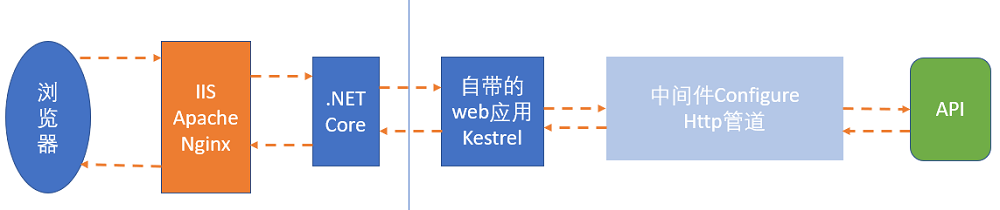
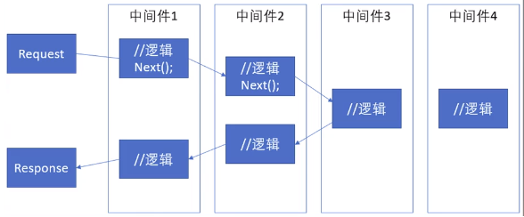
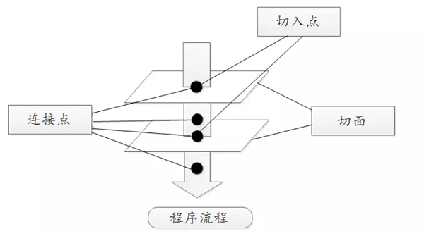
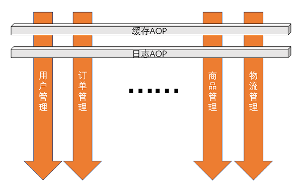
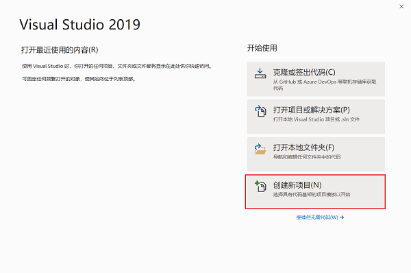
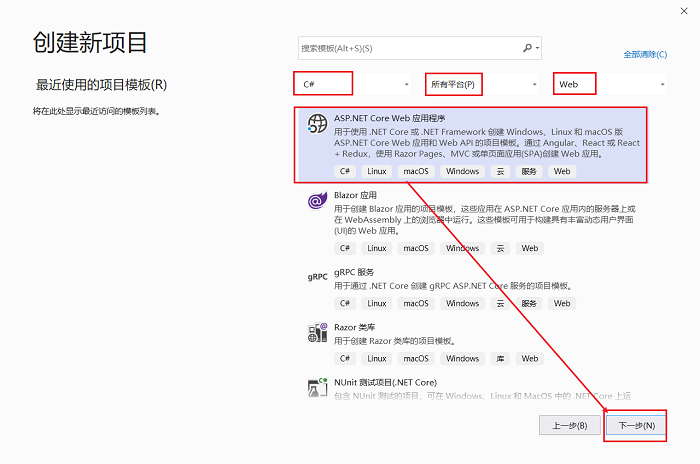
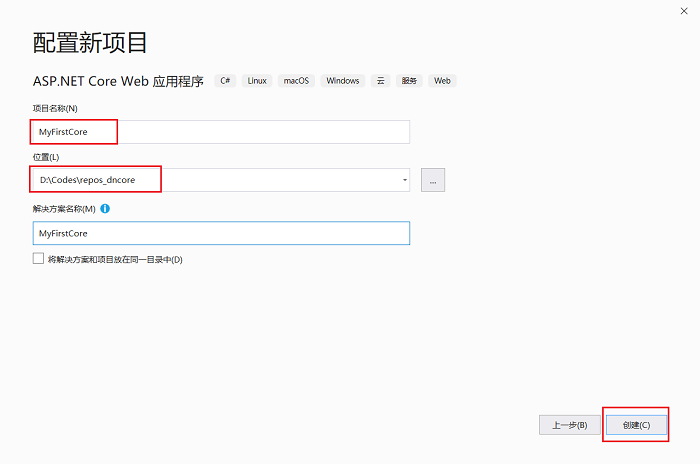
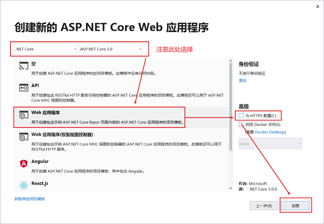
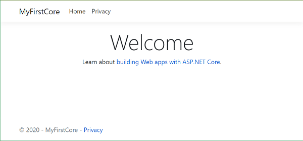
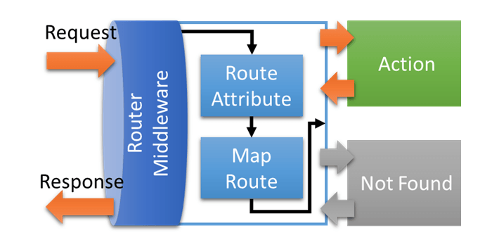

<!-- TOC -->

- [ASP.NET Core MVC](#aspnet-core-mvc)
    - [概述](#概述)
        - [执行过程](#执行过程)
        - [中间件执行过程：](#中间件执行过程)
        - [AOP 切面](#aop-切面)
    - [创建MVC项目](#创建mvc项目)
        - [创建步骤](#创建步骤)
        - [Program](#program)
        - [Startup](#startup)
        - [路由](#路由)

<!-- /TOC -->

<a id="markdown-aspnet-core-mvc" name="aspnet-core-mvc"></a>
# ASP.NET Core MVC

<a id="markdown-概述" name="概述"></a>
## 概述
ASP.NET Core MVC 框架是轻量级、开源、高度可测试的演示框架，并针对 ASP.NET Core 进行了优化。

ASP.NET Core MVC 提供一种基于模式的方式，用于生成可彻底分开管理事务的动态网站。 

<a id="markdown-执行过程" name="执行过程"></a>
### 执行过程



<a id="markdown-中间件执行过程" name="中间件执行过程"></a>
### 中间件执行过程：

启动的时候先执行该中间件类的构造函数，然后一路 Next() ；下去，返回的时候，正好是反向的，执行的是该类的逻辑部分：



<a id="markdown-aop-切面" name="aop-切面"></a>
### AOP 切面





<a id="markdown-创建mvc项目" name="创建mvc项目"></a>
## 创建MVC项目

<a id="markdown-创建步骤" name="创建步骤"></a>
### 创建步骤

选择【创建新项目】



选择对应模板



配置名称和路径信息



选择框架版本并对项目进行配置：



执行应用程序，浏览器中查看如下所示：



<a id="markdown-program" name="program"></a>
### Program

类似于控制台应用程序中的入口方法，web应用程序中【Program.cs】为入口起点

```cs
public class Program
{
    public static void Main(string[] args)
    {
        CreateHostBuilder(args).Build().Run();
    }

    public static IHostBuilder CreateHostBuilder(string[] args) =>
        Host.CreateDefaultBuilder(args)
            .ConfigureWebHostDefaults(webBuilder =>
            {
                // 程序启动时会调用 Startup 类
                webBuilder.UseStartup<Startup>();
            });
}
```

Main方法里面的内容主要是用来配置和运行程序的.

因为我们的web程序需要一个宿主, 所以 BuildWebHost 这个方法就创建了一个 WebHostBuilder. 

我们还需要 Web Server. 

ASP.NET Core 自带了两种 http servers, 一个是 WebListener, 它只能用于windows系统, 另一个是kestrel, 它是跨平台的.

上述【Program.cs】类中 CreateHostBuilder 方法的lambda写法相当于下面的写法：
```cs
public static IHostBuilder CreateHostBuilder(string[] args)
{
    var builder = Host.CreateDefaultBuilder(args)
        .ConfigureWebHostDefaults(web =>
        {
            web.UseStartup<Startup>();
        });
    return builder;
}
```

<a id="markdown-startup" name="startup"></a>
### Startup

其实Startup算是程序真正的切入点.

Startup 类的 执行顺序：`构造 -> ConfigureServices->Configure`

```cs
public class Startup
{
    public Startup(IConfiguration configuration)
    {
        Configuration = configuration;
    }

    public IConfiguration Configuration { get; }

    // This method gets called by the runtime. Use this method to add services to the container.
    public void ConfigureServices(IServiceCollection services)
    {
        services.AddRazorPages();
    }

    // This method gets called by the runtime. Use this method to configure the HTTP request pipeline.
    public void Configure(IApplicationBuilder app, IWebHostEnvironment env)
    {
        if (env.IsDevelopment())
        {
            app.UseDeveloperExceptionPage();
        }
        else
        {
            app.UseExceptionHandler("/Error");
        }

        app.UseStaticFiles();

        app.UseRouting();

        app.UseAuthorization();

        app.UseEndpoints(endpoints =>
        {
            endpoints.MapRazorPages();
        });
    }
}
```

不管你命名成什么，只要将 `webBuilder.UseStartup<>()` 中的泛型类配置成你定义的入口类即可。

**构造函数**

* IConfiguration：表示一组键/值应用程序配置属性。
* IHostingEnvironment：是一个包含与运行应用程序的Web宿主环境相关信息的接口。使用这个接口方法，我们可以改变应用程序的行为。

**ConfigureServices**

使用 `ConfigureServices` 方法将服务添加到容器。简单说，用于配置依赖注入

对于需要大量设置的功能，IServiceCollection 上有 Add{Service} 扩展方法。 

例如，`AddControllersWithViews、AddDefaultIdentity、AddEntityFrameworkStores 和 AddRazorPages`

**Configure 方法**

`Configure` 方法用于指定应用响应 HTTP 请求的方式。简单说，用于设置中间件、路由规则等

* IApplicationBuilder：是一个包含与当前环境相关的属性和方法的接口。它用于获取应用程序中的环境变量。

<a id="markdown-路由" name="路由"></a>
### 路由
大多数应用应选择基本的描述性路由方案，让 URL 有可读性和意义。 

默认传统路由 {controller=Home}/{action=Index}/{id?}：

* 支持基本的描述性路由方案。
* 是基于 UI 的应用的有用起点。

中间件 RouterMiddleware 的路由注册方式大致分为两种：
* 全局注册。如：MapRoute。
* 局部注册。如：RouteAttribute。

预设路由的顺序如下：



```cs
public void Configure(IApplicationBuilder app)
{
    // Matches request to an endpoint.
    app.UseRouting();

    // Endpoint aware middleware. 
    // Middleware can use metadata from the matched endpoint.
    app.UseAuthorization();

    // Execute the matched endpoint.
    app.UseEndpoints(endpoints =>
    {
        endpoints.MapControllerRoute(
            name: "default",
            pattern: "{controller=Home}/{action=Index}/{id?}");
    });
}
```

属性路由使用一组属性将操作直接映射到路由模板。

```cs
public class HomeController : Controller
{
   [Route("")]
   [Route("Home")]
   [Route("Home/Index")]
   public IActionResult Index()
   {
      return View();
   }
   [Route("Home/About")]
   public IActionResult About()
   {
      return View();
   }
   [Route("Home/Contact")]
   public IActionResult Contact()
   {
      return View();
   }
}
```


---

参考引用：

[](https://docs.microsoft.com/zh-cn/aspnet/core/fundamentals/startup?view=aspnetcore-3.1)

