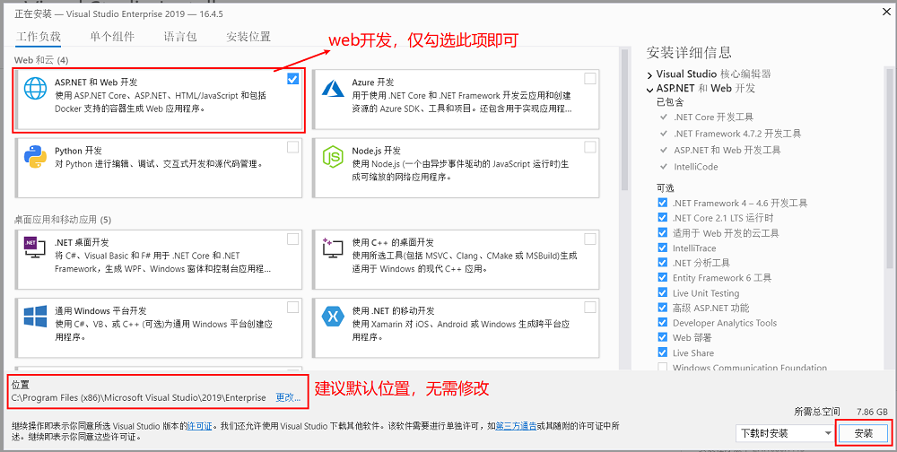

<!-- TOC -->

- [关于 .NET Core](#关于-net-core)
    - [语言](#语言)
    - [与其他.NET比较](#与其他net比较)
        - [与 .NET Framework 比较](#与-net-framework-比较)
        - [与 Mono 比较](#与-mono-比较)
    - [未来动向](#未来动向)
    - [VisualStudio2019](#visualstudio2019)

<!-- /TOC -->

# 关于 .NET Core

* .NET Core 具有以下特性：
* 跨平台： 可在 Windows、macOS 和 Linux 操作系统上运行。
* 跨体系结构保持一致： 在多个体系结构（包括 x64、x86 和 ARM）上以相同的行为运行代码。
* 命令行工具： 包括可用于本地开发和持续集成方案中的易于使用的命令行工具。
* 部署灵活： 可以包含在应用或已安装的并行（用户或系统范围安装）中。 可搭配 Docker 容器使用。
* 兼容性： .NET Core 通过 .NET Standard 与 .NET Framework、Xamarin 和 Mono 兼容。
* 开放源代码： .NET Core 平台是开放源代码，使用 MIT 和 Apache 2 许可证。 .NET Core 是一个 .NET Foundation 项目。
* 由 Microsoft 支持： .NET Core 由 Microsoft 依据 .NET Core 支持提供支持。

## 语言
可以使用 C#、Visual Basic 和 F# 语言编写适用于 .NET Core 的应用程序和库。 

这些语言可在你喜欢的文本编辑器或集成开发环境 (IDE) 中使用，包括：
* Visual Studio
* Visual Studio Code
* Sublime Text
* Vim

## 与其他.NET比较

### 与 .NET Framework 比较
.NET 由 Microsoft 于 2000 年首次发布，而后发展至今。 

近 20 年以来，.NET Framework 一直是 Microsoft 出品的主要 .NET 实现。

.NET Core 和 .NET Framework 的主要差异在于：
* **应用模型** - .NET Core 并非支持全部 .NET Framework 应用模型。 具体而言，它不支持 ASP.NET Web 窗体和 ASP.NET MVC，但支持 ASP.NET Core MVC。 自 .NET Core 3.0 起，.NET Core 还支持 WPF 和 Windows 窗体（仅限在 Windows 上）。
* **API** -- .NET Core 包含 .NET Framework 基类库的一个大型子集，但具有不同的组成要素（程序集名称不同；类型上公开的成员在关键用例中不同）。 在某些情况下，这些差异要求进行更改，以将源移植到 .NET Core 中。 有关详细信息，请参阅 .NET 可移植性分析器。 .NET Core 实施 .NET Standard API 规范。
* **子系统** -- .NET Core 实现 .NET Framework 中子系统的子级，目的是实现更简单的实现和编程模型。 例如，不支持代码访问安全性 (CAS)，但支持反射。
* **平台** -- .NET Framework 支持 Windows 和 Windows Server，而 NET Core 还支持 macOS 和 Linux。
* **开源** -- .NET Core 是开源的，而 .NET Framework 的只读子集是开源的。

### 与 Mono 比较

Mono 是 .NET 的初始跨平台实现。 

它一开始是用作 .NET Framework 的开源替代项，之后随着 iOS 和 Android 设备变得流行，过渡到面向移动设备。 

可将它看作是 .NET Framework 的社区克隆。 Mono 项目团队依赖于 Microsoft 发布的开放 .NET 标准（尤其是 ECMA 335）来实现兼容性。

## 未来动向
已宣布 .NET 5 将成为 .NET Core 的下一版本且表示平台实现统一。 此项目旨在以几项关键方法来改进 .NET：
* 生成可随处使用且提供统一运行时行为和开发人员体验的单一 .NET 运行时和框架。
* 通过充分利用 .NET Core、.NET Framework、Xamarin 和 Mono 来扩展 .NET 的功能。
* 根据单个基本代码构建开发人员（Microsoft 和社区）可处理且协同扩展，同时可改善所有方案的产品。

## VisualStudio2019

Visual Studio 2019 可以在线安装也可以下载离线安装包之后再安装。

进行web开发仅需要勾选【ASP.NET和Web开发】选项即可，全量包非常大，谨慎选择。

[Visual Studio 2019](https://visualstudio.microsoft.com/zh-hans/vs/)

[创建 Visual Studio 的脱机安装](https://docs.microsoft.com/zh-cn/visualstudio/install/create-an-offline-installation-of-visual-studio?view=vs-2019)