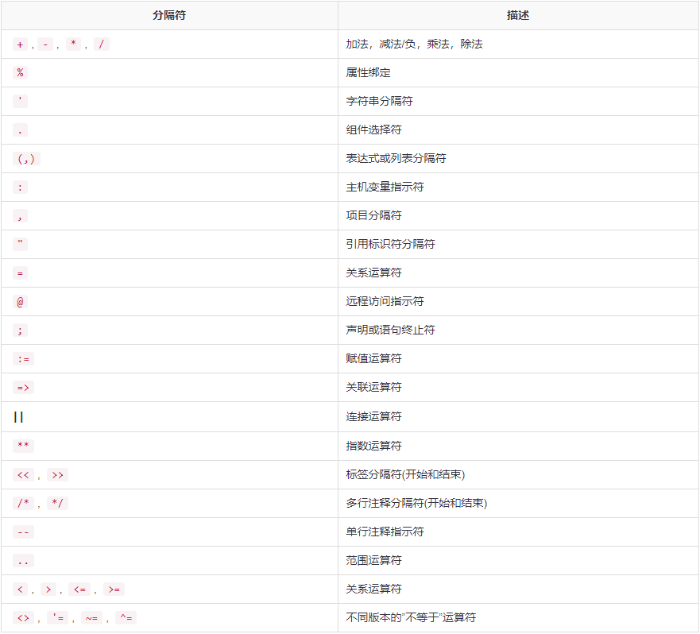

<!-- TOC -->

- [PL/SQL](#plsql)
    - [基本语法](#基本语法)
        - [结构](#结构)
        - [标识符](#标识符)
        - [PL/SQL注释](#plsql注释)
    - [数据类型](#数据类型)
        - [标量数据类型和子类型](#标量数据类型和子类型)
        - [数值数据类型和子类型](#数值数据类型和子类型)
        - [字符数据类型和子类型](#字符数据类型和子类型)
        - [大对象(LOB)数据类型](#大对象lob数据类型)

<!-- /TOC -->

<a id="markdown-plsql" name="plsql"></a>
# PL/SQL
PL/SQL编程语言由Oracle公司在20世纪80年代末由SQL和Oracle关系数据库的程序扩展语言开发。
* PL/SQL是一种完全可移植的，高性能的事务处理语言。
* PL/SQL提供了一个内置的，解释的和独立于操作系统的编程环境。
* 可以从命令行SQL * Plus界面直接调用PL/SQL。
* 直接调用也可以从外部编程语言调用到数据库中的对象(函数或过程等)。
* PL/SQL通用语法基于ADA和Pascal编程语言。
* 除Oracle之外，PL/SQL还可用于TimesTen内存数据库和IBM DB2。

<a id="markdown-基本语法" name="基本语法"></a>
## 基本语法
<a id="markdown-结构" name="结构"></a>
### 结构
PL/SQL是块结构语言; 这意味着PL/SQL程序被划分成几个部分，并在每个部分中写入逻辑代码块

每个块由三个子部分组成：
1. 声明部分 - 此部分是以关键字DECLARE开头。这是一个可选部分，并定义了程序中要使用的所有变量，游标，子程序和其他元素。
2. 可执行命令部分 - 此部分包含在关键字BEGIN和END之间，这是一个强制性部分。它由程序的可执行PL/SQL语句组成。它应该有至少一个可执行代码行，它可以只是一个NULL命令，表示不执行任何操作。
3. 异常处理部分 - 此部分以关键字EXCEPTION开头。这是一个可选部分，它包含处理程序中错误的异常。

每个PL/SQL语句以分号(;)结尾。 使用BEGIN和END可以将PL/SQL块嵌套在其他PL/SQL块中。 以下是PL/SQL块的基本结构 -
```plsql
DECLARE 
   <declarations section> 
BEGIN 
   <executable command(s)>
EXCEPTION 
   <exception handling> 
END;
```

Hello World示例
```plsql
DECLARE
  V_MSG VARCHAR2(32) := 'hello world';
BEGIN
  DBMS_OUTPUT.PUT_LINE(V_MSG);
END; -- 此处分号不可省略
```

<a id="markdown-标识符" name="标识符"></a>
### 标识符
PL/SQL标识符是常量，变量，异常，过程，游标和保留字。

标识符包括一个字母，可选地后跟多个字母，数字，美元符号，下划线和数字符号，不得超过30个字符。

默认情况下，标识符不区分大小写。例如，可以使用integer或INTEGER来表示一个数值。 

分隔符是具有特殊含义的符号。以下是PL/SQL中的分隔符列表 -



| 分隔符         | 描述                       |
| -------------- | -------------------------- |
| +,-, *, /      | 加法，减法/负，乘法，除法  |
| %              | 属性绑定                   |
| '              | 字符串分隔符               |
| .              | 组件选择符                 |
| (,)            | 表达式或列表分隔符         |
| :              | 主机变量指示符             |
| ,              | 项目分隔符                 |
| "              | 引用标识符分隔符           |
| =              | 关系运算符                 |
| @              | 远程访问指示符             |
| ;              | 声明或语句终止符           |
| :=             | 赋值运算符                 |
| =>             | 关联运算符                 |
| 连接运算符     |
| **             | 指数运算符                 |
| <<, >>         | 标签分隔符(开始和结束)     |
| /*, */         | 多行注释分隔符(开始和结束) |
| --             | 单行注释指示符             |
| ..             | 范围运算符                 |
| <, >, <=, >=   | 关系运算符                 |
| <>, '=, ~=, ^= | 不同版本的”不等于”运算符 |

<a id="markdown-plsql注释" name="plsql注释"></a>
### PL/SQL注释
PL/SQL单行注释以分隔符开头 --(双连字符)，多行注释由/*和*/括起来。

<a id="markdown-数据类型" name="数据类型"></a>
## 数据类型
* 标量(SCALAR)类型 - 它是没有内部组件的单个值，例如：NUMBER，DATE或BOOLEAN等。
* 大对象(LOB)类型 - 指向与其他数据项(例如：文本，图形图像，视频剪辑和声音波形)分开存储的大对象的指针。
* 复合类型 - 具有可单独访问的内部组件的数据项。例如，集合和记录。
* 引用类型 - 指向其他数据项。

<a id="markdown-标量数据类型和子类型" name="标量数据类型和子类型"></a>
### 标量数据类型和子类型
PL/SQL标量数据类型和子类型分为以下几类：

| 序号 | 类型     | 描述                               |
| ---- | -------- | ---------------------------------- |
| 1    | 数字     | 执行算术运算的数值。               |
| 2    | 字符     | 表示单个字符或字符串的字母数字值。 |
| 3    | 布尔     | 执行逻辑运算的逻辑值。             |
| 4    | 日期时间 | 用于表示日期和时间的值             |

<a id="markdown-数值数据类型和子类型" name="数值数据类型和子类型"></a>
### 数值数据类型和子类型

| 序号 | 类型                 | 描述                                                                           |
| ---- | -------------------- | ------------------------------------------------------------------------------ |
| 1    | PLS_INTEGER          | 带符号整数：-2,147,483,648至2,147,483,647，以32位表示                          |
| 2    | BINARY_INTEGER       | 带符号整数：-2,147,483,648至2,147,483,647，以32位表示                          |
| 3    | BINARY_FLOAT         | 单精度IEEE 754格式浮点数                                                       |
| 4    | BINARY_DOUBLE        | 双精度IEEE 754格式浮点数                                                       |
| 5    | NUMBER(prec, scale)  | 在1E-130到(但不包括)1.0E126范围内的绝对值的定点或浮点数。NUMBER变量也可以表示0 |
| 6    | DEC(prec, scale)     | ANSI特定定点类型，最大精度为38位十进制数字                                     |
| 7    | DECIMAL(prec, scale) | IBM具体定点类型，最大精度为38位十进制数字                                      |
| 8    | NUMERIC(pre, secale) | 浮点型，最大精度为38位十进制数                                                 |
| 9    | DOUBLE PRECISION     | ANSI特定浮点类型，最大精度为126位二进制数字(大约38位十进制数字)                |
| 10   | FLOAT                | ANSI和IBM特定浮点类型，最大精度为126位二进制数字(大约38位十进制数字)           |
| 11   | INT                  | ANSI特定整数类型，最大精度为38位十进制数                                       |
| 12   | INTEGER              | ANSI和IBM特定整数类型，最大精度为38位十进制数                                  |
| 13   | SMALLINT             | ANSI和IBM特定整数类型，最大精度为38位十进制数                                  |
| 14   | REAL                 | 浮点型，最大精度为63位二进制数字(约十八位数)                                   |

<a id="markdown-字符数据类型和子类型" name="字符数据类型和子类型"></a>
### 字符数据类型和子类型

| 序号 | 类型      | 描述                                                             |
| ---- | --------- | ---------------------------------------------------------------- |
| 1    | CHAR      | 固定长度字符串，最大大小为32,767字节                             |
| 2    | VARCHAR2  | 最大大小为32,767字节的可变长度字符串                             |
| 3    | RAW       | 最大大小为32,767字节的可变长度二进制或字节字符串，不由PL/SQL解释 |
| 4    | NCHAR     | 固定长度的国家字符串，最大大小为32,767字节                       |
| 5    | NVARCHAR2 | 可变长度的国家字符串，最大大小为32,767字节                       |
| 6    | LONG      | 最大长度为32,760字节的可变长度字符串                             |
| 7    | LONG RAW  | 最大大小为32,760字节的可变长度二进制或字节字符串，不由PL/SQL解释 |
| 8    | ROWID     | 物理行标识符，普通表中的行的地址                                 |
| 9    | UROWID    | 通用行标识符(物理，逻辑或外部行标识符)                           |

<a id="markdown-大对象lob数据类型" name="大对象lob数据类型"></a>
### 大对象(LOB)数据类型
| 数据类型 | 描述                                               | 大小                        |
| -------- | -------------------------------------------------- | --------------------------- |
| BFILE    | 用于在数据库外的操作系统文件中存储大型二进制对象。 | 取决于系统，但不得超过4GB。 |
| BLOB     | 用于在数据库中存储的大型二进制对象                 | 8TB至128TB                  |
| CLOB     | 用于在数据库中存储大字符数据。                     | 8TB至128TB                  |
| NCLOB    | 用于在数据库中存储大块NCHAR数据。                  | 8TB至128TB                  |


---

参考引用：

[PL/SQL教程](http://www.oraok.com/plsql/)

