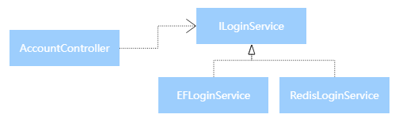
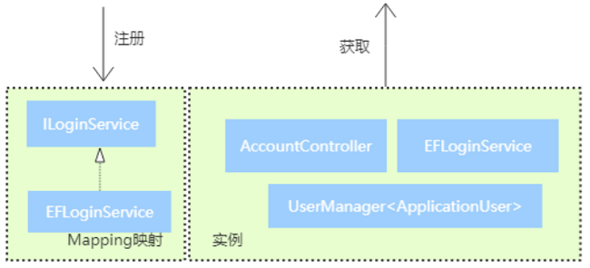

<!-- TOC -->

- [DI](#di)
    - [依赖注入](#依赖注入)
        - [什么是依赖](#什么是依赖)
        - [什么是注入](#什么是注入)
        - [为什么要反转](#为什么要反转)
        - [IoC容器](#ioc容器)
    - [.NET Core DI](#net-core-di)
        - [实例的生命周期](#实例的生命周期)

<!-- /TOC -->


<a id="markdown-di" name="di"></a>
# DI
IoC—Inversion of Control，即“控制反转”，不是什么技术，而是一种设计思想。

而依赖注入（Dependency Injection，简称DI），是实现IOC的一种手段。

<a id="markdown-依赖注入" name="依赖注入"></a>
## 依赖注入

<a id="markdown-什么是依赖" name="什么是依赖"></a>
### 什么是依赖
当一个类需要另一个类协作来完成工作的时候就产生了依赖。

比如我们在 AccountController 这个控制器需要完成和用户相关的注册、登录 等事情。

其中的登录我们由EF结合Identity来完成，所以我们封装了一个 EFLoginService 。

这里AccountController就有一个ILoginService的依赖。


这里有一个设计原则：依赖于抽象，而不是具体的实现。

所以我们给 EFLoginService 定义了一个接口，抽象了 LoginService 的行为。

<a id="markdown-什么是注入" name="什么是注入"></a>
### 什么是注入
注入体现的是一个IOC（控制反转的的思想）。

在反转之前 ，我们先看看常见的依赖写法。

AccountController 自己来实例化需要的依赖。

```cs
private ILoginService<ApplicationUser> _loginService;

public AccountController()
{
  _loginService = new EFLoginService();
}
```

但是，这样并不好，不应该自己创建它，而是应该由你的调用者给你。

于是便有了下面的写法，将logService引用由调用者传入。

```cs
public AccountController(ILoginService<ApplicationUser> loginService)
{
  _loginService = loginService;
}
```

把依赖的创建丢给其它人，自己只负责使用，其它人丢给你依赖的这个过程理解为注入。

<a id="markdown-为什么要反转" name="为什么要反转"></a>
### 为什么要反转
为了在业务变化的时候尽少改动代码可能造成的问题。

比如我们现在要把从EF中去验证登录改为从 Redis 去读，于是我们加了一个 RedisLoginService。

这个时候我们只需要在原来注入的地方改一下就可以了。



由于此处只依赖于抽象的接口，业务的变动不会影响 AccountController 控制器代码。

只需要修改不同的注入即可实现不同的方式业务，这就是反转带来的好处。

<a id="markdown-ioc容器" name="ioc容器"></a>
### IoC容器
上面我们在使用 AccountController 的时候，我们自己通过代码创建了一个 ILoggingService 的实例。

想象一下，一个系统中如果有100个这样的地方，我们是不是要在100个地方做这样的事情？ 

控制是反转了，依赖的创建也移交到了外部。

现在的问题是依赖太多，我们需要一个地方统一管理系统中所有的依赖，容器诞生了。



IoC容器实际上是一个DI框架，它能简化我们的工作量。它包含以下几个功能：
* 动态创建、注入依赖对象。
* 管理对象生命周期。
* 映射依赖关系。

<a id="markdown-net-core-di" name="net-core-di"></a>
## .NET Core DI
前面讲清楚DI和Ioc的关键概念之后，我们先来看看在控制台中对.NET Core DI的应用。

在.NET Core中DI的核心分为两个组件：`IServiceCollection`和 `IServiceProvider`。

通过默认的 `ServiceCollection`（在`Microsoft.Extensions.DependencyInjection`命名空间下）有三个方法：

```cs
public interface ILoginService
{
    bool Login(string uname, string pwd);
}

public class EFLoginService : ILoginService
{
    public bool Login(string uname, string pwd)
    {
        throw new NotImplementedException();
    }
}

class Program
{
    static void Main(string[] args)
    {
        // ServiceCollection 需要安装 Microsoft.Extensions.DependencyInjection
        var serviceCollection = new ServiceCollection();
        serviceCollection.AddTransient<ILoginService, EFLoginService>();
        serviceCollection.AddSingleton<ILoginService, EFLoginService>();
        serviceCollection.AddScoped<ILoginService, EFLoginService>();

        Console.WriteLine("Hello World!");
    }
}
```

这三个方法都是将我们的实例注册进去，只不过实例的生命周期不一样。什么时候生命周期我们下一节接着讲。

ServiceCollection 的默认实现是提供一个 ServiceDescriptor 的List

```cs
public class ServiceCollection : IServiceCollection, ICollection<ServiceDescriptor>, 
    IEnumerable<ServiceDescriptor>, IEnumerable,       IList<ServiceDescriptor>
{
    //......
}
```

上面的`AddTransient`、`AddSingleton`和`Scoped`方法是`IServiceCollection`的扩展方法， 都是往这个List里面添加`ServiceDescriptor`。

<a id="markdown-实例的生命周期" name="实例的生命周期"></a>
### 实例的生命周期

上面看到了，.NET Core DI 为我们提供的实例生命周其包括三种：
* `Transient`：每一次GetService都会创建一个新的实例
* `Scoped`：在同一个Scope内只初始化一个实例 ，可以理解为（ 每一个request级别只创建一个实例，同一个http request会在一个 scope内）
* `Singleton`：整个应用程序生命周期以内只创建一个实例

对应了Microsoft.Extensions.DependencyInjection.ServiceLifetime的三个枚举值

```cs
public enum ServiceLifetime
{
  Singleton,
  Scoped,
  Transient
}
```

为了大家能够更好的理解这个生命周期的概念我们做一个测试：

定义一个最基本的`IOperation`里面有一个`OperationId`的属性，`IOperationSingleton`也是一样，只不过是另外一个接口。

我们的`Operation`实现很简单，可以在构造函数中传入一个`Guid`进行赋值，如果没有的话则自已`new`一个`Guid`。


---

参考引用：

[深入理解DIP、IoC、DI以及IoC容器](https://www.cnblogs.com/liuhaorain/p/3747470.html)

[全面理解 ASP.NET Core 依赖注入](https://www.cnblogs.com/jesse2013/p/di-in-aspnetcore.html)

