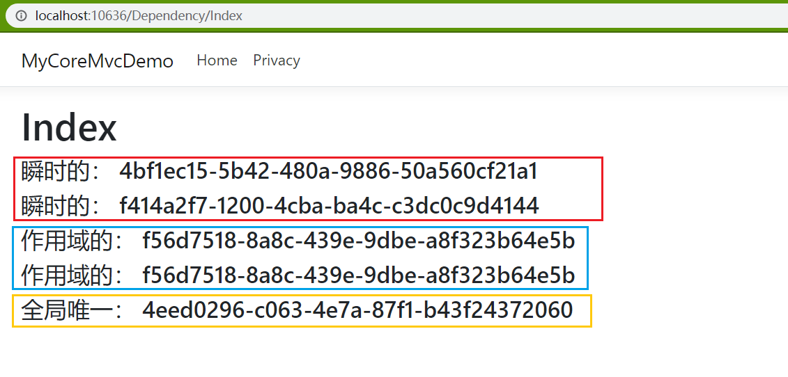

<!-- TOC -->

- [DI](#di)
    - [依赖注入](#依赖注入)
        - [什么是依赖](#什么是依赖)
        - [什么是注入](#什么是注入)
        - [为什么要反转](#为什么要反转)
        - [IoC容器](#ioc容器)
    - [三种注入方式](#三种注入方式)
        - [构造器注入](#构造器注入)
        - [属性注入](#属性注入)
        - [方法注入](#方法注入)
    - [.NET Core DI](#net-core-di)
        - [实例的生命周期](#实例的生命周期)

<!-- /TOC -->


<a id="markdown-di" name="di"></a>
# DI
IoC—Inversion of Control，即“控制反转”，不是什么技术，而是一种设计思想。

而依赖注入（Dependency Injection，简称DI），是实现IOC的一种手段。

<a id="markdown-依赖注入" name="依赖注入"></a>
## 依赖注入

<a id="markdown-什么是依赖" name="什么是依赖"></a>
### 什么是依赖
当一个类需要另一个类协作来完成工作的时候就产生了依赖。

比如我们在 `AccountController` 这个控制器需要完成和用户相关的注册、登录 等事情。

其中的登录我们由EF结合Identity来完成，所以我们封装了一个 `EFLoginService` 。

这里 `AccountController` 就有一个 `ILoginService` 的依赖。


这里有一个设计原则：依赖于抽象，而不是具体的实现。

所以我们给 `EFLoginService` 定义了一个接口，抽象了 `LoginService` 的行为。

<a id="markdown-什么是注入" name="什么是注入"></a>
### 什么是注入
注入体现的是一个IOC（控制反转的的思想）。

在反转之前 ，我们先看看常见的依赖写法。

`AccountController` 自己来实例化需要的依赖。

```cs
private ILoginService<ApplicationUser> _loginService;

public AccountController()
{
  _loginService = new EFLoginService();
}
```

但是，这样并不好，不应该自己创建它，而是应该由你的调用者给你。

于是便有了下面的写法，将 `logService` 引用由调用者传入。

```cs
public AccountController(ILoginService<ApplicationUser> loginService)
{
  _loginService = loginService;
}
```

把依赖的创建丢给其它人，自己只负责使用，其它人丢给你依赖的这个过程理解为注入。

<a id="markdown-为什么要反转" name="为什么要反转"></a>
### 为什么要反转
为了在业务变化的时候尽少改动代码可能造成的问题。

比如我们现在要把从EF中去验证登录改为从 Redis 去读，于是我们加了一个 `RedisLoginService。`

这个时候我们只需要在原来注入的地方改一下就可以了。


由于此处只依赖于抽象的接口，业务的变动不会影响 `AccountController` 控制器代码。

只需要修改不同的注入即可实现不同的方式业务，这就是反转带来的好处。

<a id="markdown-ioc容器" name="ioc容器"></a>
### IoC容器
上面我们在使用 `AccountController` 的时候，我们自己通过代码创建了一个 `ILoggingService` 的实例。

想象一下，一个系统中如果有100个这样的地方，我们是不是要在100个地方做这样的事情？ 

控制是反转了，依赖的创建也移交到了外部。

现在的问题是依赖太多，我们需要一个地方统一管理系统中所有的依赖，容器诞生了。


IoC容器实际上是一个DI框架，它能简化我们的工作量。它包含以下几个功能：
* 动态创建、注入依赖对象。
* 管理对象生命周期。
* 映射依赖关系。

<a id="markdown-三种注入方式" name="三种注入方式"></a>
## 三种注入方式
从编程的角度来讲，类型中的字段或者属性是依赖的一种主要体现形式，如果类型A中具有一个B类型的字段或者属性，那么A就对B产生了依赖。

所谓依赖注入，我们可以简单地理解为一种针对依赖字段或者属性的自动化初始化方式。

具体来说，我们可以通过三种主要的方式达到这个目的，这就是接下来着重介绍的三种依赖注入方式。

<a id="markdown-构造器注入" name="构造器注入"></a>
### 构造器注入
构造器注入就在在构造函数中借助参数将依赖的对象注入到创建的对象之中。

如下面的代码片段所示，Foo针对Bar的依赖体现在只读属性Bar上，针对该属性的初始化实现在构造函数中，具体的属性值由构造函数的传入的参数提供。

当DI容器通过调用构造函数创建一个Foo对象之前，需要根据当前注册的类型匹配关系以及其他相关的注入信息创建并初始化参数对象。

```cs
public class Foo
{
    public IBar Bar{get; private set;}
    public Foo(IBar bar)
    {
        this.Bar = bar;
    }
}
```

<a id="markdown-属性注入" name="属性注入"></a>
### 属性注入
如果依赖直接体现为类的某个属性，并且该属性不是只读的，我们可以让DI容器在对象创建之后自动对其进行赋值进而达到依赖自动注入的目的。

一般来说，我们在定义这种类型的时候，需要显式将这样的属性标识为需要自动注入的依赖属性，以区别于该类型的其他普通的属性。

```cs
public class Foo
{
   public IBar Bar{get; set;}
 
   [Injection]
   public IBaz Baz {get; set;}
}
```

<a id="markdown-方法注入" name="方法注入"></a>
### 方法注入
体现依赖关系的字段或者属性可以通过方法的形式初始化。

如下面的代码片段所示，Foo针对Bar的依赖体现在只读属性上，针对该属性的初始化实现在Initialize方法中，具体的属性值由构造函数的传入的参数提供。

```cs
public class Foo
{
    public IBar Bar{get; private set;}
 
    [Injection]
    public Initialize(IBar bar)
    {
        this.Bar = bar;
    }
}
```

<a id="markdown-net-core-di" name="net-core-di"></a>
## .NET Core DI

DI框架具有两个核心的功能，即服务的注册和提供，这两个功能分别由对应的对象来承载, 它们分别是 `ServiceCollection` 和 `ServiceProvider` 。

如下图所示，我们将相应的服务以不同的生命周期模式（`Transient`、`Scoped`和`Singleton`）注册到 `ServiceCollection` 对象之上，

再利用后者创建的 `ServiceProvider` 根据注册的服务类型提取相应的服务对象。


控制台简单案例：
```cs
public interface ILoginService
{
    bool Login();
}

public class EFLoginService : ILoginService
{
    public bool Login()
    {

        Console.WriteLine("EFLoginService");
        return true;
    }
}

public class RedisLoginService : ILoginService
{
    public bool Login()
    {
        Console.WriteLine("RedisLoginService");
        return false;
    }
}

class Program
{
    /// <summary>
    /// ServiceCollection 需要安装 Microsoft.Extensions.DependencyInjection
    /// 服务集合，充当IoC容器
    /// </summary>
    public static IServiceCollection services = new ServiceCollection();

    /// <summary>
    /// 进行注入
    /// </summary>
    static void Register()
    {
        // 添加映射关系，ILoginService 接口的 EFLoginService 实现
        services.AddScoped<ILoginService, EFLoginService>();
    }

    static void Main(string[] args)
    {
        Register();

        // 模拟具体业务调用，不关系具体的服务实现，此处只依赖于接口
        var provider = services.BuildServiceProvider();
        var loginSvc = provider.GetService<ILoginService>();
        Console.WriteLine(loginSvc.Login());
    }
}
```

<a id="markdown-实例的生命周期" name="实例的生命周期"></a>
### 实例的生命周期

`.NET Core DI` 为我们提供的实例生命周其包括三种：`Singleton`、`Scoped`、`Transient`

对应了 `Microsoft.Extensions.DependencyInjection.ServiceLifetime` 的三个枚举值

```cs
public enum ServiceLifetime
{
  Singleton,
  Scoped,
  Transient
}
```

为了方便理解，假设我们有寄快递的需求，那么我们会致电快递公司：“我们要寄快递，派一个快递员过来收货”。

接着，快递公司会如何做呢？
1. 一直派遣同一个快递员来收货。
2. 第一周派遣快递员A、第二周派遣快递员B收货。
3. 每次都派遣一个新的快递员收货。

这对应到生命周期就是：
1. 单例（Singleton），单一实例，每次使用都是该实例。
2. 作用域实例（Scoped），在一个作用域（比如单次请求）内是同一个实例，不同的作用域实例不同。
3. 瞬时实例（Transient），每次使用都创建新的实例。

快递公司也就是我们在DI中常说的容器（Container）了。

下面通过 MVC 中应用作为示例说明三种生命周期的区别：

创建三个接口展示Guid，分别对应三个实现，内容均一样：
```cs
public interface ITestService1
{
    Guid MyGuid { get; set; }
}
public interface ITestService2
{
    Guid MyGuid { get; set; }
}
public interface ITestService3
{
    Guid MyGuid { get; set; }
}
public class ImplService1 : ITestService1
{
    public ImplService1()
    {
        MyGuid = Guid.NewGuid();
    }

    public Guid MyGuid { get; set; }
}
public class ImplService2 : ITestService2
{
    public ImplService2()
    {
        MyGuid = Guid.NewGuid();
    }

    public Guid MyGuid { get; set; }
}
public class ImplService3 : ITestService3
{
    public ImplService3()
    {
        MyGuid = Guid.NewGuid();
    }

    public Guid MyGuid { get; set; }
}
```

每个实现类的构造函数中,我们都产生了一个新的guid,通过这个GUID,我们可以判断这个类到底重新执行过构造函数没有.

修改【Startup.cs】类文件，对刚刚创建的三个接口进行服务注入：
```cs
public void ConfigureServices(IServiceCollection services)
{
    services.AddControllersWithViews();

    services.AddTransient<ITestService1, ImplService1>();
    services.AddScoped<ITestService2, ImplService2>();
    services.AddSingleton<ITestService3, ImplService3>();
}
```

创建控制器【DependencyController.cs】，代码如下：
```cs
public class DependencyController : Controller
{
    readonly ITestService1 _testService1;
    readonly ITestService2 _testService2;
    readonly ITestService3 _testService3;

    // 构造注入
    public DependencyController(ITestService1 testService1,
        ITestService2 testService2, ITestService3 testService3)
    {
        _testService1 = testService1;
        _testService2 = testService2;
        _testService3 = testService3;
    }

    // 此处采用了 Action 注入的方法
    public IActionResult Index([FromServices]ITestService1 testService11,
        [FromServices]ITestService2 testService22)
    {
        ViewBag.TransientGuid = _testService1.MyGuid;
        ViewBag.TransientGuid11 = testService11.MyGuid;
        ViewBag.ScopedGuid = _testService2.MyGuid;
        ViewBag.ScopedGuid22 = testService22.MyGuid;
        ViewBag.SingletonGuid = _testService3.MyGuid;

        return View();
    }
}
```

这里说明一下,我们采用了Action注入的方法，新注入了`ITestService1`和`ITestService2`，确保它们是同 Scope

【Index.cshtml】视图如下：
```cs
<h1>Index</h1>

<h4>瞬时的： @ViewBag.TransientGuid</h4>

<h4>瞬时的： @ViewBag.TransientGuid11</h4>

<h4>作用域的： @ViewBag.ScopedGuid</h4>

<h4>作用域的： @ViewBag.ScopedGuid22</h4>

<h4>全局唯一： @ViewBag.SingletonGuid</h4>
```

执行结果如下所示：



观察得知：
* 即时在同一Scope下，`Transient`也会重新创建新的实例；
* 同一Scope下，`Scoped`会共用引用，该Action内只创建了一个实例；
* 全局唯一声明周期和应用一致，即使不同的控制器；

---

参考引用：

[深入理解DIP、IoC、DI以及IoC容器](https://www.cnblogs.com/liuhaorain/p/3747470.html)

[全面理解 ASP.NET Core 依赖注入](https://www.cnblogs.com/jesse2013/p/di-in-aspnetcore.html)

[ASP.NET Core中的依赖注入（1）：控制反转（IoC）](https://www.cnblogs.com/artech/p/asp-net-core-di-ioc.html)

[ASP.NET Core中的依赖注入（2）：依赖注入（DI）](https://www.cnblogs.com/artech/p/asp-net-core-di-di.html)

[ASP.NET Core，依赖注入详解](https://www.cnblogs.com/a2502971/articles/7762061.html)

