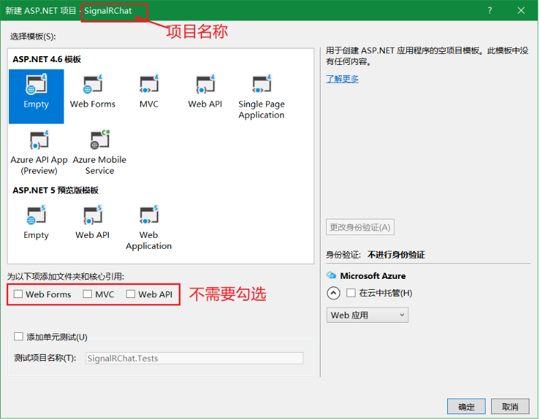
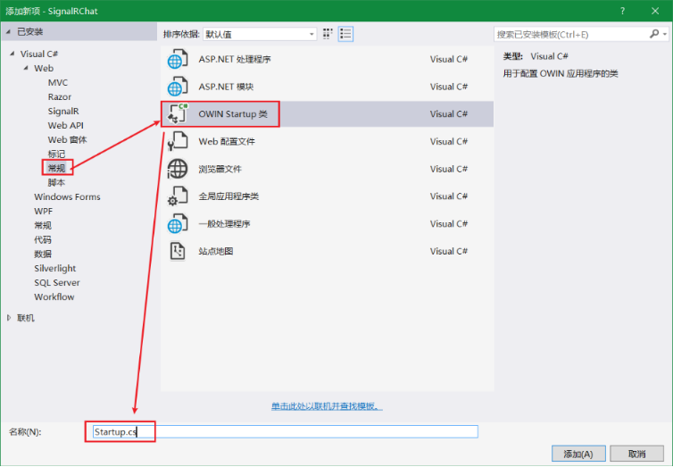
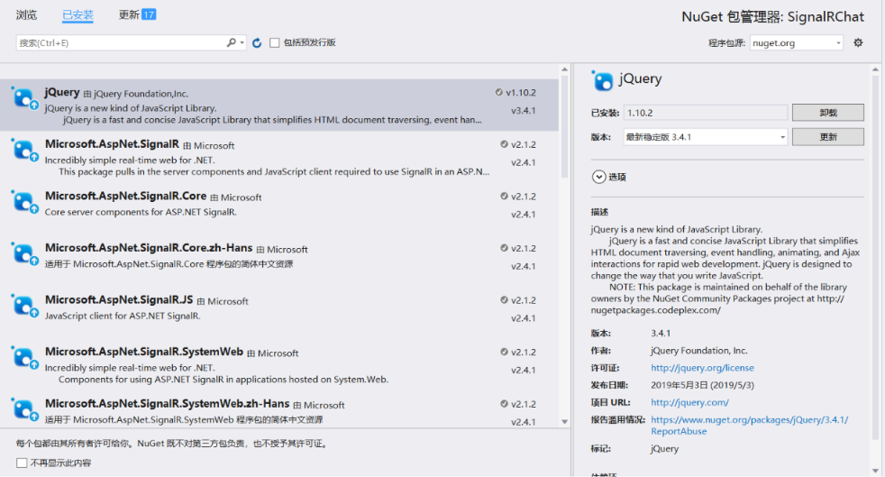
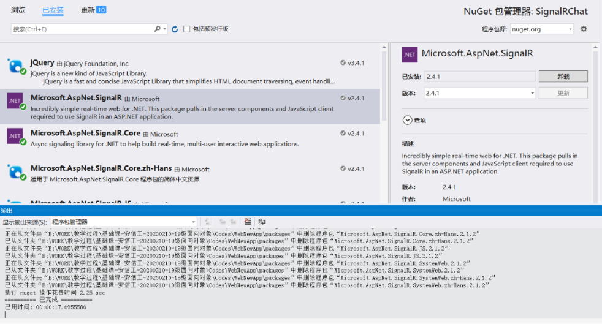

<!-- TOC -->

- [SignalR](#signalr)
    - [SignalR 简介](#signalr-简介)
    - [SignalR和WebSocket](#signalr和websocket)
        - [WebSocket](#websocket)
        - [对比](#对比)
    - [通信模型](#通信模型)
        - [Hub聊天应用](#hub聊天应用)
            - [应用程序](#应用程序)
            - [Hub集线器](#hub集线器)
            - [注册SignalR](#注册signalr)
            - [组件更新](#组件更新)
            - [Hub前端调用](#hub前端调用)
            - [多浏览器测试](#多浏览器测试)

<!-- /TOC -->

<a id="markdown-signalr" name="signalr"></a>
# SignalR

<a id="markdown-signalr-简介" name="signalr-简介"></a>
## SignalR 简介

ASP.NET SignalR 是 ASP.NET 开发人员的库，可简化将实时 web 功能添加到应用程序的过程。 

实时 web 功能使服务器代码能够在可用时立即将内容推送到连接的客户端，而不是让服务器等待客户端请求新的数据。

SignalR 可用于将任何种类的 "实时" web 功能添加到 ASP.NET 应用程序。

通常以【聊天通讯】作为示例，其实可以做更多操作，比如监视应用程序、协作应用程序（如同步编辑文档）、作业进度更新和实时窗体

SignalR 提供了一个简单的 API，用于创建从服务器端 .NET 代码调用客户端浏览器中的JS函数。

SignalR 还包括用于连接管理的 API （例如，连接和断开连接事件）以及对连接进行分组。


SignalR 自动处理连接管理，让你可同时向所有连接的客户端广播消息，就像聊天室一样。

SignalR 支持 "服务器推送" 功能，在此功能中，服务器代码可以使用远程过程调用（RPC），而不是 web 上常见的请求-响应模型，在浏览器中调用客户端代码。


<a id="markdown-signalr和websocket" name="signalr和websocket"></a>
## SignalR和WebSocket

<a id="markdown-websocket" name="websocket"></a>
### WebSocket
WebSocket是一种在单个TCP连接上进行全双工通信的协议。

WebSocket使得客户端和服务器之间的数据交换变得更加简单，允许服务端主动向客户端推送数据。

在WebSocket API中，浏览器和服务器只需要完成一次握手，两者之间就直接可以创建持久性的连接，并进行双向数据传输。

<a id="markdown-对比" name="对比"></a>
### 对比
SignalR 使用新的 WebSocket 传输（如果可用），并在必要时回退到较旧的传输（前端ajax轮询）。

当然，可以直接使用 WebSocket 编写应用，但使用 SignalR 意味着你需要实现的很多额外功能都已完成。 

最重要的是，这意味着您可以对应用程序进行编码，以便利用 WebSocket，而不必担心为较旧的客户端创建单独的代码。 

<a id="markdown-通信模型" name="通信模型"></a>
## 通信模型
SignalR 的实现机制与.NET WCF 或 Remoting 是相似的，都是使用远程代理来实现。

在具体使用上，有两种不同通信模型：PersistentConnection 和 Hubs

通信模型 | 说明
-----|---
Persistent Connections | Persistent Connections表示一个发送单个，编组，广播信息的简单终结点。开发人员通过使用持久性连接Api，直接访问SignalR公开的底层通信协议。
Hubs | Hubs是基于连接Api的更高级别的通信管道，它允许客户端和服务器上彼此直接调用方法，SignalR能够很神奇地处理跨机器的调度，使得客户端和服务器端能够轻松调用在对方端上的方法。使用Hub还允许开发人员将强类型的参数传递给方法并且绑定模型

SignalR 将整个连接，信息交换过程封装得非常漂亮，客户端与服务器端全部使用 JSON 来交换数据。

<a id="markdown-hub聊天应用" name="hub聊天应用"></a>
### Hub聊天应用

<a id="markdown-应用程序" name="应用程序"></a>
#### 应用程序
在 Visual Studio 中，创建一个 ASP.NET Web 应用程序，选择空模板，如下所示：



<a id="markdown-hub集线器" name="hub集线器"></a>
#### Hub集线器
在解决方案资源管理器中，右键单击项目，然后选择 "添加 > 新项"，选择" SignalR Hub 类（v2） "


添加SignalR类后，vs会自动将相关程序集引用至该项目，可以从引用中查看新增了SignalR相关的程序集。

将新的ChatHub.cs类文件中的代码替换为以下代码：

```cs
using System;
using System.Web;
using Microsoft.AspNet.SignalR;
namespace SignalRChat
{
    public class ChatHub : Hub
    {
        public void Send(string name, string message)
        {
            // Call the broadcastMessage method to update clients.
            Clients.All.broadcastMessage(name, message);
        }
    }
}
```

Send 方法演示了几个中心概念：

* 在中心声明公共方法，使客户端可以调用它们。
* 使用 Microsoft.AspNet.SignalR.Hub.Clients 动态属性与连接到此集线器的所有客户端通信。
* 在客户端上调用一个函数（如 broadcastMessage 函数）以更新客户端。

<a id="markdown-注册signalr" name="注册signalr"></a>
#### 注册SignalR

在 "添加新项"-SignalRChat选择 "安装 > Visual C# > Web "，然后选择 " OWIN Startup 类"，如下图所示：



将Startup类【Configuration】方法中添加SignalR的注册代码`app.MapSignalR();`，类如下所示：

```cs
[assembly: OwinStartup(typeof(SignalRChat.Startup))]
namespace SignalRChat
{
    public class Startup
    {
        public void Configuration(IAppBuilder app)
        {
            // 注册 SignalR 中间件
            app.MapSignalR();
        }
    }
}
```

<a id="markdown-组件更新" name="组件更新"></a>
#### 组件更新
由于默认添加的SignalR版本并不是最新的，在升级jQuery版本时，也需要一并升级SignalR。

打开项目的 "Nuget程序包" 管理器，对【jQuery】和【Microsoft.AspNet.SignalR】进行更新





<a id="markdown-hub前端调用" name="hub前端调用"></a>
#### Hub前端调用

在项目中新增html页面【chat.html】：
```html
<!DOCTYPE html>
<html>
<head>
    <meta http-equiv="Content-Type" content="text/html; charset=utf-8" />
    <title>聊天室</title>
    <meta charset="utf-8" />
</head>
<body>
    <div class="container">
        <input type="text" id="message" />
        <input type="button" id="sendmessage" value="Send" />
        <input type="hidden" id="displayname" />
        <ul id="discussion"></ul>
    </div>

    <script src="Scripts/jquery-3.4.1.min.js"></script>
    <script src="Scripts/jquery.signalR-2.4.1.min.js"></script>
    <script src="signalr/hubs"></script>

    <script>
        $(function () {
            // 创建服务端hub引用的代理
            var chat = $.connection.chatHub;
            // 创建客户端的回调方法，broadcastMessage方法由服务端远程调用，将消息广播至每个客户端
            chat.client.broadcastMessage = (name, message) => {
                $('#discussion').append(`
                    <li>
                    <strong>${name}</strong>:
                    <em>${message}</em>
                    </li>
                    `);
            };

            // 设置隐藏域的名称，通过prompt弹框输入
            $('#displayname').val(prompt('Enter your name:'));
            $('#message').focus();

            // 打开连接后进行发送事件的注册
            $.connection.hub.start().done(function () {
                $('#sendmessage').click(() => {
                    // 远程调用hub上的Send方法
                    chat.server.send($('#displayname').val(), $('#message').val());
                    $('#message').val('').focus();
                });

            });
        })
    </script>
</body>
</html>
```

代码示例显示了如何使用 SignalR jQuery 库与 SignalR 中心通信。

运用代理的思想，chat对象用于代理服务端的chatHub集线器。

```js
var chat = $.connection.chatHub;
```

> 在 JavaScript 中，对服务器类及其成员的引用必须是 camelCase。 

此代码示例引用C#中的ChatHub类作为 chatHub，同样的【ChatHub.cs】类中Send()方法在js中对应chat.server.send()


<a id="markdown-多浏览器测试" name="多浏览器测试"></a>
#### 多浏览器测试
设置【chat.html】为起始页面，开启多浏览器进行聊天测试：


