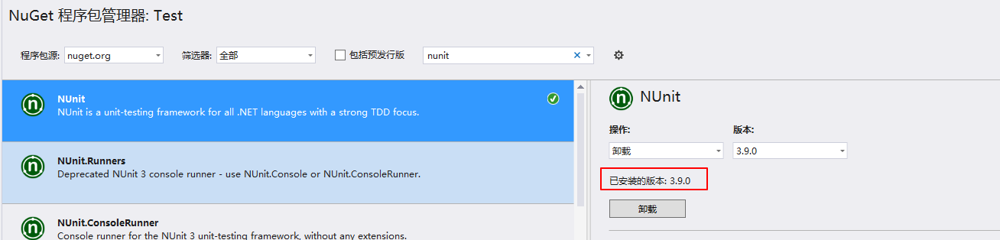
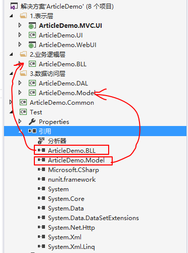
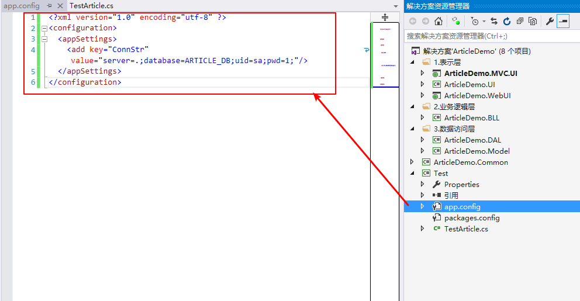
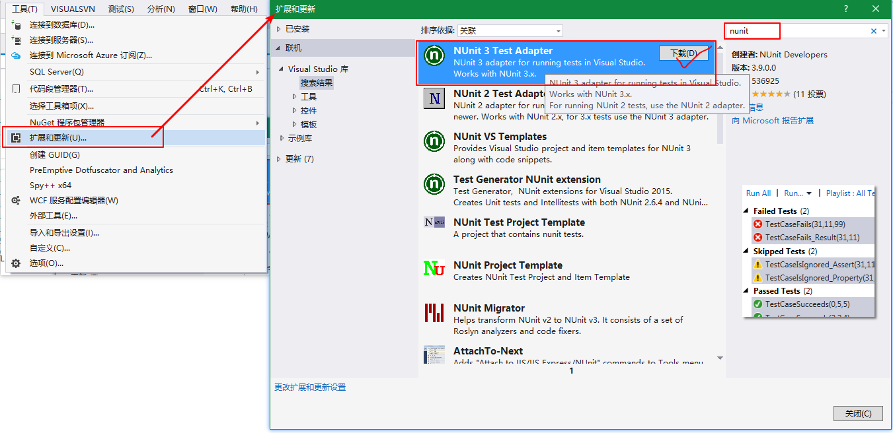
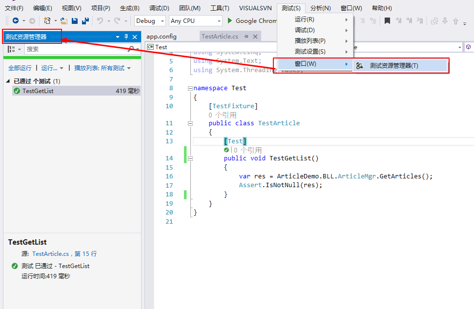

<!-- TOC -->

- [UnitTest](#unittest)
    - [Nunit](#nunit)
        - [特性Attribute](#特性attribute)
        - [安装及应用](#安装及应用)
            - [安装](#安装)
            - [创建测试方法](#创建测试方法)
            - [进行测试](#进行测试)
    - [MS Test](#ms-test)
    - [Bogus](#bogus)

<!-- /TOC -->

<a id="markdown-unittest" name="unittest"></a>
# UnitTest
单元测试（unit testing），是指对软件中的最小可测试单元进行检查和验证。

总的来说，单元就是人为规定的最小的被测功能模块。单元测试是在软件开发过程中要进行的最低级别的测试活动，软件的独立单元将在与程序的其他部分相隔离的情况下进行测试。

简单来说，就是为了在新增/修改/重构功能的时候，对以前、当前的功能进行测试，以节省时间成本，减少bug提高质量。

<a id="markdown-nunit" name="nunit"></a>
## Nunit
NUnit is a unit-testing framework for all .Net languages. Initially ported from JUnit, the current production release, version 3, has been completely rewritten with many new features and support for a wide range of .NET platforms.

http://nunit.org/

<a id="markdown-特性attribute" name="特性attribute"></a>
### 特性Attribute
NUnit使用自定义属性来标识测试。所有的Nunit特性都包含在NUnit.Framework命名空间中。

列举常用的几种特性：

Attribute | Usage
----------|------
TestFixture Attribute | 此特性标记一个类包含有测试方法，必须是一个公开类型。
Test Attribute | 标记一个在标记为TestFixture的类中指定的方法为测试方法
SetUp Attribute | 在一个TestFixture中提供一个通用的功能集，这个功能集在每个测试方法调用前执行。一个TestFixture 只能有一个SetUp方法。
TearDown Attribute | 在一个TestFixture中提供一个通用的功能集，这个功能集在每个测试方法运行后执行。一个TestFixture只能有一个TearDown方法。

<a id="markdown-安装及应用" name="安装及应用"></a>
### 安装及应用

<a id="markdown-安装" name="安装"></a>
#### 安装
我们以一个简单三层的案例来进行Nunit的示例，添加Test项目并通过NuGet包管理器添加对Nunit的引用：



<a id="markdown-创建测试方法" name="创建测试方法"></a>
#### 创建测试方法
针对上一步添加的【Test】项目添加引用，我们针对BLL业务逻辑的接口进行单元测试，添加对BLL和MODEL层的引用，如下：



由于我们需要通过单元测试模拟UI层的调用，测试的接口包含有数据访问，所以对应单元测试项目也要添加相应的配置文件包含数据库连接字符串。如下：



```xml
<?xml version="1.0" encoding="utf-8" ?>
<configuration>
  <appSettings>
    <add key="ConnStr" value="server=.;database=ARTICLE_DB;uid=sa;pwd=1;"/>
  </appSettings>
</configuration>
```

添加测试类【TestArticle.cs】，内容如下：
```cs
[TestFixture]
public class TestArticle
{
    [Test]
    public void TestGetList()
    {
        var res = ArticleDemo.BLL.ArticleMgr.GetArticles();
        Assert.IsNotNull(res);
    }
}
```

<a id="markdown-进行测试" name="进行测试"></a>
#### 进行测试

在进行Nunit单元测试的运行时，需要安装TestAdapter适配器，如果已经安装过请略过此步骤。



调出测试资源管理器窗口，在测试资源管理器中会自动显示当前测试项目已经添加的单元测试方法，如图：



接下来，我们就可以进行运行和调试，在【测试资源管理器】窗口中运行或者选择进行调试：


<a id="markdown-ms-test" name="ms-test"></a>
## MS Test
微软提供的单元测试，更多内容请自行查阅

> http://www.cnblogs.com/ColdJokeLife/p/3158812.html

<a id="markdown-bogus" name="bogus"></a>
## Bogus
Bogus一个简单而强大的假数据生成器,用于C#,F#和VB.NET.从著名的faker.js移植过来.

在测试或者需要一些虚拟的数据时,Bogus就可以派上用场了.这是一个移植自faker.js的一个.NET的库,帮助你快速生成看起来有意义的假数据.

快速上手：

Nuget包管理器安装【Bogus】包，单元测试中模拟构建数据：

```cs
[TestMethod]
public void TestAddProduct()
{
    /*
    Product entity = new Product();
    entity.ProductName = "日光灯";
    entity.ProductID = 200;
    entity.Price = 20;
    entity.ProductStockNumber = 100;
    */

    var entity = new Bogus.Faker<Product>("zh_CN") // 使用中文数据，目前仅对名称有效
          .RuleFor(t => t.ProductID, f => f.Random.Int())// 生成Int.MinValue到Int.MaxValue随机数
          .RuleFor(t => t.ProductName, f => f.Commerce.ProductName())// 获取随机的产品名称。
          .RuleFor(t => t.ProductStockNumber, f => f.Random.Number(1, 100)) // 1-100 随机值
          .RuleFor(t => t.Price, f => f.Finance.Random.Double(0, 1000));// 随机浮点数 0-1000之间

    bool res = ProductMgr.AddProduct(entity);

    Assert.IsTrue(res);
}
```

> https://github.com/bchavez/Bogus#bogus-api-support


---

参考引用：

[nunit/docs](https://github.com/nunit/docs/wiki/Installation)

[nunit2.6.4-docs](http://nunit.org/docs/2.6.4/docHome.html)

[C#单元测试，带你快速入门](https://www.cnblogs.com/zhaopei/p/UnitTesting.html)


