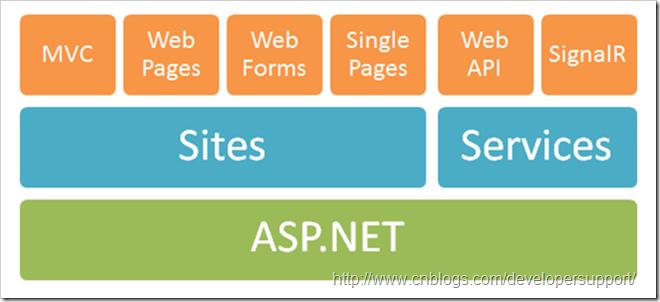
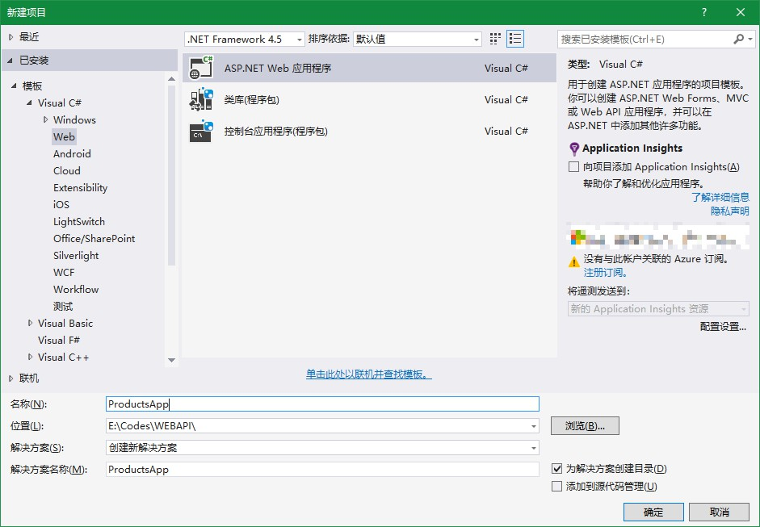
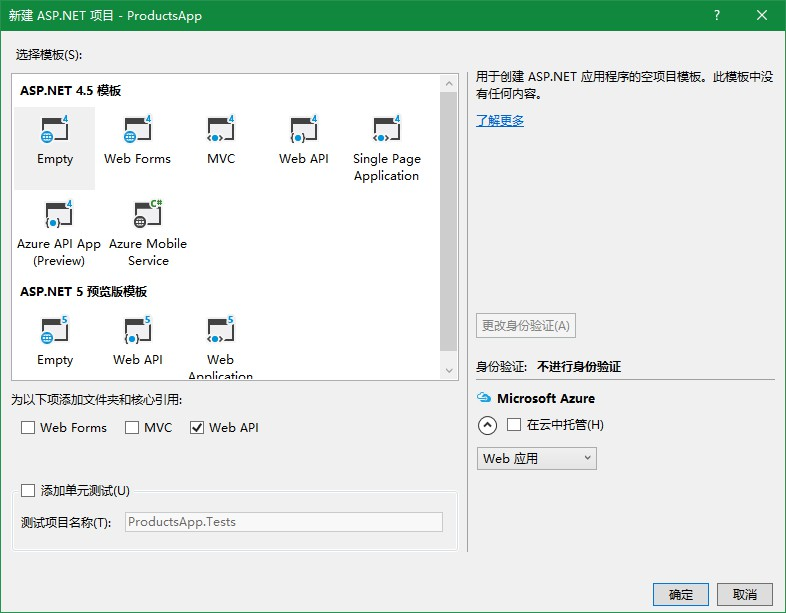
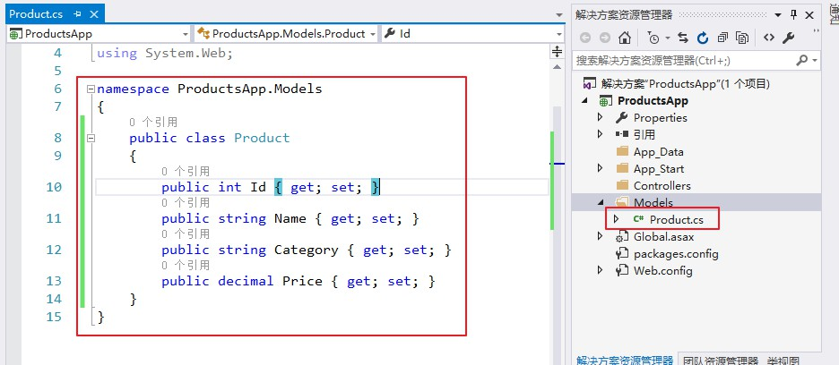
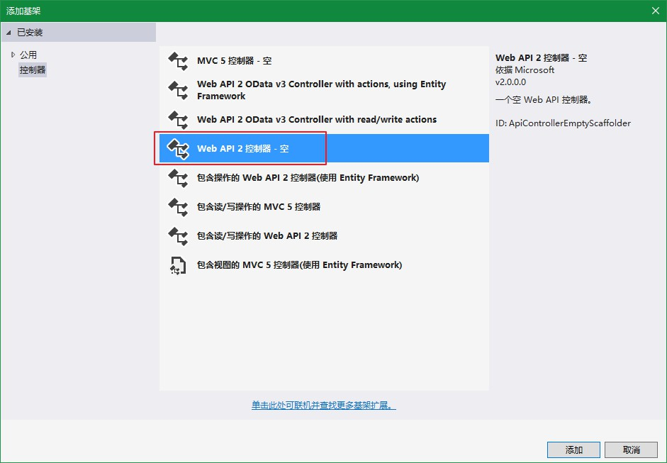
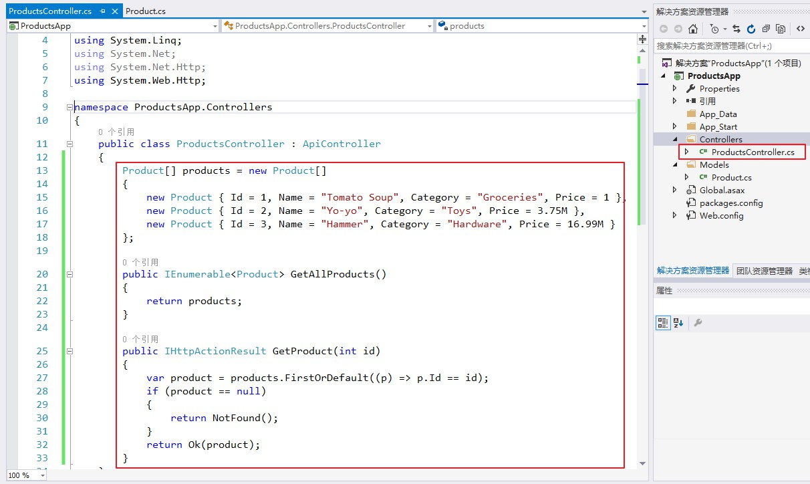
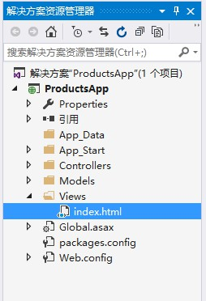
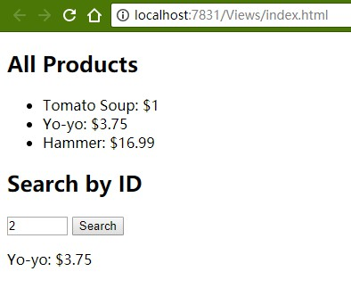

<!-- TOC -->

- [WebAPI](#webapi)
    - [概念](#概念)
        - [什么是WebAPI](#什么是webapi)
        - [为什么用WebAPI](#为什么用webapi)
        - [功能简介](#功能简介)
        - [Web API vs MVC](#web-api-vs-mvc)
        - [Web API vs WCF](#web-api-vs-wcf)
    - [入门项目](#入门项目)
        - [创建项目](#创建项目)
        - [新建Model和Controller](#新建model和controller)
        - [前端模拟交互](#前端模拟交互)
    - [操作结果](#操作结果)
    - [路由](#路由)
        - [路由表](#路由表)

<!-- /TOC -->

<a id="markdown-webapi" name="webapi"></a>
# WebAPI

Web API是一个比较宽泛的概念。这里我们提到Web API特指ASP.NET Web API。

这篇文章中我们主要介绍Web API的主要功能以及与其他同类型框架的对比，最后通过一些相对复杂的实例展示如何通过Web API构建http服务，同时也展示了Visual Studio构建.net项目的各种强大。

<a id="markdown-概念" name="概念"></a>
## 概念

<a id="markdown-什么是webapi" name="什么是webapi"></a>
### 什么是WebAPI
官方定义如下，强调两个关键点，即可以对接各种客户端（浏览器，移动设备），构建http服务的框架。

> ASP.NET Web API is a framework that makes it easy to build HTTP services that reach a broad range of clients, including browsers and mobile devices. ASP.NET Web API is an ideal platform for building RESTful applications on the .NET Framework.


Web API在ASP.NET完整框架中地位如下图，与SignalR一起同为构建Service的框架。



Web API负责构建http常规服务，而SingalR主要负责的是构建实时服务，例如股票，聊天室，在线游戏等实时性要求比较高的服务。

<a id="markdown-为什么用webapi" name="为什么用webapi"></a>
### 为什么用WebAPI
Web API最重要的是可以构建面向各种客户端的服务。另外与WCF REST Service不同在于，Web API利用Http协议的各个方面来表达服务(例如 URI/request response header/caching/versioning/content format)，因此就省掉很多配置。


当你遇到以下这些情况的时候，就可以考虑使用Web API了。
* 需要Web Service但是不需要SOAP
* 需要在已有的WCF服务基础上建立non-soap-based http服务
* 只想发布一些简单的Http服务，不想使用相对复杂的WCF配置
* 发布的服务可能会被带宽受限的设备访问
* 希望使用开源框架，关键时候可以自己调试或者自定义一下框架

<a id="markdown-功能简介" name="功能简介"></a>
### 功能简介
Web API的主要功能
1. 支持基于Http verb (GET, POST, PUT, DELETE)的CRUD (create, retrieve, update, delete)操作。通过不同的http动作表达不同的含义，这样就不需要暴露多个API来支持这些基本操作。
2. 请求的回复通过Http Status Code表达不同含义，并且客户端可以通过Accept header来与服务器协商格式，例如你希望服务器返回JSON格式还是XML格式。
3. 请求的回复格式支持 JSON，XML，并且可以扩展添加其他格式。
4. 原生支持OData。
5. 支持Self-host或者IIS host。
6. 支持大多数MVC功能，例如Routing/Controller/Action Result/Filter/Model Builder/IOC Container/Dependency Injection。

<a id="markdown-web-api-vs-mvc" name="web-api-vs-mvc"></a>
### Web API vs MVC
你可能会觉得Web API 与MVC很类似，他们有哪些不同之处呢？先上图，这就是他们最大的不同之处。


详细点说他们的区别：
* MVC主要用来构建网站，既关心数据也关心页面展示，而Web API只关注数据
* Web API支持格式协商，客户端可以通过Accept header通知服务器期望的格式
* Web API支持Self Host，MVC目前不支持
* Web API通过不同的http verb表达不同的动作(CRUD)，MVC则通过Action名字表达动作
* Web API内建于ASP.NET System.Web.Http命名空间下，MVC位于System.Web.Mvc命名空间下，因此model binding/filter/routing等功能有所不同
* 最后，Web API非常适合构建移动客户端服务

<a id="markdown-web-api-vs-wcf" name="web-api-vs-wcf"></a>
### Web API vs WCF
发布服务在Web API和WCF之间该如何取舍呢？这里提供些简单地判断规则，

* 如果服务需要支持One Way Messaging/Message Queue/Duplex Communication，选择WCF
* 如果服务需要在TCP/Named Pipes/UDP (wcf 4.5)，选择WCF
* 如果服务需要在http协议上，并且希望利用http协议的各种功能，选择Web API
* 如果服务需要被各种客户端(特别是移动客户端)调用，选择Web API

<a id="markdown-入门项目" name="入门项目"></a>
## 入门项目
<a id="markdown-创建项目" name="创建项目"></a>
### 创建项目
在模板窗格中，选择已安装的模板展开Visual C# 节点。 下Visual C#，选择Web。 在项目模板列表中选择ASP.NET Web 应用程序。 

命名项目"ProductsApp"，然后单击确定。



在中新建 ASP.NET 项目对话框中，选择空模板。 下"添加文件夹和核心引用"，检查Web API。 单击 “确定”。



<a id="markdown-新建model和controller" name="新建model和controller"></a>
### 新建Model和Controller

新建Model：



```cs
namespace ProductsApp.Models
{
    public class Product
    {
        public int Id { get; set; }
        public string Name { get; set; }
        public string Category { get; set; }
        public decimal Price { get; set; }
    }
}
```

新建控制器,在添加基架对话框中，选择Web API 控制器-空，如图：



将控制器命名"ProductsController"。修改控制器内容如下：



```cs
public class ProductsController : ApiController
{
    Product[] products = new Product[]
    {
        new Product { Id = 1, Name = "Tomato Soup", Category = "Groceries", Price = 1 },
        new Product { Id = 2, Name = "Yo-yo", Category = "Toys", Price = 3.75M },
        new Product { Id = 3, Name = "Hammer", Category = "Hardware", Price = 16.99M }
    };

    public IEnumerable<Product> GetAllProducts()
    {
        return products;
    }

    public IHttpActionResult GetProduct(int id)
    {
        var product = products.FirstOrDefault((p) => p.Id == id);
        if (product == null)
        {
            return NotFound();
        }
        return Ok(product);
    }
}
```

* GetAllProducts方法返回作为产品的整个列表IEnumerable<产品> 类型。
* GetProduct方法查找单个产品通过其 id。

<a id="markdown-前端模拟交互" name="前端模拟交互"></a>
### 前端模拟交互

选择Web节点下的Visual C#，然后选择HTML 页项。 将该页命名为"index.html"。



```html
<!DOCTYPE html>
<html>
<head>
    <title>Product App</title>
</head>
<body>

    <div>
        <h2>All Products</h2>
        <ul id="products" />
    </div>
    <div>
        <h2>Search by ID</h2>
        <input type="text" id="prodId" size="5" />
        <input type="button" value="Search" onclick="find();" />
        <p id="product" />
    </div>

    <!--此处使用的是Microsoft Ajax CDN-->
    <script src="https://ajax.aspnetcdn.com/ajax/jQuery/jquery-2.0.3.min.js"></script>
    <script>
        //注意此处开始需要有 斜杠'/'，否则会因为路径的问题导致数据获取有误
        var uri = '/api/products';

        $(document).ready(function () {
            // Send an AJAX request
            $.getJSON(uri)
                .done(function (data) {
                    // On success, 'data' contains a list of products.
                    $.each(data, function (key, item) {
                        // Add a list item for the product.
                        $('<li>', { text: formatItem(item) }).appendTo($('#products'));
                    });
                });
        });

        function formatItem(item) {
            return item.Name + ': $' + item.Price;
        }

        function find() {
            var id = $('#prodId').val();
            $.getJSON(uri + '/' + id)
                .done(function (data) {
                    $('#product').text(formatItem(data));
                })
                .fail(function (jqXHR, textStatus, err) {
                    $('#product').text('Error: ' + err);
                });
        }
    </script>
</body>
</html>
```

开始调试应用程序。 网页应如下所示：



<a id="markdown-操作结果" name="操作结果"></a>
## 操作结果

Web API 控制器操作可以返回以下任一项：

返回类型 | Web API 创建响应的方式
-----|----------------
void | 返回空 204 （无内容）
HttpResponseMessage | 转换为直接 HTTP 响应消息。
IHttpActionResult | 调用ExecuteAsync来创建HttpResponseMessage，然后将转换为 HTTP 响应消息。
其他类型 | 将序列化的返回值写入到响应正文中;返回 200 （正常）。

<a id="markdown-路由" name="路由"></a>
## 路由

<a id="markdown-路由表" name="路由表"></a>
### 路由表

在 ASP.NET Web API 中，控制器是处理 HTTP 请求的类。 调用控制器的公共方法操作方法或只需操作。 当 Web API 框架收到请求时，它将请求路由到某个操作。

若要确定要调用的操作，框架将使用路由表。 【WebApiConfig.cs】文件

```cs
routes.MapHttpRoute(
    name: "API Default",
    routeTemplate: "api/{controller}/{id}",
    defaults: new { id = RouteParameter.Optional }
);
```

路由表中的每个条目包含路由模板。 Web API 的默认路由模板"api / {controller} / {id}"。 在此模板中， "api"是文本路径段和 {controller} 和 {id} 是占位符变量。

Web API 框架接收 HTTP 请求时，它尝试匹配根据一个路由表中的路由模板的 URI。 如果没有路由匹配，客户端收到 404 错误。 例如，下面的 Uri 匹配的默认路由：

* / api/联系人
* /api/contacts/1
* /api/products/gizmo1

但是，下面的 URI 不匹配，因为它缺少"api"段：

* / contacts/1

> 在路由中使用"api"的原因是避免使用 ASP.NET MVC 路由冲突。 这样一来，可以具有"/contacts"转到 MVC 控制器，并"/api/contacts"转到 Web API 控制器。 当然，如果您不喜欢这种约定，您可以更改默认路由表。

一旦找到匹配的路由，Web API 选择控制器和操作：

* 若要查找控制器，Web API 将添加"控制器"的值 {controller} 变量。
* 若要查找操作，Web API 的 HTTP 方法，将查看，然后查找其名称以与该 HTTP 方法名称的操作。 例如，使用 GET 请求，Web API 查找操作以开头的"GET..."，如"GetContact"或"GetAllContacts"。 此约定仅适用于GET、 POST、 PUT 和 DELETE 方法。 可以通过在控制器上使用属性来启用其他 HTTP 方法。 我们将看到一个示例说明更高版本。
* 其他占位符变量在路由模板中，如 {id} 映射到操作参数。

让我们看一个示例。 假设定义以下控制器：
```cs
public class ProductsController : ApiController
{
    public IEnumerable<Product> GetAllProducts() { }
    public Product GetProductById(int id) { }
    public HttpResponseMessage DeleteProduct(int id){ }
}
```

下面是一些可能的 HTTP 请求，以及每个调用的操作：

HTTP 方法 | URI 路径 | 操作 | 参数
--------|--------|----|---
GET | api/products | GetAllProducts | （无）
GET | api/products/4 | GetProductById | 4
DELETE | api/products/4 | DeleteProduct | 4

请注意， {id} 段的 URI，如果存在，将映射到id操作的操作参数。 在此示例中，控制器定义了两个 GET 方法，另一个使用id参数，另一个不带任何参数。

以上，为默认的apil路由，相比较mvc的路由缺少了{action}段，在使用上来看并没有那么方便。

我们可以在路由中包含action操作名称来解决这个问题，修改【WebApiConfig.cs】文件新增action段如下：

```cs
routes.MapHttpRoute(
    name: "ActionApi",
    routeTemplate: "api/{controller}/{action}/{id}",
    defaults: new { id = RouteParameter.Optional }
);
```

在此路由模板中， {action} 参数名称在控制器上的操作方法。 使用此样式的路由，使用属性来指定允许的 HTTP 方法。

例如，假设您的控制器具有以下方法：

```cs
public class ProductsController : ApiController
{
    [HttpGet]
    public string Details(int id);
}
```

在这种情况下，"api/products/Details/1"的 GET 请求将映射到的详细信息的方法。 

这种路由是类似于 ASP.NET MVC 中，并可能适用于 RPC 样式 API。


可以通过重写操作的名称ActionName属性。 在以下示例中，有两个操作映射到"api/products/thumbnail/id"。

一种支持 GET方法 和另一种支持 POST方法 ：

```cs
public class ProductsController : ApiController
{
    [HttpGet]
    [ActionName("Thumbnail")]
    public HttpResponseMessage GetThumbnailImage(int id);

    [HttpPost]
    [ActionName("Thumbnail")]
    public void AddThumbnailImage(int id);
}
```

若要防止为一个操作中调用一个action，使用NonAction属性。 NonAction表明该方法并非一个action，即使它符合路由规则。

```cs
// Not an action method.
[NonAction]  
public string GetPrivateData() { ... }
```

尝试访问会返回：No action was found on the controller 'ControllerName' that matches the name 'ActionName'.

WebAPI对于复杂对象的传递也十分的方便，如下：

```cs
static List<Product> listProducts = new List<Product>();
/// <summary>
/// 使用 x-www-form-urlencoded 键值对方式发送数据，使用$.ajax()默认类型发送请求
/// </summary>
/// <param name="pro"></param>
/// <returns></returns>
public IHttpActionResult SaveProduct(Product pro)
{
    if (null != pro)
    {
        listProducts.Add(pro);
    }
    return Ok(listProducts);
}
```

> https://www.cnblogs.com/guyun/p/4589115.html

> https://docs.microsoft.com/zh-cn/aspnet/web-api/overview/getting-started-with-aspnet-web-api/tutorial-your-first-web-api

webapi 用户验证

https://www.cnblogs.com/landeanfen/p/5287064.html#_label3_0

