<!-- TOC -->

- [安装](#安装)
    - [启用或关闭windows应用](#启用或关闭windows应用)
        - [打开控制面板](#打开控制面板)
        - [选择程序](#选择程序)
        - [打开或关闭windows功能](#打开或关闭windows功能)
    - [启用IIS功能](#启用iis功能)
        - [如下图所示勾选功能](#如下图所示勾选功能)
        - [启用功能成功](#启用功能成功)
- [打开IIS](#打开iis)
    - [方法1 开始菜单-管理工具-IIS](#方法1-开始菜单-管理工具-iis)
    - [方法2 运行命令中输入 inetmgr（推荐，高逼格）](#方法2-运行命令中输入-inetmgr推荐高逼格)
    - [方法3 桌面上右键点击此电脑，管理](#方法3-桌面上右键点击此电脑管理)
    - [进入IIS管理器](#进入iis管理器)
- [简单测试](#简单测试)
    - [默认Default Web Site](#默认default-web-site)
    - [简单静态页面测试](#简单静态页面测试)
        - [新建html页面](#新建html页面)
        - [添加网站](#添加网站)
        - [添加默认文档](#添加默认文档)
        - [浏览测试](#浏览测试)
- [MVC项目的发布](#mvc项目的发布)
    - [使用文件系统发布](#使用文件系统发布)
    - [添加站点](#添加站点)
    - [发布到IIS网站调试](#发布到iis网站调试)
- [疑难杂症](#疑难杂症)
    - [启用windows功能报错 0x80070057](#启用windows功能报错-0x80070057)

<!-- /TOC -->
<a id="markdown-安装" name="安装"></a>
# 安装
<a id="markdown-启用或关闭windows应用" name="启用或关闭windows应用"></a>
## 启用或关闭windows应用

<a id="markdown-打开控制面板" name="打开控制面板"></a>
### 打开控制面板

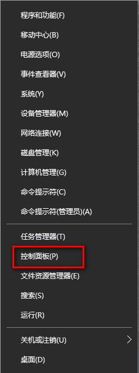 

<a id="markdown-选择程序" name="选择程序"></a>
### 选择程序

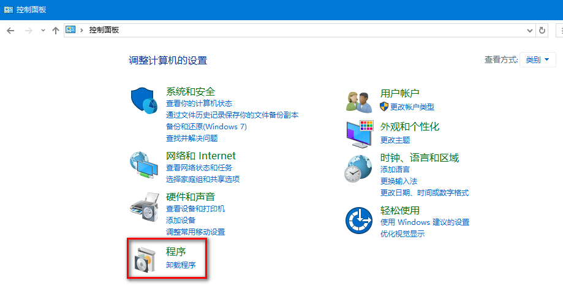

<a id="markdown-打开或关闭windows功能" name="打开或关闭windows功能"></a>
### 打开或关闭windows功能

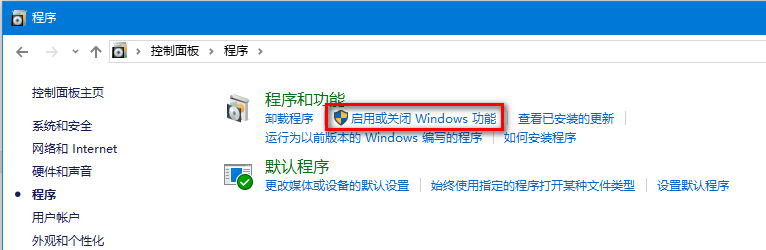

<a id="markdown-启用iis功能" name="启用iis功能"></a>
## 启用IIS功能

<a id="markdown-如下图所示勾选功能" name="如下图所示勾选功能"></a>
### 如下图所示勾选功能

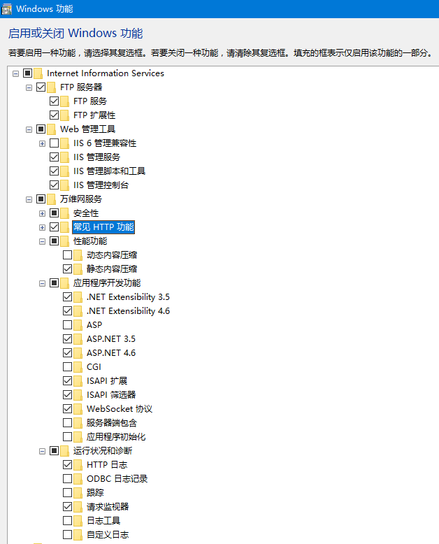

<a id="markdown-启用功能成功" name="启用功能成功"></a>
### 启用功能成功

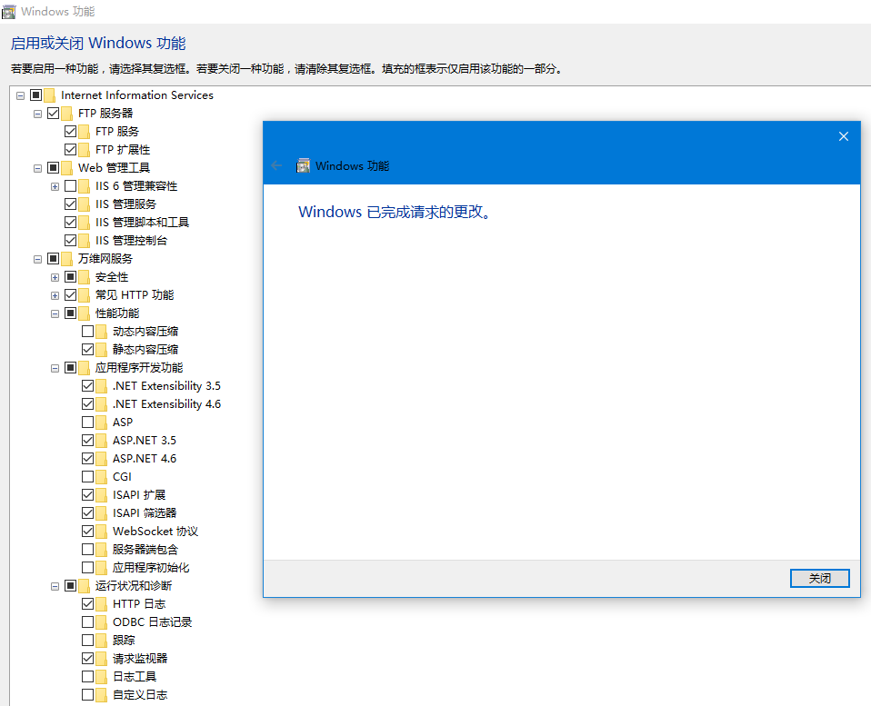

<a id="markdown-打开iis" name="打开iis"></a>
# 打开IIS

<a id="markdown-方法1-开始菜单-管理工具-iis" name="方法1-开始菜单-管理工具-iis"></a>
## 方法1 开始菜单-管理工具-IIS

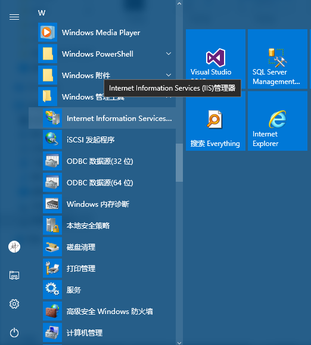

<a id="markdown-方法2-运行命令中输入-inetmgr推荐高逼格" name="方法2-运行命令中输入-inetmgr推荐高逼格"></a>
## 方法2 运行命令中输入 inetmgr（推荐，高逼格）

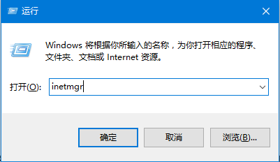

<a id="markdown-方法3-桌面上右键点击此电脑管理" name="方法3-桌面上右键点击此电脑管理"></a>
## 方法3 桌面上右键点击此电脑，管理

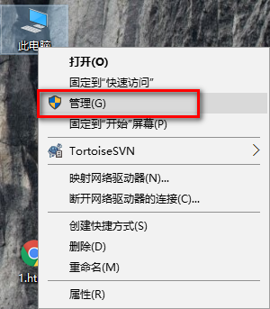

<a id="markdown-进入iis管理器" name="进入iis管理器"></a>
## 进入IIS管理器

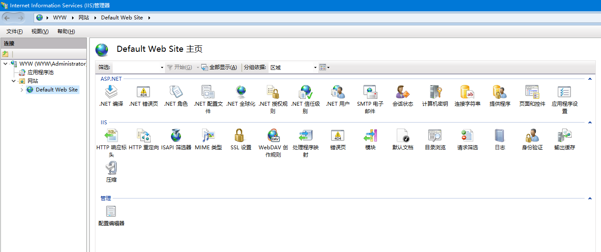

<a id="markdown-简单测试" name="简单测试"></a>
# 简单测试

<a id="markdown-默认default-web-site" name="默认default-web-site"></a>
## 默认Default Web Site

默认网站的端口为80，可在浏览器中测试：
>http://localhost

>http://localhost:80

>http://127.0.0.1

出现如下界面表示启用IIS成功

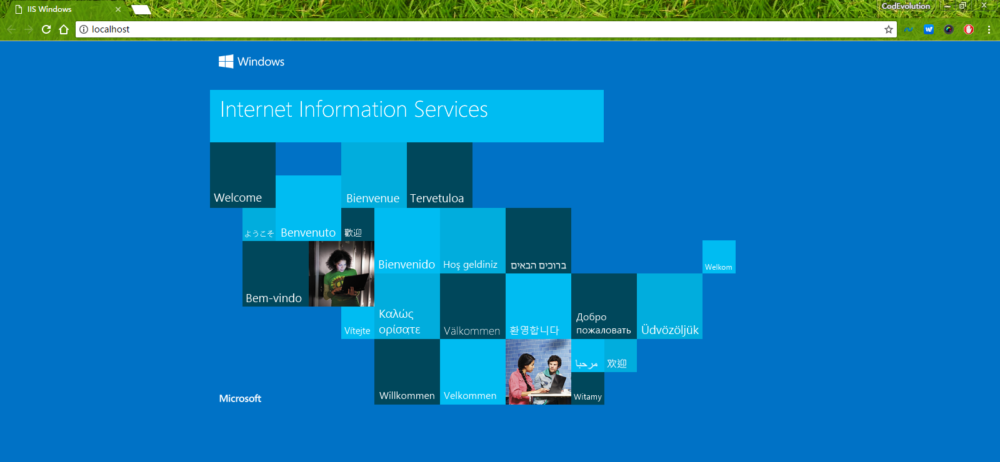

<a id="markdown-简单静态页面测试" name="简单静态页面测试"></a>
## 简单静态页面测试

<a id="markdown-新建html页面" name="新建html页面"></a>
### 新建html页面
新建一个html静态页面，内容如下：
``` html
<!DOCTYPE html>
<html>
<head>
    <meta charset="utf-8" />
    <title>测试页面</title>
    <style type="text/css">
        .center {
            text-align: center;
        }
    </style>
</head>
<body>

    <header class="center">HTML测试页面</header>
    <h1>标题一</h1>
    <hr />
    <p>段落</p>
    <footer class="center">Copyright</footer>
</body>
</html>

```

文件保存物理路径为 D:\release\myWeb\1.html

<a id="markdown-添加网站" name="添加网站"></a>
### 添加网站

IIS管理器添加一个网站

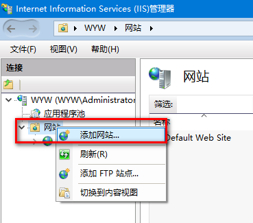

网站名称随意，与文件目录名称无关，应用程序池可新建也可使用默认添加的。

物理路径一定要选择上一步保存的【D:\release\myWeb\】。

端口号默认80已经被默认网站占用，需要重新设置，简单引申下【端口号】。

 从1-65535，其中从1-1023叫知名端口号，也叫源端口号。这些端口是被tcp和udp定义了的端口，从1024-49151叫做已注册端口号，被一些公司用于自己的某种协议。49152-65535叫动态分配端口号，是我们随便可以用的。

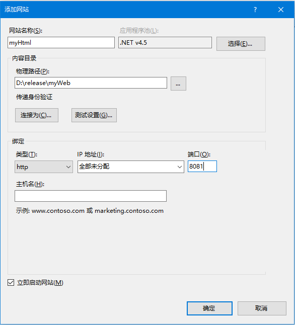

<a id="markdown-添加默认文档" name="添加默认文档"></a>
### 添加默认文档

IIS管理器中选择刚刚添加的网站，添加默认文档

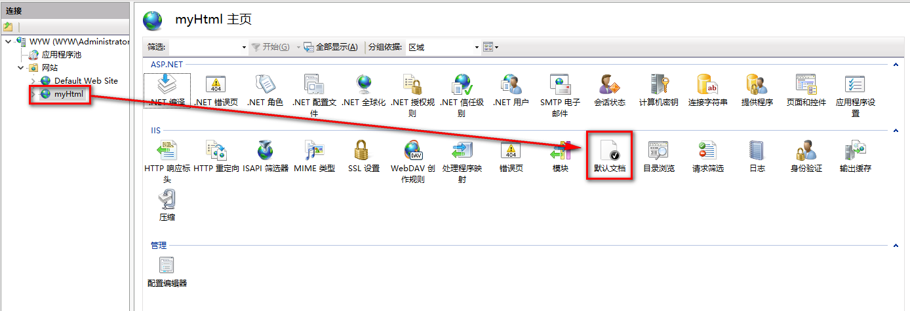

添加文件名称，与添加的静态页面文件名称保持一致

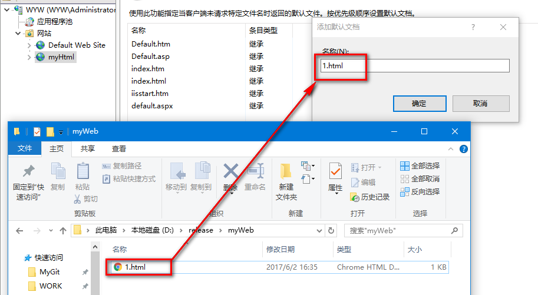

<a id="markdown-浏览测试" name="浏览测试"></a>
### 浏览测试

浏览器中输入地址测试

>http://localhost:8081

返回默认文档 1.html成功！

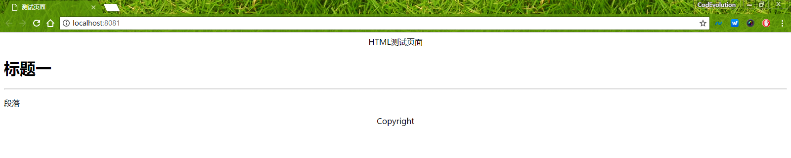

<a id="markdown-mvc项目的发布" name="mvc项目的发布"></a>
# MVC项目的发布
<a id="markdown-使用文件系统发布" name="使用文件系统发布"></a>
## 使用文件系统发布
设置MVC项目为启动项

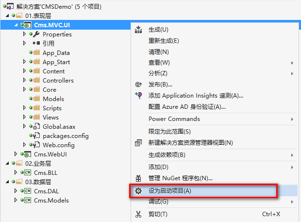

UI项目右键选择【发布】选项

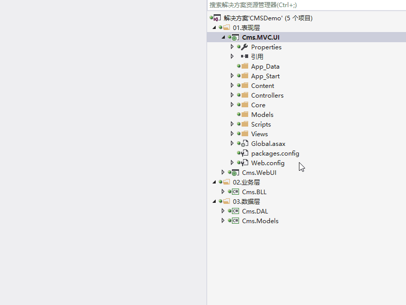

编译成功，发布成功

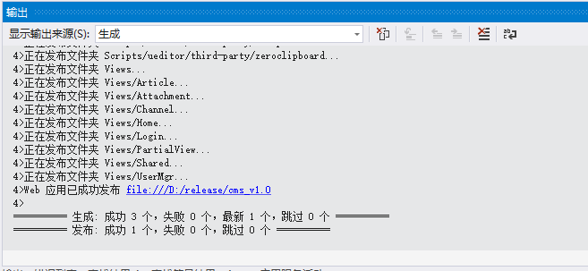

生成bin包到指定目录

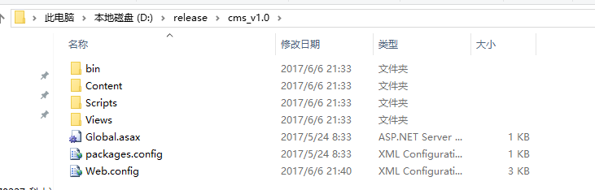

<a id="markdown-添加站点" name="添加站点"></a>
## 添加站点

添加一个站点，注意物理路径对应上一步生成的bin包路径

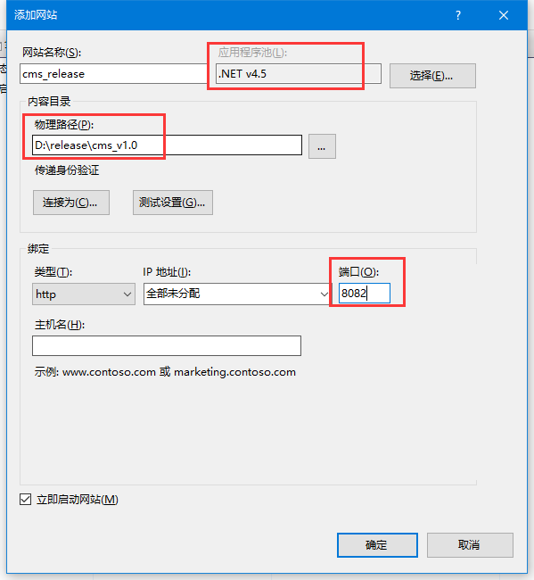

直接访问即可 
>http://localhost:8082

<a id="markdown-发布到iis网站调试" name="发布到iis网站调试"></a>
## 发布到IIS网站调试
发布到IIS的网站如何进入调试，与IDE自带的IIS Express调试不同

MVC项目上右键选择【属性】-【Web】选项，将服务器修改为"本地IIS"，
项目URL修改为对应目录

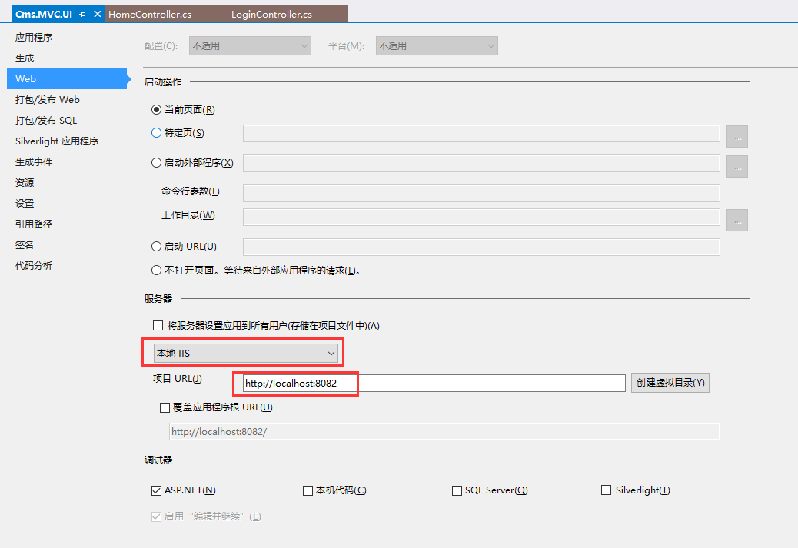

直接调试（F5）即可进入调试状态

<a id="markdown-疑难杂症" name="疑难杂症"></a>
# 疑难杂症
<a id="markdown-启用windows功能报错-0x80070057" name="启用windows功能报错-0x80070057"></a>
## 启用windows功能报错 0x80070057
环境是win10专业版，参数错误

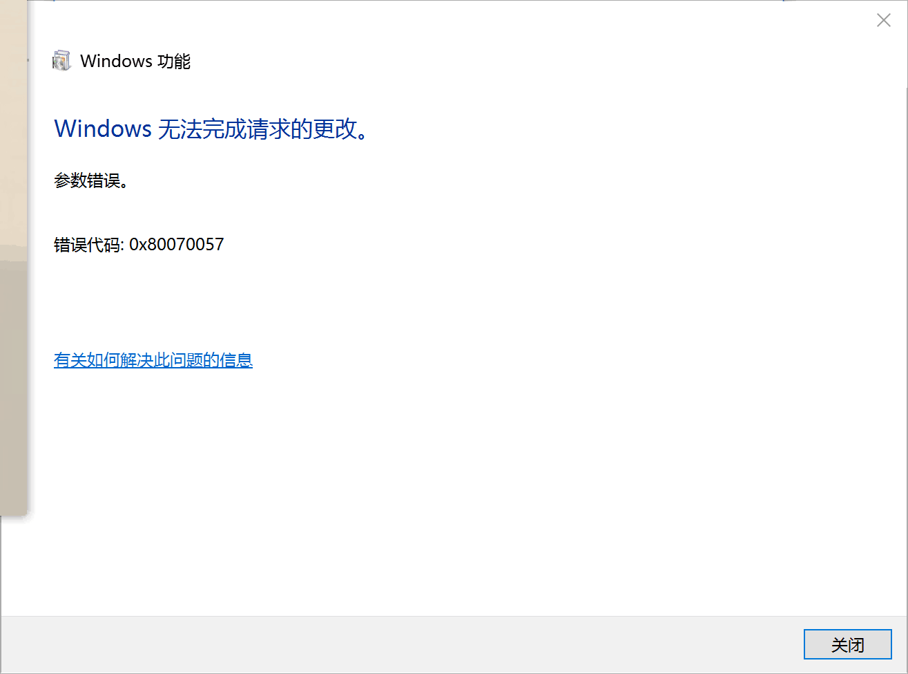

尝试解决方案有：
- 打开windows update服务，更新到最新，无效；
- 修改注册表项IsConvergedUpdateStackEnabled，无法保存；


