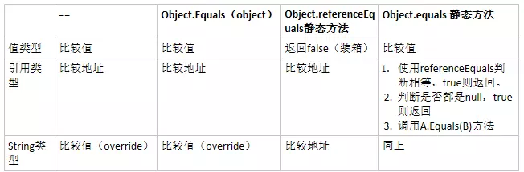

<!-- TOC -->

- [专题](#专题)
    - [Equals和==](#equals和)
    - [MD5加密](#md5加密)
    - [上传文件](#上传文件)
        - [form表单方式上传](#form表单方式上传)
        - [FormData对象上传](#formdata对象上传)
        - [使用组件上传](#使用组件上传)
    - [下载文件](#下载文件)
    - [echart统计图表](#echart统计图表)
    - [富文本编辑](#富文本编辑)

<!-- /TOC -->

<a id="markdown-专题" name="专题"></a>
# 专题

<a id="markdown-equals和" name="equals和"></a>
## Equals和==




<a id="markdown-md5加密" name="md5加密"></a>
## MD5加密
MD5的全称是Message-Digest Algorithm 5（信息-摘要算法），

在90年代初由MIT Laboratory for Computer Science和RSA Data Security Inc的Ronald L. Rivest开发出来，经MD2、MD3和MD4发展而来。

MD5 是不可逆算法，解密只能通过暴力破解的方式。

```cs
string clearText = "hello world";

// 构造一个MD5对象
MD5 md5 = new MD5CryptoServiceProvider();
string cipherText = BitConverter.ToString(md5.ComputeHash(Encoding.UTF8.GetBytes(clearText))).Replace("-", "");
```

<a id="markdown-上传文件" name="上传文件"></a>
## 上传文件

<a id="markdown-form表单方式上传" name="form表单方式上传"></a>
### form表单方式上传
使用表单上传附件，一定要将enctype属性设置为"multipart/form-data"，如下所示：

```html
<form id="form1" action="/Home/GetFormFile" method="post" enctype="multipart/form-data" >
    <input type="file"  name="myFile" />
    <input type="submit" id="btnUpload" />
</form>
```

对应控制器中的action如下：
```cs
/// <summary>
/// 处理表单上传的附件
/// myFile为上传的附件，或者使用Request.Files[0]获取上传附件，同样的作用
/// </summary>
/// <param name="myFile">myFile与表单中上传控件的name属性对应</param>
/// <returns></returns>
public JsonResult GetFormFile(HttpPostedFileBase myFile)
{
    // 构造上传附件保存的目录，AppDomain.CurrentDomain.BaseDirectory为程序基路径
    string path = Path.Combine(AppDomain.CurrentDomain.BaseDirectory, "UploadFiles");
    if (!Directory.Exists(path))
    {
        Directory.CreateDirectory(path);
    }
    // 将文件保存至服务端，文件方式存储
    myFile.SaveAs(Path.Combine(path, myFile.FileName));
    return Json(new { Status = true });
}
```

文件上传后保存至程序基路径下【UploadFiles】文件夹内

<a id="markdown-formdata对象上传" name="formdata对象上传"></a>
### FormData对象上传

使用FormData通过ajax上传，解决了表单提交刷新页面的问题

```html
<div>
    <input type="file" name="file2" id="file2" />
    <input type="text" id="txtName" />
    <button id="btnUp">提交</button>
</div>

<script>
    $('#btnUp').click(function () {
        // 构造FormData对象
        var formData = new FormData();
        // 添加附件信息
        formData.append('myFile', document.getElementById('file2').files[0]);
        // 添加传值
        formData.append('name', $('#txtName').val());
        $.ajax({
            url: '/Home/GetAjaxFile',
            type: 'POST',
            data: formData,
            //必须false才会避开jQuery对 formdata 的默认处理.XMLHttpRequest会对 formdata 进行正确的处理.
            processData: false,
            //必须false才会自动加上正确的Content-Type
            contentType: false,
            success: function (resp) {
                //...
            }
        });
    });
</script>
```

对应控制器中action如下：
```cs
/// <summary>
/// 处理ajax上传的文件
/// </summary>
/// <param name="myFile"></param>
/// <returns></returns>
public JsonResult GetAjaxFile(HttpPostedFileBase myFile, string name)
{
    // 构造上传附件保存的目录，AppDomain.CurrentDomain.BaseDirectory为程序基路径
    string path = Path.Combine(AppDomain.CurrentDomain.BaseDirectory, "UploadFiles");
    if (!Directory.Exists(path))
    {
        Directory.CreateDirectory(path);
    }
    // 将文件保存至服务端，文件方式存储
    myFile.SaveAs(Path.Combine(path, myFile.FileName));
    return Json(new { Status = true });
}
```

使用ajax方式进行提交，可定制化程度更高一些，在传附件的同时也可以传值

<a id="markdown-使用组件上传" name="使用组件上传"></a>
### 使用组件上传

例如layui中的upload组件

> https://www.layui.com/demo/upload.html


<a id="markdown-下载文件" name="下载文件"></a>
## 下载文件

通过物理路径进行下载
```cs
/// <summary>
/// 下载文件
/// </summary>
/// <param name="filePath"></param>
/// <returns></returns>
public FileResult DownFile(string filePath)
{
    // 获取文件的contentType
    string mimetype = MimeMapping.GetMimeMapping(filePath);
    return File(filePath, mimetype, Path.GetFileName(filePath));
}
```

需要注意的是，实际下载文件操作都是从数据库中读取文件信息，通过保存的路径和名称信息进行下载。

如果多个文件下载，会打包后再进行下载。添加压缩和解压缩可以参考SharpZipLib库。

<a id="markdown-echart统计图表" name="echart统计图表"></a>
## echart统计图表

<a id="markdown-富文本编辑" name="富文本编辑"></a>
## 富文本编辑

