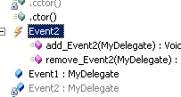

<!-- TOC -->

- [面试](#面试)
    - [编程基础](#编程基础)
        - [值类型和引用类型区别](#值类型和引用类型区别)
        - [抽象类和接口的区别？](#抽象类和接口的区别)
        - [委托是什么？事件和委托关系](#委托是什么事件和委托关系)
        - [string s=""和string s=null的区别？](#string-s和string-snull的区别)
    - [非技术方面](#非技术方面)
        - [好印象](#好印象)
        - [知彼](#知彼)
        - [自我介绍](#自我介绍)
        - [常见问答](#常见问答)
            - [你为什么要从上一家企业离职？（稳定性问题）](#你为什么要从上一家企业离职稳定性问题)
            - [你还有什么要问的吗？](#你还有什么要问的吗)

<!-- /TOC -->

<a id="markdown-面试" name="面试"></a>
# 面试

<a id="markdown-编程基础" name="编程基础"></a>
## 编程基础

<a id="markdown-值类型和引用类型区别" name="值类型和引用类型区别"></a>
### 值类型和引用类型区别
1. 将一个值类型变量赋给另一个值类型变量时，将复制包含的值。引用类型变量的赋值只复制对对象的引用，而不复制对象本身。
2. 值类型不可能派生出新的类型：所有的值类型均隐式派生自 System.ValueType。但与引用类型相同的是，结构也可以实现接口。
3. 值类型不可能包含 null 值：然而，可空类型功能允许将 null 赋给值类型。 
4. 每种值类型均有一个隐式的默认构造函数来初始化该类型的默认值。 

<a id="markdown-抽象类和接口的区别" name="抽象类和接口的区别"></a>
### 抽象类和接口的区别？
- 相同点：
1. 不能被直接实例化
2. 可以包含任意个抽象成员
- 不同点：
1. 抽象类也是类，具有类的共同特点：单基类继承，多接口实现；接口： 接口不是类只能继承多个接口
2. 抽象类中可以包含已经实现的非抽象成员，而接口中所有的成员都是抽象的，没有实现的。

<a id="markdown-委托是什么事件和委托关系" name="委托是什么事件和委托关系"></a>
### 委托是什么？事件和委托关系
委托可以把一个方法作为参数代入另一个方法。

委托可以理解为指向一个函数的指针。

委托和事件没有可比性，因为委托是类型，事件是对象，下面说的是委托的对象（用委托方式实现的事件）和（标准的event方式实现）事件的区别。

事件的内部是用委托实现的。

因为对于事件来讲，外部只能“注册自己+=、注销自己-=”，外界不可以注销其他的注册者，外界不可以主动触发事件，

因此如果用Delegate就没法进行上面的控制，因此诞生了事件这种语法。

事件是用来阉割委托实例的，类比用一个自定义类阉割List。

事件只能add、remove自己，不能赋值。事件只能+=、-=，不能= 。

加分的补充回答：事件内部就是一个private的委托和add、remove两个方法



<a id="markdown-string-s和string-snull的区别" name="string-s和string-snull的区别"></a>
### string s=""和string s=null的区别？
string  s=" "; 字符串变量s指向空字符串，表示给变量s分配类内存空间，只不过s指向了一个长度为零的空字符串对象。

string s=null ；字符串变量s指向了空引用null，表示s没有引用任何对象，既没有给变量分配内存空间。


<a id="markdown-非技术方面" name="非技术方面"></a>
## 非技术方面

<a id="markdown-好印象" name="好印象"></a>
### 好印象
面试前就留下跟其他面试者不一样的好印象

面试前10分钟发个消息，注明名字跟岗位，获得印象跟好感！

有始有终，面完后再发个消息，表示感谢，加深印象！并暗示自己在等对方的答复！


<a id="markdown-知彼" name="知彼"></a>
### 知彼
面试前，对企业有一定的了解，简单来说就是企业的氛围、文化、价值观等有一个初步的认识

如果公司整体比较年轻活跃逗比性质的，那就表现得轻松活跃一点，多微笑。

如果公司整体比较严肃感觉很正式，那就表现得严肃认真一些，多注意一下礼仪。

如果公司整体比较青春热血、激昂澎湃，那就表现得热血狼性一点，强调自己吃苦耐劳、敢想敢拼与超强的执行力。

你的味道跟公司的味道一致了，对方会觉得有那么一些“自己人”的感觉，快速增加好感！

<a id="markdown-自我介绍" name="自我介绍"></a>
### 自我介绍
多数情况下，自我介绍是面试过程中的必经环节，一次好的自我介绍能大大增加你的入职成功率。

自我介绍一般把控在1~2分钟之内最佳，时间有限，说清楚3点即可：

1. 简单背景介绍
2. 公司为什么要选你
3. 你为什么要选择公司

**背景介绍**

名字，几几年生，几几年毕业，工作年限。如果你的大学比较牛或者专业跟岗位对口的话，那就要提一下，否则可不提。

**公司为什么选择你**

分析岗位，挑选出最重要的3点（知彼），再针对性地说自己做过该3点（知己）

**你为什么选择公司**

可从公司的行业，产品、企业文化、团队氛围等角度入手，任选一二。

范例：
```
X经理您好，我叫XXX，XX年出生，XX年毕业，之前在XX公司担任XX职位X年。（背景介绍）

面试之前我有简单了解过贵公司的XX岗位的招聘职责，主要是AAA，BBB，CCC三大板块。

而这三大板块，恰好也是我之前一直在做的事情并取得了一些小小成就。（知己知彼）

贵公司属于XX行业，并且是一家年轻的创业型公司，这两点非常吸引我。

XX行业是我多年来一直所关注的，并立志长期在该行业发展。

创业型公司对我来讲意味着挑战跟机遇，意味着强大的执行力与创造力，我非常喜欢这样的环境跟氛围。（为什么选择该公司）

所以那天我看见贵公司的招聘需求后，立刻投递了简历，今天非常荣幸能够跟您面对面沟通！
```

<a id="markdown-常见问答" name="常见问答"></a>
### 常见问答

<a id="markdown-你为什么要从上一家企业离职稳定性问题" name="你为什么要从上一家企业离职稳定性问题"></a>
#### 你为什么要从上一家企业离职？（稳定性问题）

此题几乎是跳槽面试必问题目，看似简单，但无数人挂在该题上！

如果直接回答说 上家企业XXX不好，所以离职。

那如果XXX刚好也是现在这家公司存在的问题呢？

面试官会认为你会因为同样的原因离开公司，然后将你PASS掉！

没错，求职是双向选择的，但“双向”并非同时存在，从选择的角度来讲，面试分为“他选择你阶段”与 “你选择他阶段”。

此处很明显，你处于被选择阶段，所以我建议不要在此处直接说出抱怨性的离职原因（时机不对），而应在“你选择他阶段”通过提问的方式，确定公司是否存在某些你顾及的问题，效果会更好！

那如何在自己处于被动阶段回答“你为什么要从上一家企业离职的问题呢？”

**找到老东家跟现在这家的最大区别，然后作答。**

比如：上家是个大公司，现在是个小公司。

则可回答：之前公司规模较大，每个员工负责的面比较窄，接触到的知识面比较有限，而自己倾向于在小公司，接触到的东西多，可以充分发挥自己的价值。

再比如：上家公司主打海外业务，这家公司只做国内。

则可回答：因为XX原因，不能长期出差国外，想长期在国内工作。

<a id="markdown-你还有什么要问的吗" name="你还有什么要问的吗"></a>
#### 你还有什么要问的吗？

很多人在这个地方会问到薪资、福利、双不双休，加不加班等等

如果企业已经明确提出让你入职了，那可以问清楚。

但如果企业还没有表明会给你发Offer或暗示邀请你入职，可先暂时别问这些问题！

推荐这样回答：“如果有幸能被贵公司录用的话，请问有没有什么 需要我在入职前，提前学习和准备的。”

不论他是否回答你，你的积极态度，都会为你加分！


--- 

参考引用：[面试技巧-Jeeper](https://www.zhihu.com/question/35953016/answer/424927405)