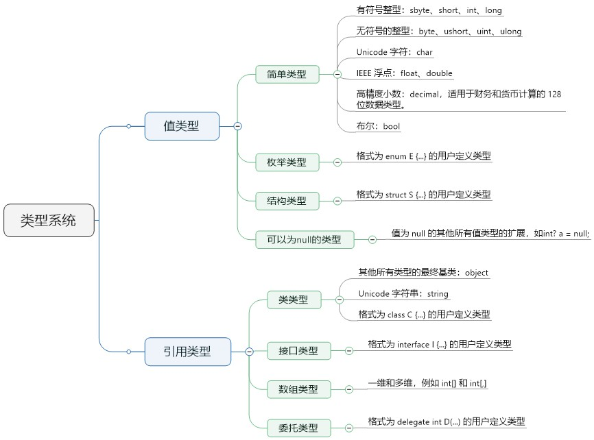
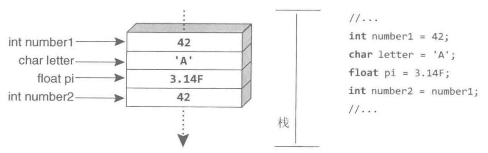
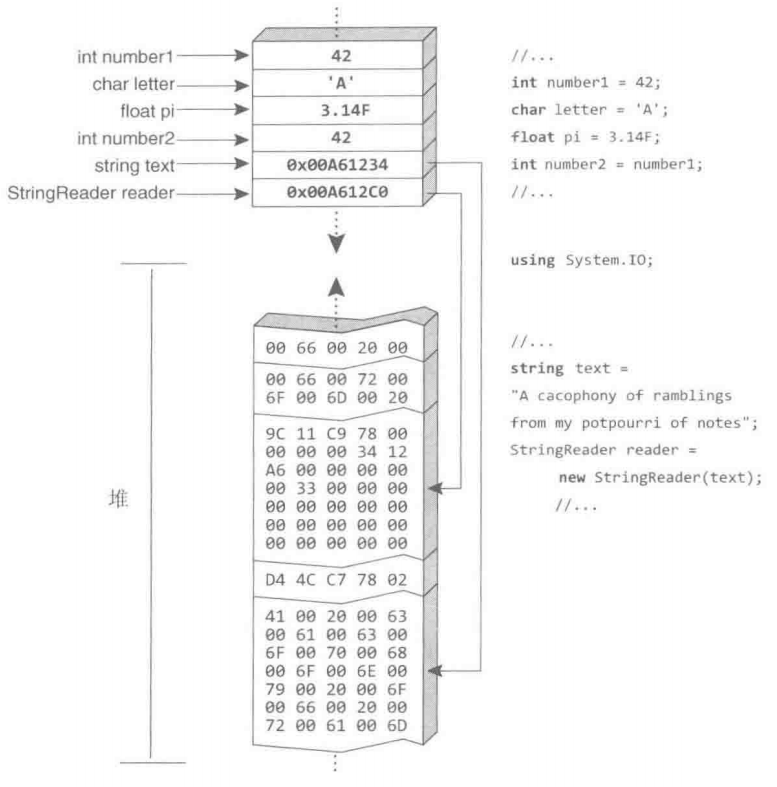
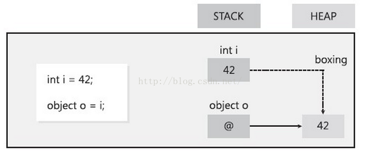
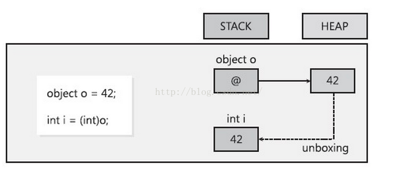
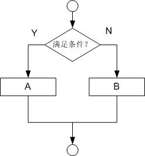
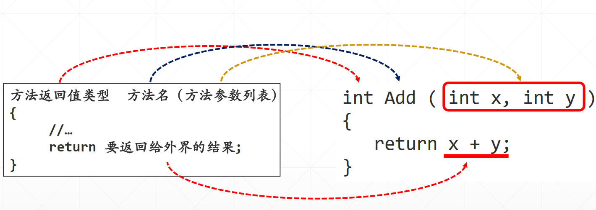
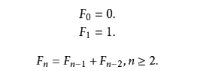

<!-- TOC -->

- [编程基础](#编程基础)
    - [数据类型](#数据类型)
        - [变量](#变量)
            - [值类型](#值类型)
            - [引用类型](#引用类型)
            - [类型系统](#类型系统)
        - [常量](#常量)
            - [const](#const)
            - [枚举](#枚举)
            - [const/readonly](#constreadonly)
        - [结构体](#结构体)
            - [结构体和类](#结构体和类)
        - [值类型和引用类型](#值类型和引用类型)
        - [可空修饰符](#可空修饰符)
        - [类型转换](#类型转换)
            - [显式转换(强制转换)](#显式转换强制转换)
            - [隐式转换](#隐式转换)
            - [Parse](#parse)
            - [TryParse](#tryparse)
            - [使用帮助类](#使用帮助类)
        - [装箱(boxing)、拆箱(unboxing)](#装箱boxing拆箱unboxing)
            - [装箱](#装箱)
            - [拆箱](#拆箱)
            - [过程](#过程)
            - [为什么装箱？](#为什么装箱)
            - [执行效率](#执行效率)
    - [流程控制](#流程控制)
        - [顺序](#顺序)
        - [分支](#分支)
        - [循环](#循环)
    - [数组](#数组)
        - [一维数组](#一维数组)
        - [循环](#循环-1)
        - [多维数组](#多维数组)
    - [方法](#方法)
        - [形参实参](#形参实参)
        - [静态方法](#静态方法)
        - [重载](#重载)
        - [参数传递](#参数传递)
            - [值传递](#值传递)
            - [引用传递](#引用传递)
            - [输出参数](#输出参数)
            - [params](#params)
        - [可选参数](#可选参数)
        - [命名参数](#命名参数)
        - [递归](#递归)

<!-- /TOC -->

<a id="markdown-编程基础" name="编程基础"></a>
# 编程基础

<a id="markdown-数据类型" name="数据类型"></a>
## 数据类型

<a id="markdown-变量" name="变量"></a>
### 变量
一个变量只不过是一个供程序操作的存储区的名字。

在 C# 中，每个变量都有一个特定的类型，类型决定了变量的内存大小和布局。

例如字符串的定义：
```cs
string str  = "Hello iflytek";
```

<a id="markdown-值类型" name="值类型"></a>
#### 值类型
原类型（sbyte、byte、short、ushort、int、uint、long、ulong、char、float、double、bool、decimal）、枚举(enum)、结构(struct)

**整形类型**，下表描述的是常见的整型类型：byte、short、int、long

| C#类型 | 位数 | CTS类型      | 取值范围                                 |
| ------ | ---- | ------------ | ---------------------------------------- |
| byte   | 8    | System.Byte  | 0~255                                    |
| short  | 16   | System.Int16 | -32768~32767                             |
| int    | 32   | System.Int32 | -2147483648~2147483647                   |
| long   | 64   | System.Int64 | -9223372036854775808~9223372036854775807 |

**浮点类型**

| C#类型  | 位数 | CTS类型        | 取值范围                             |
| ------- | ---- | -------------- | ------------------------------------ |
| float   | 32   | System.Single  | 1.5E-45~3.4E+38，以 f 结束           |
| double  | 64   | System.Double  | 5E-324~1.7E+308，默认不写或以 d 结束 |
| decimal | 128  | System.Decimal | 1E-28~7.9E+28，以 m 结束             |

**其它类型**

| C#类型     | 位数 | CTS类型        | 取值范围                           |
| ---------- | ---- | -------------- | ---------------------------------- |
| char       | 16   | System.Char    | 0~65535                            |
| **string** | 16   | System.String  | 可变大小的内存，因此没有字符数上限 |
| bool       | 32   | System.Boolean | true、false                        |

值类型就是在栈中分配内存，在申明的同时就初始化，以确保数据不为NULL；

常见数据类型：

数据类型名字 | 说明 | 数值类型后缀字符
-------|----|---------
int | 整型，4字节，32位 | 
long | 长整型，8字节，64位 | l
float | 浮点型，4字节，32位 | f
double | 双精度数，8字节，64位 | d

常用数据类型所占内存空间：
```cs
Console.WriteLine("int类型占用:{0}字节",sizeof(int));
Console.WriteLine("long类型占用:{0}字节", sizeof(long));
Console.WriteLine("float类型占用:{0}字节", sizeof(float));
Console.WriteLine("double类型占用:{0}字节", sizeof(double));

//output:
/*
int类型占用： 4字节
long类型占用： 8字节
float类型占用： 4字节
double类型占用： 8字节
*/
```

```cs
int a;
Console.WriteLine(a);//会报错，a未进行赋值

//在类属性中的应用，既是不赋值也是有初始值的
class Student
{
    public int Age {get;set;}
    public bool IsMarry {get;set;}
}
//实例化一个对象，不进行任何的赋值操作，对象属性会有初始值
Student s1 = new Student();
Console.WriteLine(s1.Age);
Console.WriteLine(s1.IsMarry);
```

<a id="markdown-引用类型" name="引用类型"></a>
#### 引用类型
类、数组、接口、委托、字符串等。

引用型是在堆中分配内存，初始化为null，引用型是需要GC(GARBAGE COLLECTION)来回收内存的。

值类型不需要GC，超出了作用范围，系统就会自动释放！

<a id="markdown-类型系统" name="类型系统"></a>
#### 类型系统


<a id="markdown-常量" name="常量"></a>
### 常量

<a id="markdown-const" name="const"></a>
#### const
常量就是值不可被更改的一种数据，常量一经声明和初始化之后，就不能再对其进行赋值操作，也不可以更改它的内容。

区别于变量，在类型前加了关键字`const`

常量定义方式：`const <type> <varName> = <initialValue>;`

```cs
const double PI = 3.14;
```

<a id="markdown-枚举" name="枚举"></a>
#### 枚举
枚举是一组命名整型常量。枚举类型是使用 enum 关键字声明的。

C# 枚举是值类型。换句话说，枚举包含自己的值，且不能继承或传递继承。

语法如下：
```cs
//enum_name 指定枚举的类型名称。
enum <enum_name>
{ 
    //enumeration list 是一个用逗号分隔的标识符列表。
    enumeration list 
};
```

枚举列表中的每个符号代表一个整数值，一个比它前面的符号大的整数值。

默认情况下，第一个枚举符号的值是 0.

例如：

```cs
enum Week
{
    Sunday,
    Monday,
    Tuesday,
    Wednesday,
    Thursday,
    Friday,
    Saturday
}

static void Main(string[] args)
{
    // 枚举类型转换为字面值和数值
    Console.WriteLine(Week.Monday);//Monday
    Console.WriteLine((int)Week.Monday);//1

    Week today = Week.Tuesday;
    
    //1、枚举类型转换为数值
    int today1 = (int)today;
    
    //2、数值转换为枚举类型
    Week resWeek = (Week)Enum.Parse(typeof(Week), "5");//resWeek为5对应的Friday
    Week wk5 = (Week)5;
    
    //3、数值转换为枚举字符串
    string str = Enum.GetName(typeof(Week), 6);//Saturday

    //4、字符串转换为枚举类型
    Week wk1 = (Week)Enum.Parse(typeof(Week), "Friday");
}
```

<a id="markdown-constreadonly" name="constreadonly"></a>
#### const/readonly
readonly为运行时常量，程序运行时进行赋值，赋值完成后便无法更改，因此也有人称其为只读变量。

const为编译时常量，程序编译时将对常量值进行解析，并将所有常量引用替换为相应值。

下面声明两个常量：
```cs
public static readonly int A = 2; //A为运行时常量
public const int B = 3; //B为编译时常量
```

下面的表达式：
```cs
int C = A + B;
```

经过编译后与下面的形式等价：
```cs
int C = A + 3;
```
其中的const常量B被替换成字面量3，而readonly常量A则保持引用方式。

**readonly常量**只能声明为类字段，支持实例类型或静态类型，

可以在声明的同时初始化或者在构造函数中进行初始化，初始化完成后便无法更改。

**const常量**除了可以声明为类字段之外，还可以声明为方法中的局部常量，

默认为静态类型(无需用static修饰，否则将导致编译错误)，但必须在声明的同时完成初始化。

性能上来说：const直接以字面量形式参与运算，性能要略高于readonly，但对于一般应用而言，这种性能上的差别可以说是微乎其微。

在下面两种情况下可以使用const常量，除此之外的其他情况都应该优先采用readonly常量：
1. 取值永久不变(比如圆周率、一天包含的小时数、地球的半径等)
2. 对程序性能要求非常苛刻

<a id="markdown-结构体" name="结构体"></a>
### 结构体
结构体是值类型数据结构。它使得一个单一变量可以存储各种数据类型的相关数据。struct 关键字用于创建结构体。

结构存放在栈中并按值传递，和存放在堆中的类对象相比，它们具有性能上的优势。
1. 值类型的分配优于引用类型。
2. 存放在栈中的值一离开作用域就立即被收回。不用等待垃圾回收器来完成工作。

```cs
//定义结构体
public struct Books
{
    //定义字段
    public string _field;
    
    //定义属性
    public string PropertyName { get; set;}
    
    //定义方法
    public void Say(){ }
};  
```

<a id="markdown-结构体和类" name="结构体和类"></a>
#### 结构体和类
类和结构有以下几个基本的不同点：
* 类是引用类型，结构是值类型。
* 结构不支持继承。
* 结构不能声明默认的构造函数。

以下代码体现了，结构体在参数传递时实际传递的是副本，而不是像类一样传递引用。
```cs
//定义Student类
public class Student
{
    public string Name { get; set; }
}

//定义StructStu结构体
public struct StructStu
{
    public string Name { get; set; }
}

class Program
{
    static void ResetName(StructStu stu)
    {
        stu.Name = "default";
    }

    static void ResetName(Student stu)
    {
        stu.Name = "default";
    }

    static void Main(string[] args)
    {
        Student stu1 = new Student();
        stu1.Name = "jack";

        StructStu stu2 = new StructStu();
        stu2.Name = "jack";

        ResetName(stu1);
        ResetName(stu2);

        Console.WriteLine("修改后的值：" + stu1.Name);
        Console.WriteLine("修改后的值：" + stu2.Name);
    }
}
```

和引用类型相比，结构越复杂，复制造成的性能开销越大。因此，结构应该只用来表示小的数据结构。

<a id="markdown-值类型和引用类型" name="值类型和引用类型"></a>
### 值类型和引用类型

所有的类型都可以归为值类型和引用类型。

它们的区别在于复制方式：值类型的数据总是进行值复制，而引用类型的数据总是进行引用复制。

变量引用的位置就是值在内存中实际存储的位置，将第一个变量的值赋给第二个变量时会创建原始变量值的一个内存副本。



类似地，将值类型的实例传给方法，如Console.WriteLine()，也会生成一个内存副本。

在方法内部对参数值进行的任何修改都不会影响调用函数中的原始值。

引用类型的值存储的是对数据存储位置的引用，而不是直接存储数据。

要去那个位置才能找到真正的数据。因此，为了访问数据，“运行时"要先从变量中读取内存位置，再“跳转"到包含数据的内存位置。

引用类型指向的内存区域称为堆（heap），如下图所示：



引用类型不像值类型那样要求创建数据的内存副本，所以复制引用类型的实例比复制大的值类型实例更高效。

将引用类型的变量赋给另一个引用类型的变量，只会复制引用而不需要复制所引用的数据。

显然，复制对一个大数据块的引用，比复制整个数据块快得多。

<a id="markdown-可空修饰符" name="可空修饰符"></a>
### 可空修饰符

一般不能将null值赋给值类型。

这是因为根据定义，值类型不能包含引用，即使是对“无（nothing）”的引用。

但在值本来就缺失的时候，这也会带来问题。

例如，在指定计数的时候，假如计数未知，应该如何输入？

一个可能的解决方案是指定特殊值，比如`-1`或者`int.MaxValue`.但这些都是有效的整数。

我们倒更希望直接将null赋给值类型，因为这不是有效的整数。

```cs
/*
int和DateTime同为值类型，不可以为null值
使用可空修饰符？或者Nullable<T>类型
*/
// int number = null;// 值类型不可以赋值为null
int? count = null;
Nullable<DateTime> start = null;

// 针对可空值类型的判断,HasValue判断是否有值
if (count.HasValue)
{
}
// GetValueOrDefault 当为null时获取默认值
int res = count.GetValueOrDefault(-1);
```

<a id="markdown-类型转换" name="类型转换"></a>
### 类型转换

由于 C# 是在编译时静态类型化的，因此变量在声明后就无法再次声明，

或无法分配另一种类型的值，除非该类型可以隐式转换为变量的类型。 

例如，string 无法隐式转换为 int。 

因此，在将 i 声明为 int 后，无法将字符串“Hello”分配给它，如以下代码所示：
```cs
int i;  
i = "Hello"; // error CS0029: Cannot implicitly convert type 'string' to 'int'
```
在 C# 中，可以执行以下几种类型的转换：隐式转换、显式转换（强制转换）、用户定义的转换、使用帮助程序类进行转换

<a id="markdown-显式转换强制转换" name="显式转换强制转换"></a>
#### 显式转换(强制转换)

通过在圆括号中指定希望变量转换成的类型，表明你已认可在发生显式转型时可能丢失精度和数据，或者可能造成异常。

如果进行转换可能会导致信息丢失，则编译器会要求执行显式转换，显式转换也称为强制转换。

```cs
//下面的程序将 double 强制转换为 int
double x = 1234.7;
int a;

// Cast double to int.
a = (int)x;
Console.WriteLine(a);// Output: 1234
```

<a id="markdown-隐式转换" name="隐式转换"></a>
#### 隐式转换
对于内置数值类型，如果要存储的值无需截断或四舍五入即可适应变量，则可以进行隐式转换。 

例如，long 类型的变量（64 位整数）能够存储 int（32 位整数）可存储的任何值。
```cs
int num = 2147483647;
long bigNum = num;
```

<a id="markdown-parse" name="parse"></a>
#### Parse
每个数值数据类型都包含一个Parse()方法，允许将字符串转换为对应的数值类型。

```cs
string text1 = "123.45";
var res1 = double.Parse(text1);

string text2 = "666";
var res2 = int.Parse(text2);

string text3 = "2019-2-14";
var res3 = DateTime.Parse(text3);
```

<a id="markdown-tryparse" name="tryparse"></a>
#### TryParse
所有基元数值类型都包含静态Tryparse()方法。

该方法与Parse()非常相似，只是转换失败的情况下，它不引发异常，而是返回false。

```cs
double number;
string input;
Console.Write("请输入一个数值:");
input = Console.ReadLine();

// 解析得到的number是通过out参数返回的
if (double.TryParse(input, out number))
{
    Console.WriteLine(number);
}
else
{
    Console.WriteLine("您的输入不是一个有效数值");
}
```

<a id="markdown-使用帮助类" name="使用帮助类"></a>
#### 使用帮助类
静态方法Convert类主要用于在.NET Framework 中支持基本数据类型之间的转换。 

支持的基类型为Boolean， Char， SByte， Byte， Int16， 

Int32， Int64， UInt16， UInt32， UInt64， 

Single， Double，Decimal，DateTime和String。 

此外，Convert类包含方法以支持其他类型的转换，比如DateTime结构体。

```cs
double dNumber = 23.15;

// Returns 23
int iNumber = Convert.ToInt32(dNumber);
Console.WriteLine(iNumber);

// Returns True
bool bNumber = Convert.ToBoolean(dNumber);
Console.WriteLine(bNumber);

// Returns "23.15"
string strNumber = Convert.ToString(dNumber);
Console.WriteLine(strNumber);

// Returns '2'
char chrNumber = Convert.ToChar(strNumber[0]);
Console.WriteLine(chrNumber);

string time = "2019-2-17 18:18:38";
DateTime dt = Convert.ToDateTime(time);
Console.WriteLine(dt);
```


<a id="markdown-装箱boxing拆箱unboxing" name="装箱boxing拆箱unboxing"></a>
### 装箱(boxing)、拆箱(unboxing)

<a id="markdown-装箱" name="装箱"></a>
#### 装箱
装箱是将**值类型**转换为**引用类型** ；

```cs
// val是值类型，对val进行装箱
int val = 100; 
object obj = val; 
Console.WriteLine ("对象的值 = {0}", obj); //对象的值 = 100
```

<a id="markdown-拆箱" name="拆箱"></a>
#### 拆箱

拆箱是将**引用类型**转换为**值类型**。

被装过箱的对象才能被拆箱，val经过装箱成obj，再进行强制类型转换为值类型
```cs
int val = 100; 
object obj = val; 
int num = (int) obj; 
Console.WriteLine ("num: {0}", num); //num: 100
```

<a id="markdown-过程" name="过程"></a>
#### 过程

**装箱操作：**



上图中的值类型i和引用o互不影响，因为装箱会产生i的副本。上述装箱的过程：
1. 首先从托管堆中为新生成的引用对象分配内存(大小为值类型实例大小加上一个方法表指针和一个SyncBlockIndex)。 
2. 然后将值类型的数据拷贝到刚刚分配的内存中。 
3. 返回托管堆中新分配对象的地址。这个地址就是一个指向对象的引用了。

**拆箱操作：**



上图中的引用o和值类型i的改变也互不影响，上图对应的拆箱过程：
1. 首先获取托管堆中属于值类型那部分字段的地址，这一步是严格意义上的拆箱。
2. 将引用对象中的值拷贝到位于线程堆栈上的值类型实例中。

<a id="markdown-为什么装箱" name="为什么装箱"></a>
#### 为什么装箱？

为什么需要装箱？也就是为何要将值类型转为引用类型？

一种最普通的场景是，调用一个含类型为Object的参数的方法，该Object可支持任意类型，以便通用。

当你需要将一个值类型(如Int32)传入时，需要装箱。 

另一种用法是，一个非泛型的容器，同样是为了保证通用，而将元素类型定义为Object。

于是，要将值类型数据加入容器时，需要装箱。

<a id="markdown-执行效率" name="执行效率"></a>
#### 执行效率

从原理上可以看出，装箱时，生成的是全新的引用对象，这会有时间损耗，也就是造成效率降低。

针对上面提到的两种情况，在第一种情况下，可以通过重载函数来避免。第二种情况，则可以通过泛型来避免。 

```cs
int i = 0;//L1
object obj = i;//L2
Console.WriteLine(i + "," + (int)obj);//L3
```
上述代码实际进行了三次装箱、一次拆箱

L2行，i装箱为obj，1次装箱；

L3行，WriteLine参数应该为字符串，即i又进行一次装箱，变为string引用类型，2次装箱；

L3行，(int)obj对obj对象进行拆箱转换为值类型，1次拆箱；

L3行，(int)obj的结果为值类型，控制台打印输出需要又一次的装箱为string类型，3次装箱；

频繁的装拆箱会造成性能的损耗！！！

<a id="markdown-流程控制" name="流程控制"></a>
## 流程控制
<a id="markdown-顺序" name="顺序"></a>
### 顺序
程序渐进的流程，一条语句一条语句地逐条推进，按预先设置好的步骤来完成功能

<a id="markdown-分支" name="分支"></a>
### 分支
if...else...



```cs
if ( 条件 )
{
    //执行语句块A
}
else
{
    //执行语句块B
}
```

switch
```cs
switch (intValue)
{
    case 0:
        CaseZero();
        break;
    case 1:
        CaseOne();
        break;
    default:
        CaseOthers();
        break;
}
```


需要注意的几点：
1. switch…case…只能用于case值为常量的分支结构，而if…else…更加灵活。
2. if判断条件为逻辑表达式，可以是布尔类型的合法表达式、可以是常量、枚举等。而switch 通常处理算术表达式，或字符。
3. switch 进行一次条件判断后直接执行到程序的条件语句。而if…else 有几种条件，就得判断多少次。
4. 相比if语句，switch语句是以空间换时间的分支结构。因为它要生成跳转表，所以占用较多的代码空间。当case常量分布范围很大但实际有效值又比较少的情况，switch…case的空间利用率将变得很低。
5. 分支较多时，使用switch的效率高于if，除非第一个if条件就为真。

**总结：**
* 当分支较多时，使用if…else…代码可读性不如switch…case…高；
* switch可以用if else代替，反之则不行；


<a id="markdown-循环" name="循环"></a>
### 循环
- do{}while()
- while(true){}
- for(){}

跳出循环：

* continue
* break
* return

<a id="markdown-数组" name="数组"></a>
## 数组
数组是一个存储相同类型元素的固定大小的顺序集合。

数组是用来存储数据的集合，通常认为数组是一个同一类型变量的集合。

数组中某个指定的元素是通过索引来访问的。

所有的数组都是由连续的内存位置组成的。最低的地址对应第一个元素，最高的地址对应最后一个元素。

这也是为什么在初始化数组的时候就需要指定数组的大小。

<a id="markdown-一维数组" name="一维数组"></a>
### 一维数组
在内存中是顺序连续存储的，所以它的索引速度非常快，赋值与修改元素也很简单。

数组也是一个引用类型，初始化需要使用new关键字。

```cs
//使用字面值
int[] array = { 1, 2, 3, 4, 5 };
//使用new操作符
int[] array = new int[5];
//两者结合
int[] array = new int[] { 1, 2, 3, 4, 5 };
```

<a id="markdown-循环-1" name="循环-1"></a>
### 循环
```cs
//索引遍历（for循环）
for (int i = 0; i < array.Length; i++){..array[i]..}

/*
只读遍历
foreach 是自动迭代的，不需要事先获取数组的长度，但是只能读数据而不能写数据
只有实现了 IEnumerable 接口的类才能使用 foreach
*/
foreach (int data in array){..data..}
foreach (var data in array){..data..}

//示例
int[] array = { 1, 2, 3, 4, 5 };
for (int i = 0; i < array.Length; i++)
{
    Console.WriteLine(i);
}
foreach (int item in array)
{
    Console.WriteLine(item);
}
```

<a id="markdown-多维数组" name="多维数组"></a>
### 多维数组
多维数组最简单的形式是二维数组。一个二维数组，在本质上，是一个一维数组的列表。

一个二维数组可以被认为是一个带有 x 行和 y 列的表格。下面是一个二维数组，包含 3 行和 4 列：


规则数组，即每行的元素个数都是相同的
```cs
//int[,]这样声明的二维数组，需要通过相同索引器进行访问：array1[1,1]
int[,] array1 = { { 1, 2, 3, 4 }, { 4, 5, 6, 7 }, { 8, 9, 10, 11 } };
int[,] array2 = new int[3, 4];
int[,] array3 = new int[,] { { 1, 2, 3, 4 }, { 4, 5, 6, 7 }, { 8, 9, 10, 11 } };

//循环遍历
foreach (int item in array1)
{
    Console.Write(item + "\t");
}
Console.WriteLine();
```

锯齿数组，即不规则数组
```cs
//锯齿数组，同样可以使用for和foreach进行遍历，通过索引器访问 array[1][1]
int[][] array = new int[3][] { new int[] { 1, 2, 3, 4 }, new int[] { 5, 6, 7 }, new int[] { 8, 9 } };
int[][] array = new int[][] { new int[] { 1, 2 }, new int[] { 1, 2, 3 }, new int[] { } };

//循环遍历
foreach (int[] item in array)
{
    foreach (int v in item)
    {
        Console.Write(v + "\t");
    }
    Console.WriteLine();
}
```

<a id="markdown-方法" name="方法"></a>
## 方法
一个方法是把一些相关的语句组织在一起，用来执行一个任务的语句块。每一个 C# 程序至少有一个带有 Main 方法的类。

定义方法：
```cs
/*
<Access Specifier> 访问修饰符
<Return Type> 返回类型
<Method Name> 方法名
Parameter List 形参列表
*/
<Access Specifier> <Return Type> <Method Name>(Parameter List)
{
   Method Body
}
```

调用方法：`MethodName(<parameter>);`

<a id="markdown-形参实参" name="形参实参"></a>
### 形参实参


```cs
//方法的定义，返回类型int，方法名Add，形参列表：int x, int y
int Add(int x, int y)
{
    return x + y;
}

//方法的调用，传入实参 1和2
int sum = Add(1, 2);
```

<a id="markdown-静态方法" name="静态方法"></a>
### 静态方法
C#中，位于同一个类的静态方法可以通过方法名直接调用， 其它类要调用时，

需要加上此方法所在的类名，比如： `Program.Add(100,200);`

```cs
// 方法前加上static关键字
static int Add ( int x, int y)
{
    return x + y;
}
```

如果定义方法时没有加上static关键字，它表明这个方法是一个“实例方法（instance method） ”，

这种方法依附于特定的对象，外界需要通过对象变量来调用。

典型案例，如.NET基类库中的Math类中静态方法。

<a id="markdown-重载" name="重载"></a>
### 重载
```cs
public int Calculate(int x, int y) {......}
public double Calculate(double x, double y) {......}
```
特点（两必须一可以）
1. 方法名必须相同
2. 参数列表必须不相同
3. 返回值类型可以不相同

<a id="markdown-参数传递" name="参数传递"></a>
### 参数传递
当调用带有参数的方法时，您需要向方法传递参数。在 C# 中，有三种向方法传递参数的方式：

| 方式     | 描述  |
| -------- | ------- |
| 值参数   | 这种方式复制参数的实际值给函数的形式参数，实参和形参使用的是两个不同内存中的值。在这种情况下，当形参的值发生改变时，不会影响实参的值，从而保证了实参数据的安全。 |
| 引用参数 | 这种方式复制参数的内存位置的引用给形式参数。这意味着，当形参的值发生改变时，同时也改变实参的值。 |
| 输出参数 | 这种方式可以返回多个值。|

<a id="markdown-值传递" name="值传递"></a>
#### 值传递
值参数，实际在传递时发生了拷贝，即方法调用时实际改变你的是变量的副本。如下例所示：
```cs
static void Swap(int x, int y)
{
    int temp = x;
    x = y;
    y = temp;
}

static void Main(string[] args)
{
    int a = 1;
    int b = 2;
    Swap(a, b);
    Console.WriteLine("交换后：{0}\t{1}", a, b);
}
```

<a id="markdown-引用传递" name="引用传递"></a>
#### 引用传递
引用参数是一个对变量的内存位置的引用。当按引用传递参数时，与值参数不同的是，它不会为这些参数创建一个新的存储位置。

引用参数表示与提供给方法的实际参数具有相同的内存位置。

下面案例中的数组`arr1`是一个引用类型，在参数传递时并未发生拷贝，传递的是地址，所以在方法内的改变也会影响到对象本身。

```cs
static void Main(string[] args)
{
    int[] arr1 = { 1, 2, 3 };
    Change(arr1);
    foreach (int item in arr1)
    {
        Console.WriteLine(item);
    }
}

static void Change(int[] arr)
{
    for (int i = 0; i < arr.Length; i++)
    {
        arr[i] = 666;
    }
}
```

针对上例中的交换方法Swap难道没有办法进行引用传递吗？即传递是变量本身，而非值的副本。

当然，我们可以使用ref关键字来声明参数是引用传递，需要特别注意方法声明和调用处都需要添加ref关键字，ref是reference的简写。如下示例：
```cs
static void Swap(ref int x, ref int y)
{
    int temp = x;
    x = y;
    y = temp;
}

static void Main(string[] args)
{
    int a = 1;
    int b = 2;
    Swap(ref a, ref b);
    Console.WriteLine("交换后：{0}\t{1}", a, b);
}
```

<a id="markdown-输出参数" name="输出参数"></a>
#### 输出参数
return 语句可用于只从函数中返回一个值。但是，可以使用 输出参数 来从函数中返回两个值。

输出参数会把方法输出的数据赋给自己，其他方面与引用参数相似。

```cs
static void AddValue(out int val)
{
    //模拟返回值，通过out关键字，可以返回多个值
    val = 5;
}

static void Main(string[] args)
{
    int res;
    AddValue(out res);
}
```

综合前面说到的ref，和out都会将传参强制传递引用，区别如下：
1. ref传参时，传入的参数必须是初始化之后的数据；而out，必须在方法中对其完成初始化；
2. 使用out可以返回一个值

<a id="markdown-params" name="params"></a>
#### params
有时，当声明一个方法时，您不能确定要传递给函数作为参数的参数数目。

在使用数组作为形参时，C# 提供了 params 关键字，使调用数组为形参的方法时，既可以传递数组实参，也可以传递一组数组元素。

params 的使用格式为：`public 返回类型 方法名称( params 类型名称[] 数组名称 )`
```cs
static int GetSum(params int[] arr)
{
    int sum = 0;
    foreach (int i in arr)
    {
        sum += i;
    }
    return sum;
}

static void Main(string[] args)
{
    int sum = GetSum(1, 2, 3, 4, 5);
    Console.WriteLine("总和是： {0}", sum);
}
```
需要注意的是：
1. 带 params 关键字的参数类型必须是一维数组，不能使用在多维数组上；
2. 不允许和 ref、out 同时使用；
3. 带 params 关键字的参数必须是最后一个参数，并且在方法声明中只允许一个 params 关键字。
4. 不能仅使用 params 来使用重载方法。
5. 没有 params 关键字的方法的优先级高于带有params关键字的方法的优先级

<a id="markdown-可选参数" name="可选参数"></a>
### 可选参数
从C#4.0开始，增添了对可选参数（optional parameters）的支持。

声明方法时将常量值赋给参数，以后调用方法时就不必每个参数都指定。

```cs
static void Main(string[] args)
{
    Console.WriteLine(Add(1, 2));
    Console.WriteLine(Add(1));
}

static int Add(int a, int b = 1)
{
    return a + b;
}
```

在上例中，如果调用时不指定extension(扩展)参数，就是使用声明时赋给extension的值(上例中b默认为1)。

这样的设计，避免了额外一个方法重载的需求。

需要注意两点：
1. 可选参数一定放在所有必须参数的后面
2. 默认参数的默认值必须是常量，或者说必须是能在编译时确定下来的值

下例中，DateTime.Now.Month并非是编译时常量，所以无法通过编译
```cs
static int Add(int a, int b = DateTime.Now.Month)
{
    return a + b;
}
```

<a id="markdown-命名参数" name="命名参数"></a>
### 命名参数
利用命名参数，调用者可显式地为一个参数赋值，而不是像以前那样只能依据参数顺序来决定哪个值赋给哪个参数，如下代码所示：

```cs
static void Main(string[] args)
{
    Console.WriteLine(Display("马云"));
    Console.WriteLine(Display("刘强东", lastName: "liu"));
}

static string Display(string name, string firstName = "jack", string lastName = "ma")
{
    return $"{name}-{firstName} {lastName}";
}
```

调用时，在两个可选参数中（firstName和lastName），只指定了lastName。

试想，如果一个方法有大量参数，而且其中许多都是可选的（在一些第三方组件中，这是很常见的一种情况），那么命名参数语法肯定能带来不少便利。

但是，这个便利的代价是牺牲方法接口的灵活性。过去（至少就c#来说），参数名可以自由更改，不会造成调用代码无法编译的情况。

但在添加了命名参数后，参数名就成为方法接口的一部分。更改名称会导致使用命名参数的代码无法编译。

所以，重构的时候针对此情况一定要特别注意！

<a id="markdown-递归" name="递归"></a>
### 递归
递归意味着方法调用它自身。

有趣的类比：递归就是包子馅的包子。它的极限是馒头。

求n的阶乘
```cs
/// <summary>
/// 4! = 4*3!  4*3*2!  4*3*2*1
/// 3! = 3*2!  3*2*1
/// 2! = 2*1
/// 1! = 1
/// </summary>
/// <param name="n"></param>
/// <returns></returns>
int JieCheng(int n)
{
    if (n == 1)
    {
        return 1;
    }
    else
    {
        return n * JieCheng(n - 1);
    }
}
```

在数学上，费波那契数列是以递归的方法来定义：



就是费波那契数列由0和1开始，之后的费波那契系数就是由之前的两数相加而得出。首几个费波那契系数是：

0,1,1,2,3,5,8,13,21,34,55,89,144,233……

**特别指出：0不是第一项，而是第零项。**
```cs
static void Main(string[] args)
{
    DateTime time = DateTime.Now;
    for (int i = 0; i < 40; i++)
    {
        Console.WriteLine(Fibonacci(i));
    }
    Console.WriteLine("！！！耗时(单位秒)：" + DateTime.Now.Subtract(time).TotalSeconds);
}

// 结构简单，复杂度高
static int Fibonacci(int n)
{
    if (n == 0)
    {
        return 0;
    }
    else if (n == 1)
    {
        return 1;
    }
    else
    {
        return Fibonacci(n - 2) + Fibonacci(n - 1);
    }
}
```

精简化后：
// 结构更简单，复杂度仍很高
```cs
static int Fibonacci(int n)
{
    return n < 2 ? n : Fibonacci(n - 2) + Fibonacci(n - 1);
}
```

非递归解法，提升效率：
```cs
static void Main(string[] args)
{
    DateTime time = DateTime.Now;

    int LENGTH = 40;
    int[] arrFibo = new int[LENGTH];
    for (int i = 0; i < LENGTH; i++)
    {
        Console.WriteLine(Fibonacci(i, arrFibo));
    }
    Console.WriteLine("！！！耗时(单位秒)：" + DateTime.Now.Subtract(time).TotalSeconds);
}

/// <summary>
/// 通过中间结果提升效率
/// </summary>
/// <param name="n"></param>
/// <param name="arr">通过数组记录中间结果</param>
/// <returns></returns>
static int Fibonacci(int n, int[] arr)
{
    if (n < 2)
    {
        arr[n] = n;
        return n;
    }
    else
    {
        arr[n] = arr[n - 2] + arr[n - 1];
        return arr[n];
    }
}
```

用递归实现方法时，常见错误是在程序执行期间发生栈溢出。

通常是由于无限递归造成的。如果方法持续调用自身，永远抵达不了递归结束的位置触发点。

---

参考引用：

[类型和变量](https://docs.microsoft.com/zh-cn/dotnet/csharp/tour-of-csharp/types-and-variables)

