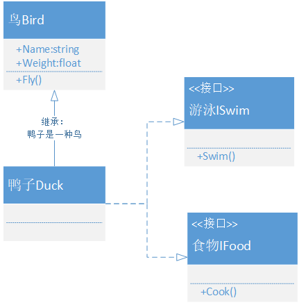
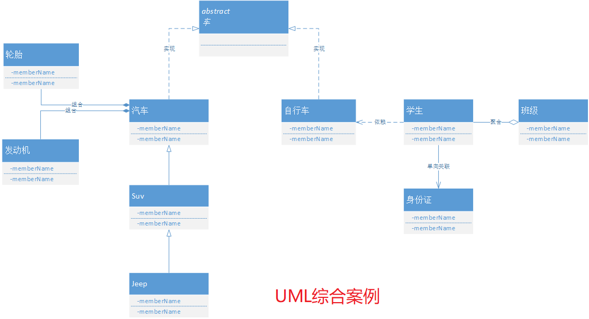
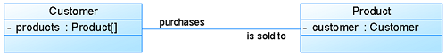
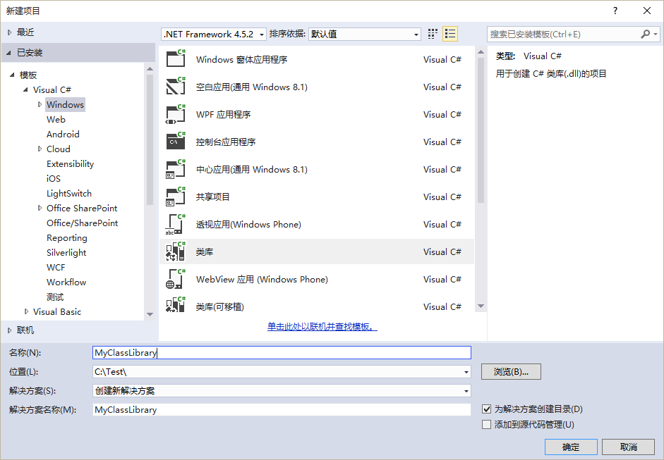
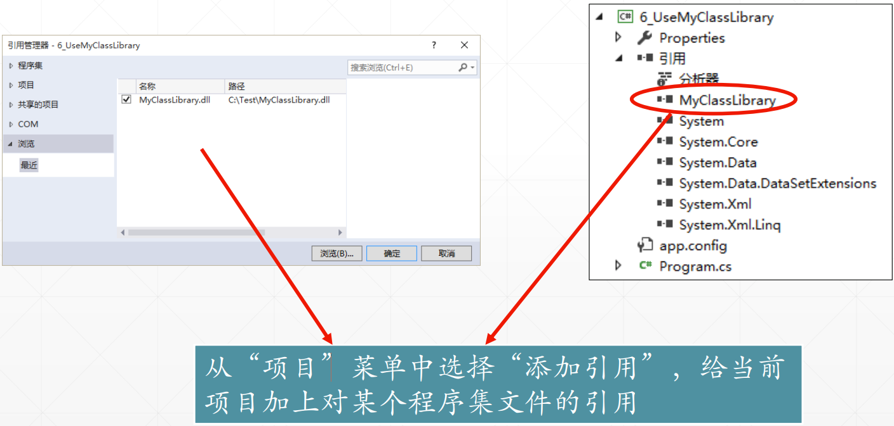

<!-- TOC -->

- [面向对象](#面向对象)
    - [抽象](#抽象)
    - [面向对象编程](#面向对象编程)
    - [类和对象](#类和对象)
        - [类成员](#类成员)
            - [字段](#字段)
            - [属性](#属性)
            - [方法](#方法)
            - [实例和静态](#实例和静态)
        - [访问修饰符](#访问修饰符)
        - [对象的创建和销毁](#对象的创建和销毁)
            - [构造函数](#构造函数)
            - [析构函数](#析构函数)
        - [分部类](#分部类)
    - [三个基本特征](#三个基本特征)
        - [封装](#封装)
        - [继承](#继承)
            - [类继承](#类继承)
            - [this和base](#this和base)
            - [继承中的构造函数](#继承中的构造函数)
            - [父类与子类转换](#父类与子类转换)
            - [类继承修饰符](#类继承修饰符)
            - [基类修饰virtual和abstract](#基类修饰virtual和abstract)
            - [派生类修饰override和new](#派生类修饰override和new)
            - [接口继承](#接口继承)
        - [多态](#多态)
    - [类之间的关系](#类之间的关系)
        - [依赖](#依赖)
        - [泛化](#泛化)
        - [关联](#关联)
            - [双向关联](#双向关联)
            - [单向关联](#单向关联)
            - [自关联](#自关联)
        - [关联和依赖的区别](#关联和依赖的区别)
        - [实现](#实现)
        - [聚合](#聚合)
        - [组合](#组合)
        - [聚合和组合](#聚合和组合)
    - [程序集](#程序集)
        - [程序集与命名空间](#程序集与命名空间)

<!-- /TOC -->
<a id="markdown-面向对象" name="面向对象"></a>
# 面向对象


<a id="markdown-抽象" name="抽象"></a>
## 抽象
世间万物皆对象，面向对象的设计也是基于现实世界的。

- 面向过程

体现了程序员的逻辑思维能力，其本质是把一个业务看作一个流程化操作动作(使用函数来实现)，一步步的去执行。

- 面向对象

体现了程序员的抽象思维能力，其本质是把一个业务分成若干个模块(使用对象[类]来实现)，由这些模块交互组合去执行。

- 生命周期

构造函数(实例化对象) -> 对象的使用/操作 -> 析构函数(销毁对象)

**案列之大象装冰箱**
```cs
//面向过程编程，只有三步
打开冰箱门();
装大象进冰箱();
关闭冰箱门();
```

```cs
/*
面向对象编程
则要分析，案例中出现了几种类型的对象，分别具有什么属性和方法
*/
public class 大象{}
public class 冰箱{}
public class 人{}
//todo...
```

<a id="markdown-面向对象编程" name="面向对象编程"></a>
## 面向对象编程

面向对象编程——Object Oriented Programming，简称OOP，是一种程序设计思想。

OOP把对象作为程序的基本单元，一个对象包含了数据和操作数据的函数。

面向过程的程序设计把计算机程序视为一系列的命令集合，即一组函数的顺序执行。

为了简化程序设计，面向过程把函数继续切分为子函数，即把大块函数通过切割成小块函数来降低系统的复杂度。

而面向对象的程序设计把计算机程序视为一组对象的集合，而每个对象都可以接收其他对象发过来的消息，并处理这些消息。

计算机程序的执行就是一系列消息在各个对象之间传递。


<a id="markdown-类和对象" name="类和对象"></a>
## 类和对象

<a id="markdown-类成员" name="类成员"></a>
### 类成员

<a id="markdown-字段" name="字段"></a>
#### 字段
声明：修饰符 + 标准的变量声明
```cs
//私有字段，只可以类的内部进行访问
private string  classField = string.Empty;

//static 静态字段，通过类名访问
public static int ViewCount = 0;

//readonly 只读字段，只能在声明或构造函数中赋值
public static readonly string Version = "静态只读字段";

//const 常量
public const double PI = 3.1415926;

```

<a id="markdown-属性" name="属性"></a>
#### 属性
属性描述的是内置映射字段的读写能力。

字段 + get/set访问器 = **属性**

```cs
//属性的声明，和下面的方式是等效的，是下面写法的简化
public string Name { get; set; }

//==========================================
private string name;
public string Name
{
    get { return name; }
    set { name = value; }
}
```

属性作用：我们可以很容易地在读/写属性时“插入一些”特定的代码，

完成诸如“检验数据”、“显示信息”、“触发事件”等工作，这是单纯的字段所不具备的特性。

属性的各种玩法，以Student类成员示例：
```cs
public class Student
{
    // 普通属性
    public string Name { get; set; }

    // 只读字段birth，只能在类的内部进行设置赋值
    private DateTime birth;
    // 属性Birth，没有set方法，外部无法访问
    public DateTime Birth
    {
        get { return birth; }
    }

    // 只有类的内部可以进行设置，外部不可通过实例进行访问，同上述Birth属性，只能在类的内部进行设置赋值
    public int Age { get; private set; }

    // 给定初始值的属性，C# 6.0
    public string AutoInitProp { get; } = "hello";

    /// <summary>
    /// 身高，单位cm
    /// </summary>
    private float height;
    public string Height
    {
        get
        {
            return height > 170 ? "高富帅" : "不足170的都会说170";
        }
        set
        {
            height = float.Parse(value);
        }
    }
}
```

<a id="markdown-方法" name="方法"></a>
#### 方法
```cs
/// <summary>
/// 实例方法，在对象上调用
/// </summary>
void Say() { }

/// <summary>
/// 静态方法，多个实例共享同一个数据
/// </summary>
static void Talk() { }
```

<a id="markdown-实例和静态" name="实例和静态"></a>
#### 实例和静态
- 实例成员

通过该对象名进行对实例成员的访问。必须先实例化对象，通过【对象.实例成员】方式进行调用。

- 静态成员

每个实例即为一个对象，对象之间数据不共享。使用static声明，在多个实例间共享同一个数据。

静态成员需要通过【类名.静态成员】进行访问，实例成员可以访问静态成员，但静态成员不能访问实例成员。

```cs
class Person
{
    //静态成员变量
    private static int nAge;
    //实例成员变量
    private string strName;
    public static void Run()
    {
        Console.WriteLine("我会奔跑！");
    }
    public void Sing()
    {
        Console.WriteLine("我会唱歌");
    }
}
class Program
{
    static void Main(string[] args)
    {
        //静态成员属于类，可以直接通过“类名.静态成员”的方式访问
        Person.Run();

        //实例成员属于对象，需要通过“对象名.实例成员”来访问
        Person p = new Person();
        p.Sing();

        Person p1 = new Person();
        Person p2 = new Person();
    }
}
```


当类第一次加载的时候(第一次被加载到内存的时候),该类下的所有的静态成员都会被加载。

静态成员会被加载到静态存储区，直到程序退出时才会被释放；

由上面显然可知，定义静态的成员是可以影响程序的执行效率的。那么什么时候定义静态的成员变量呢？

1. 变量需要被共享的时候
2. 方法需要被反复的调用的时候

<a id="markdown-访问修饰符" name="访问修饰符"></a>
### 访问修饰符

一个类编写完成后，并不是任何角色都能去访问该类或该类中的某些特定成员。

使用“访问修饰符”来对类和类成员的访问权限进行控制

- 类的访问修饰符

修饰符 | 说明
------|---
public | 公共的，该可以被任何代码访问
internal | (默认，可不写)内部的，只能由定义它的工程内部的代码访问

- 类成员访问修饰符

修饰符 | 说明
------ | -----
public | 公共的，成员可以被任何代码访问
private | (默认，可不写)私有的，只能由本类中的代码访问
protected | 受保护的，成员只能由本类或其派生类中的代码访问
internal | 内部的，成员只能由定义它的工程内部的代码访问
protected internal | 该成员既可以被同一工程的其它代码访问，也可以被其派生类访问

<a id="markdown-对象的创建和销毁" name="对象的创建和销毁"></a>
### 对象的创建和销毁
对象即类的实例化，每个对象都有自己的生命周期，构造而生，析构而亡。

构造创建对象：使用 new 关键字调用类的构造函数。

析构销毁对象：1)管制堆内存紧张时 CLR 自动调用析构函数清理对象;2)使用Dispose模式手工释放非内存资源;

<a id="markdown-构造函数" name="构造函数"></a>
#### 构造函数
主要用于为对象分配存储空间,对数据成员进行初始化：
1. 构造函数的名字必须与类同名;
2. 构造函数没有返回类型,它可以带参数,也可以不带参数;
3. 自动调用！即在创建一个类的新对象（使用new关键字）时，系统会自动调用构造函数初始化新对象;

```cs
public class Student
{
    //属性
    public string Name{ get; set; }

    //默认构造函数，可以不写，但是如果有自定义构造函数，则不会添加默认构造函数
    public Student(){}

    //自定义构造函数，可以在对象创建时做一些初始化操作
    public Student(string name){ Name = name; }
}
```

除此，还有静态构造函数，私有构造函数。
```cs
public class Student
{
    /*私有构造函数 设计模式中常用
    1、将构造函数申明为私有的，则不能通过new运算符在外部代码中实例化。
    但可以编写一个静态方法或属性在其内部实例化一个对象，再将结果返回给外部代码。
    2、永远不会实例化，因为它仅用作某些静态成员的容器;
    3、希望类只能通过调用某个静态方法来实例化(即所谓的对象实例化的类工厂方法);
    */
    private Student(){}

    /*静态构造函数 用的不多
    1.静态构造函数既没有访问修饰符，也没有参数。
    2.在创建第一个实例或引用任何静态成员之前，将自动调用静态构造函数来初始化类，
    也就是无法直接调用静态构造函数，也无法控制什么时候执行静态构造函数。
    3.一个类只能有一个静态构造函数，最多只能运行一次。
    4.静态构造函数不可以被继承。
    5.如果没有静态构造函数，而类中的静态成员有初始值，那么编译器会自动生成默认的静态构造函数。
    */
    static Student(){}
}
```

<a id="markdown-析构函数" name="析构函数"></a>
#### 析构函数
析构函数(destructor) 与构造函数相反，当对象脱离其作用域时（例如对象所在的函数已调用完毕），系统自动执行析构函数。

析构函数往往用来做“清理善后” 的工作（例如在建立对象时用new开辟了一片内存空间，应在退出前在析构函数中用delete释放）。

析构函数名也应与类名相同，只是在函数名前面加一个波浪符~

* 一个类只能有一个解构器。 
* 解构器不能被继承或重载。 
* 解构器不能被手动调用。他们是自动被（编译器）调用的。 
* 解构器不能带修饰或参数。 

```cs
public class Student
{
    ~Student(){}
}
```

<a id="markdown-分部类" name="分部类"></a>
### 分部类
把同一个类的代码分散到多个文件中。

* 每个分部类的声明都含有一些类成员的声明。
* 类的分部类声明可以在同一文件中也可以在不同文件中。
* 每个局部声明必须被标为partial class,而不是单独的关键字class。

<a id="markdown-三个基本特征" name="三个基本特征"></a>
## 三个基本特征

**搞笑图解**


<a id="markdown-封装" name="封装"></a>
### 封装
屏蔽具体的实现，不用关心实现的过程。

封装的意义，在于明确标识出允许外部使用的所有成员函数和数据项，或者叫接口。

有了封装，就可以明确区分内外，使得类实现者可以修改封装内的东西而不影响外部调用者；

而外部调用者也可以知道自己不可以碰哪里。

这就提供一个良好的合作基础——或者说，只要接口这个基础约定不变，则代码改变不足为虑。

<a id="markdown-继承" name="继承"></a>
### 继承
继承是子类自动共享父类数据和方法的机制，这是类之间的一种关系，提高了软件的可重用性和可扩展性

<a id="markdown-类继承" name="类继承"></a>
#### 类继承

直接使用基类的属性和方法而无需额外编码的能力，基类和派生类一样，也是一个类，使用 class 关键字定义一个基类

通过继承创建的新类称为“子类”或“派生类”；被继承的类称为“基类”、“父类”或“超类”；

编译器不允许派生类的访问级别比基类更高，如没有显式标记基类，则默认基类为Object类；

<a id="markdown-this和base" name="this和base"></a>
#### this和base

* this：指当前类，this调用当前类的属性，方法，包括构造函数的方法，继承本类的构造函数
* base：指当前类的父类，可调用父类的非私有属性，方法，继承父类的构造函数括号里的参数

<a id="markdown-继承中的构造函数" name="继承中的构造函数"></a>
#### 继承中的构造函数
base关键字表示调用父类，如base()表示父类无参构造函数

构造函数调用的顺序：
1. 如果子类没有定义构造方法，则调用父类的无参数的构造方法。
2. 如果子类定义了构造方法，不论是无参数还是带参数，在创建子类的对象的时候,首先执行父类无参数的构造方法，然后执行自己的构造方法。
3. 在创建子类对象时候，如果子类的构造函数没有显式调用父类的构造函数，则会调用父类的默认无参构造函数。
4. 在创建子类对象时候，如果子类的构造函数没有显式调用父类的构造函数且父类自己提供了无参构造函数，则会调用父类自己的无参构造函数。
5. 在创建子类对象时候，如果子类的构造函数没有显示调用父类的构造函数且父类只定义了自己的有参构造函数，则会出错（如果父类只有有参数的构造方法，则子类必须显式调用此带参构造方法）。

<a id="markdown-父类与子类转换" name="父类与子类转换"></a>
#### 父类与子类转换
以下均以Person、Student、Teacher进行示例
```cs
public class Person
{
    public string Name { get; set; }
}

public class Student : Person
{
    public string StuNo { get; set; }
}

public class Teacher : Person
{
    public string TeaNo { get; set; }
}
```

```cs
//子类引用不能指向父类对象
Person p1 = new Person();
Student s1 = (Student)p1;//p1为Person的实例，无法进行转换，编译不报错，但运行会报错

//父类引用可以指向子类对象
Person p2 = new Student();
Student s2 = (Student)p2;//p2实际为Student的实例，可以进行转换

//父类引用子类对象，只能调用父类中的成员
p2.Name = "";
p2.StuNo = "";//报错，无法访问
```

**里氏转换：**
1. 子类可以赋值给父类
2. 如果父类中装的是子类对象，则可以将这个父类转换为对应的子类对象

关键字：
1. is：返回bool类型，指示是否可以做这个转换
2. as：如果转换成功，则返回对象，否则返回null


<a id="markdown-类继承修饰符" name="类继承修饰符"></a>
#### 类继承修饰符

abstract：抽象的，不能实例化，只能被继承，可以有抽象成员

sealed：密封的，不能被继承

<a id="markdown-基类修饰virtual和abstract" name="基类修饰virtual和abstract"></a>
#### 基类修饰virtual和abstract

virtual：虚拟，可以被派生类重写，也可以不进行重写；

abstract：抽象，不需要方法实现，必须被派生类重写，只要一个成员为抽象成员，该类也就必须声明为抽象类

virtual和abstract都是用来修饰父类的，通过覆盖父类的定义，让子类重新定义。

如果用来修饰方法，前面必须添加public，要不然就会出现编译错误：

虚拟方法或抽象方法是不能私有的。毕竟加上virtual或abstract就是让子类重新定义的，而private成员是不能被子类访问的。

```cs
/// <summary>
/// 有抽象方法，则类必须声明为抽象类。只有抽象类才能有抽象方法
/// 反之，抽象类可以有普通方法
/// </summary>
public abstract class Person
{
    /// <summary>
    /// abstract 抽象方法
    /// 不能有实现！！！
    /// 必须由子类实现
    /// </summary>
    public abstract void SayHi();

    /// <summary>
    /// virtual 虚方法
    /// 必须要有实现，可以被子类重写/覆盖
    /// </summary>
    public virtual void Talk()
    {
        Console.WriteLine("person talk");
    }

    /// <summary>
    /// 普通方法
    /// </summary>
    public void Chat()
    {
        Console.WriteLine("person chat");
    }
}

/// <summary>
/// 继承抽象类Person
/// </summary>
public class Student : Person
{
    /// <summary>
    /// 必须实现父类抽象类里的抽象方法
    /// </summary>
    public override void SayHi()
    {
        Console.WriteLine("student sayhi");
    }
}
```

<a id="markdown-派生类修饰override和new" name="派生类修饰override和new"></a>
#### 派生类修饰override和new

override：重写，派生类重写基类成员

new：隐藏，隐藏基类同名成员，使两成员均不出现彼此覆盖的影响，可不写，但会出现警告

```cs
public class Animal
{
    public virtual void Say()
    {
        Console.WriteLine("animal say...");
    }

    public void Talk()
    {
        Console.WriteLine("animal talk...");
    }
}

public class Dog : Animal
{
    /// <summary>
    /// 方法重写，重写父类中的虚方法
    /// 当父类引用指向子类对象时，通过引用调用的为子类的方法实现
    /// </summary>
    public override void Say()
    {
        Console.WriteLine("dog say...");
    }

    /// <summary>
    /// 覆盖父类中同名方法，但不会改变父类引用的调用
    /// 可以覆盖普通方法，即父类中不需要设置为虚方法
    /// </summary>
    public new void Talk()
    {
        Console.WriteLine("dog talk...");
    }
}

class Program
{
    static void Main(string[] args)
    {
        Animal a = new Dog();

        a.Say();//dog say...
        a.Talk();//animal talk...
    }
}
```

**总结：**
1. 不管是重写还是覆盖都不会影响父类自身的功能（废话，肯定的嘛，除非代码被改）。
2. 当用子类创建父类的时候，如 C1 c3 = new C2()，重写会改变父类的功能，即调用子类的功能；而覆盖不会，仍然调用父类功能。
3. 虚方法、实方法都可以被覆盖（new），抽象方法，接口 不可以。
4. 抽象方法，接口，标记为virtual的方法可以被重写（override），实方法不可以。
5. 重写使用的频率比较高，实现多态；覆盖用的频率比较低，用于对以前无法修改的类进行继承的时候。


<a id="markdown-接口继承" name="接口继承"></a>
#### 接口继承

什么是接口？其实，接口简单理解就是一种约定，使得实现接口的类或结构在形式上保持一致。

所有接口成员都是公共 public 的（也就是说不需要public进行修饰）

接口可以定义属性、方法，**但不能定义字段**

不能被static、virtual、abstract和sealed修饰，但可以有new来隐藏基接口成员



**总结：**
1. C#中的接口是独立于类来定义的。这与 C++模型是对立的，在 C++中接口实际上就是抽象基类。
2. 接口和类都可以继承多个接口。
3. 类可以继承一个基类，接口根本不能继承类。这种模型避免了 C++的多继承问题，C++中不同基类中的实现可能出现冲突。
4. 一个接口定义一个只有抽象成员的引用类型。C#中一个接口实际所做的，仅仅只存在着方法标志，但根本就没有执行代码。这就暗示了不能实例化一个接口，只能实例化一个派生自该接口的对象。
5. 接口可以定义方法、属性和索引。所以，对比一个类，接口的特殊性是：当定义一个类时，可以派生自多重接口，而你只能可以从仅有的一个类派生。

<a id="markdown-多态" name="多态"></a>
### 多态
同一操作作用于不同的对象，可以有不同的解释，产生不同的执行结果，这就是多态性。

多态是指程序中定义的引用变量所指向的具体类型和通过该引用变量发出的方法调用在编程时并不确定，

而是在程序运行期间才确定，即不修改程序代码就可以改变程序运行时所绑定的具体代码，

让程序可以选择多个运行状态，这就是多态性。

多态的存在有三个前提:
1. 要有继承关系
2. 子类要重写父类的方法
3. 父类引用指向子类对象

```cs
public class Animal
{
    public virtual void Eat()
    {
        Console.WriteLine("Animal eat");
    }
}

public class Cat : Animal
{
    public override void Eat()
    {
        Console.WriteLine("Cat eat");
    }
}

public class Dog : Animal
{
    public override void Eat()
    {
        Console.WriteLine("Dog eat");
    }
}

static void Main(string[] args)
{
    Animal[] animals = new Animal[3];

    animals[0] = new Animal();
    animals[1] = new Cat();
    animals[2] = new Dog();

    for (int i = 0; i < 3; i++)
    {
        animals[i].Eat();
    }
}
```

多态性增强了软件的灵活性和扩展性

<a id="markdown-类之间的关系" name="类之间的关系"></a>
## 类之间的关系
有一个很好的UML图可以很显然的展示类之间的关系



<a id="markdown-依赖" name="依赖"></a>
### 依赖
依赖关系(Dependency) 是一种使用关系，

特定事物的改变有可能会影响到使用该事物的其他事物，在需要表示一个事物使用另一个事物时使用依赖关系。

大多数情况下，依赖关系体现在某个类的方法使用另一个类的对象作为参数。

在UML中，依赖关系用带箭头的虚线表示，由依赖的一方指向被依赖的一方。如上图【UML综合案例】中学生和自行车的关系；


1、A类是B类中的(某方法的)局部变量，如Bike类是Student类中某个方法的局部变量，则Student类可以调用它
```cs
public class Student
{
    public void Ride()
    {
        Bike giant = new Bike();
    }
}
public class Bike {}
```

2、A类是B类方法当中的一个参数，如Bike类作为Student类中某个方法的参数或返回值
```cs
public class Student
{
    public Bike Ride(Bike bk) {}
}
public class Bike {}
```

该案例与面向对象课程中人使用船过河案例同理。

3、A类向B类发送消息，从而影响B类发生变化；

<a id="markdown-泛化" name="泛化"></a>
### 泛化
泛化关系(Generalization)也就是继承关系，也称为"is-a-kind-of"关系，

泛化关系用于描述父类与子类之间的关系，父类又称作基类或超类，子类又称作派生类。

在UML中，泛化关系用带空心三角形的直线来表示。如上图【UML综合案例】中Suv类继承自小汽车类

```cs
public class Car
{
    public string Name {get;set;}
}

//Suv 继承 Car
public class Suv : Car
{
    //燃烧汽油
    public void BurnOil(){}
}

//Jeep 继承 Suv
public class Jeep : Suv
{
    //爬山
    public void ClimbMountain(){}
}
```

<a id="markdown-关联" name="关联"></a>
### 关联

关联关系(Association) 是类与类之间最常用的一种关系，它是一种结构化关系，用于表示一类对象与另一类对象之间有联系。

在UML类图中，用实线连接有关联的对象所对应的类，

在使用Java、C#和C++等编程语言实现关联关系时，通常将一个类的对象作为另一个类的属性。

如上图【UML综合案例】中，学生和身份证之间的单向关联关系。


<a id="markdown-双向关联" name="双向关联"></a>
#### 双向关联
默认情况下，关联是双向的。


```cs
public class Customer
{
    private Product[] products;
}
public class Product
{
    private Customer customer;
}
```

<a id="markdown-单向关联" name="单向关联"></a>
#### 单向关联
类的关联关系也可以是单向的，单向关联用带箭头的实线表示.


```cs
public class Customer
{
    private Address address;
}
 
public class Address
{ }
```

<a id="markdown-自关联" name="自关联"></a>
#### 自关联
在系统中可能会存在一些类的属性对象类型为该类本身，这种特殊的关联关系称为自关联。


```cs
public class Node
{
    private Node subNode;
}
```

<a id="markdown-关联和依赖的区别" name="关联和依赖的区别"></a>
### 关联和依赖的区别
- 从类的属性是否增加的角度看：

发生依赖关系的两个类都不会增加属性。其中的一个类作为另一个类的方法的参数或者返回值，或者是某个方法的变量而已。

发生关联关系的两个类，其中的一个类成为另一个类的属性，而属性是一种更为紧密的耦合，更为长久的持有关系。

- 从关系的生命周期来看：
 
依赖关系是仅当类的方法被调用时而产生，伴随着方法的结束而结束了。

关联关系是当类实例化的时候即产生，当类销毁的时候，关系结束。相比依赖讲，关联关系的生存期更长。

<a id="markdown-实现" name="实现"></a>
### 实现
实现关系是一种类与接口的关系，表示类是接口所有特征和行为的实现。
飞机和鸟都可以飞
```cs
public interface IFly
{
    //最高飞行高度
    int MaxHigh { get; set; }

    //飞起来
    void Fly();
}

public class Plane : IFly
{
    /// <summary>
    /// 最高飞行高度
    /// </summary>
    public int MaxHigh { get; set; }

    /// <summary>
    /// 飞机飞起来
    /// </summary>
    public void Fly() { }
}

public class Bird : IFly
{
    /// <summary>
    /// 最高飞行高度
    /// </summary>
    public int MaxHigh { get; set; }

    /// <summary>
    /// 鸟儿飞起来
    /// </summary>
    public void Fly() { }
}
```

<a id="markdown-聚合" name="聚合"></a>
### 聚合
聚合关系(Aggregation):表示的是整体和部分的关系，整体与部分可以分开。

- 聚合关系(Aggregation) 表示一个整体与部分的关系。通常在定义一个整体类后，再去分析这个整体类的组成结构，从而找出一些成员类，该整体类和成员类之间就形成了聚合关系。
- 在聚合关系中，成员类是整体类的一部分，即成员对象是整体对象的一部分，但是成员对象可以脱离整体对象独立存在。

在UML中，聚合关系用带空心菱形的直线表示。如上图【UML综合案例】中，学生和班级的聚合关系。

班级生命周期结束（解散了），学生仍然存在。

同样的，下面案例中大雁群没有了，但是每个个体大雁仍然存在。

```cs
/// <summary>
/// 大雁群
/// </summary>
public class GooseGroup
{
    public List<Goose> LstGoose { get; set; }
}

/// <summary>
/// 大雁
/// </summary>
public class Goose { }
```

<a id="markdown-组合" name="组合"></a>
### 组合
组合关系(Composition):也是整体与部分的关系，但是整体与部分不可以分开。

- 组合关系(Composition)也表示类之间整体和部分的关系，但是组合关系中部分和整体具有统一的生存期。一旦整体对象不存在，部分对象也将不存在，部分对象与整体对象之间具有同生共死的关系。
- 在组合关系中，成员类是整体类的一部分，而且整体类可以控制成员类的生命周期，即成员类的存在依赖于整体类。

在UML中，组合关系用带实心菱形的直线表示。如上图【UML综合案例】中，汽车和轮胎、发动机是组合关系。

通常来说，汽车没有了，轮胎和发动机也就没有了。

同样的，下面案例中大雁没有了，雁翅也就不复存在了。

```cs
/// <summary>
/// 大雁
/// </summary>
public class Goose
{
    /// <summary>
    /// 翅膀
    /// </summary>
    public object Wings { get; set; }
}

/// <summary>
/// 翅膀
/// </summary>
public class Wings { }
```

<a id="markdown-聚合和组合" name="聚合和组合"></a>
### 聚合和组合

引用程杰的《大话设计模式》里举的那个大雁的例子 ：

大雁喜欢热闹害怕孤独，所以它们一直过着群居的生活，这样就有了雁群，

每一只大雁都有自己的雁群，每个雁群都有好多大雁，大雁与雁群的这种关系就可以称之为聚合。

另外每只大雁都有两只翅膀，大雁与雁翅的关系就叫做组合。

由此可见：

聚合的关系明显没有组合紧密，大雁不会因为它们的群主将雁群解散而无法生存,也就是雁群没有，而大雁不会消失；

而大雁没有了则雁翅也将不复存在，组合关系的类具有相同的生命周期。

<a id="markdown-程序集" name="程序集"></a>
## 程序集
* .NET程序的基本构造块是“程序集（Assembly） ” 
* 程序集是一个扩展名为.dll或.exe的文件
* .NET Framework中的各个类，存放在相应的程序集文件中。

如何创建一个程序集？

类库（class library） ”项目模板可以用于创建一个DLL程序集



在一个新项目中添加对于特定程序集的“引用（Reference） ”，即可使用此程序集中的类：



<a id="markdown-程序集与命名空间" name="程序集与命名空间"></a>
### 程序集与命名空间
* 程序集的物理载体是“实实在在可以看得到” 的.dll或.exe文件。
* 命名空间是类的一种组织方式，它是一个逻辑上的概念。一个命名空间中的类可以分布在多个程序集文件中。
* 一个程序集至少包含一个命名空间。可以在项目的“属性”面板中直接指定其生成的程序集默认的命名空间。

---

参考引用：

[UML图中类之间的关系:依赖,泛化,关联,聚合,组合,实现](http://blog.csdn.net/hguisu/article/details/7609483/)

[看懂UML类图和时序图](https://design-patterns.readthedocs.io/zh_CN/latest/read_uml.html)

