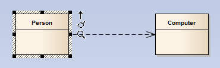
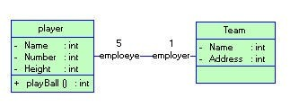

<!-- TOC -->

- [面向对象](#面向对象)
    - [抽象](#抽象)
    - [类和对象](#类和对象)
        - [类成员](#类成员)
            - [字段](#字段)
            - [属性](#属性)
            - [方法](#方法)
            - [类成员的访问](#类成员的访问)
            - [类的访问修饰符](#类的访问修饰符)
            - [成员的访问修饰符](#成员的访问修饰符)
        - [对象的创建和销毁](#对象的创建和销毁)
            - [构造函数](#构造函数)
            - [析构函数](#析构函数)
    - [访问修饰符](#访问修饰符)
    - [类与结构体](#类与结构体)
    - [三个基本特征](#三个基本特征)
        - [封装](#封装)
        - [继承](#继承)
            - [类继承](#类继承)
            - [接口继承](#接口继承)
            - [基类与派生类](#基类与派生类)
            - [类继承修饰符](#类继承修饰符)
            - [类成员继承修饰符](#类成员继承修饰符)
            - [接口继承](#接口继承-1)
        - [多态](#多态)
    - [类之间的关系](#类之间的关系)
        - [依赖](#依赖)
        - [关联](#关联)
        - [关联和依赖的区别](#关联和依赖的区别)
        - [泛化](#泛化)
        - [实现](#实现)
        - [聚合](#聚合)
        - [组合](#组合)
        - [聚合和组合](#聚合和组合)

<!-- /TOC -->
<a id="markdown-面向对象" name="面向对象"></a>
# 面向对象
<a id="markdown-抽象" name="抽象"></a>
## 抽象
世间万物皆对象，面向对象的设计也是基于现实世界的。

- 面向过程

体现了程序员的逻辑思维能力，其本质是把一个业务看作一个流程化操作动作(使用函数来实现)，一步步的去执行。

- 面向对象

体现了程序员的抽象思维能力，其本质是把一个业务分成若干个模块(使用对象[类]来实现)，由这些模块交互组合去执行。

- 生命周期

构造函数(实例化对象) -> 对象的使用/操作 -> 析构函数(销毁对象)

**案列之大象装冰箱**
```cs
//面向过程编程，只有三步
打开冰箱门();
装大象进冰箱();
关闭冰箱门();
```

```cs
/*
面向对象编程
则要分析，案例中出现了几种类型的对象，分别具有什么属性和方法
*/
public class 大象{}
public class 冰箱{}
public class 人{}
//todo...
```

<a id="markdown-类和对象" name="类和对象"></a>
## 类和对象

<a id="markdown-类成员" name="类成员"></a>
### 类成员

<a id="markdown-字段" name="字段"></a>
#### 字段
声明：修饰符 + 标准的变量声明
```cs
//私有字段，只可以类的内部进行访问
private string  classField = string.Empty;

//static 静态字段，通过类名访问
public static int ViewCount = 0;

//readonly 只读字段，只能在声明或构造函数中赋值
public static readonly string Version = "静态只读字段";

//const 常量
public const double PI = 3.1415926;

```

<a id="markdown-属性" name="属性"></a>
#### 属性
属性描述的是内置映射字段的读写能力

```cs
//属性的声明，和下面的方式是等效的，是下面写法的简化
public string Name { get; set; }

//==========================================
private string name;
public string Name
{
    get { return name; }
    set { name = value; }
}
```

设置属性为内部可读写，从外部只能进行读取：
```cs
public class Student
{
    //属性
    public string Name{get;set;}

    //只读属性，只能在类的内部进行设置赋值
    private DateTime birth;
    public DateTime Birth
    {
        get{ return birth;}
    }

    //只有类的内部可以进行设置，外部不可通过实例进行访问，同上述Birth属性，只能在类的内部进行设置赋值
    public int Age{get; private set;}
}
```

<a id="markdown-方法" name="方法"></a>
#### 方法
```cs
/// <summary>
/// 实例方法，在对象上调用
/// </summary>
void Say() { }

/// <summary>
/// 静态方法，多个实例共享同一个数据
/// </summary>
static void Talk() { }
```

<a id="markdown-类成员的访问" name="类成员的访问"></a>
#### 类成员的访问
- 实例成员

通过该对象名进行对实例成员的访问。

- 静态成员

每个实例即为一个对象，对象之间数据不共享。使用static声明，在多个实例间共享同一个数据。

静态成员需要通过类名进行访问，实例成员可以访问静态成员，但静态成员不能访问实例成员。

<a id="markdown-类的访问修饰符" name="类的访问修饰符"></a>
#### 类的访问修饰符
* public：公共的，该可以被任何代码访问。
* internal：(默认，可不写)内部的，只能由定义它的工程内部的代码访问。

<a id="markdown-成员的访问修饰符" name="成员的访问修饰符"></a>
#### 成员的访问修饰符
* public：公共的，成员可以被任何代码访问
* private：（默认，可不写）私有的，只能由本类中的代码访问
* protected：受保护的，成员只能由本类或其派生类中的代码访问
* internal：内部的，成员只能由定义它的工程内部的代码访问
* protected internal：该成员既可以被同一工程的其它代码访问，也可以被其派生类访问


<a id="markdown-对象的创建和销毁" name="对象的创建和销毁"></a>
### 对象的创建和销毁
对象即类的实例化，每个对象都有自己的生命周期，构造而生，析构而亡。

构造创建对象：使用 new 关键字调用类的构造函数。

析构销毁对象：1)管制堆内存紧张时 CLR 自动调用析构函数清理对象;2)使用Dispose模式手工释放非内存资源;

<a id="markdown-构造函数" name="构造函数"></a>
#### 构造函数
主要用于为对象分配存储空间,对数据成员进行初始化：
1. C#构造函数的名字必须与类同名;
2. C#构造函数没有返回类型,它可以带参数,也可以不带参数;
3. C#构造函数的主要作用是完成对类的初始化工作;
4. 在创建一个类的新对象（使用new关键字）时，系统回自动调用给类的构造函数初始化新对象;

```cs
public class Student
{
    //属性
    public string Name{get;set;}

    //默认构造函数，可以不写，但是如果有自定义构造函数，则不会添加默认构造函数
    public Student(){}

    //自定义构造函数，可以在对象创建时做一些初始化操作
    public Student(string name){ Name = name; }
}
```

除此，还有静态构造函数，私有构造函数。
```cs
public class Student
{
    /*私有构造函数 设计模式中常用
    1、将构造函数申明为私有的，则不能通过new运算符在外部代码中实例化。
    但可以编写一个静态方法或属性在其内部实例化一个对象，再将结果返回给外部代码。
    2、永远不会实例化，因为它仅用作某些静态成员的容器;
    3、希望类只能通过调用某个静态方法来实例化(即所谓的对象实例化的类工厂方法);
    */
    private Student(){}

    /*静态构造函数 用的不多
    1.静态构造函数既没有访问修饰符，也没有参数。
    2.在创建第一个实例或引用任何静态成员之前，将自动调用静态构造函数来初始化类，
    也就是无法直接调用静态构造函数，也无法控制什么时候执行静态构造函数。
    3.一个类只能有一个静态构造函数，最多只能运行一次。
    4.静态构造函数不可以被继承。
    5.如果没有静态构造函数，而类中的静态成员有初始值，那么编译器会自动生成默认的静态构造函数。
    */
    static Student(){}
}
```

<a id="markdown-析构函数" name="析构函数"></a>
#### 析构函数
析构函数(destructor) 与构造函数相反，当对象脱离其作用域时（例如对象所在的函数已调用完毕），系统自动执行析构函数。
析构函数往往用来做“清理善后” 的工作（例如在建立对象时用new开辟了一片内存空间，应在退出前在析构函数中用delete释放）。

析构函数名也应与类名相同，只是在函数名前面加一个波浪符~

* 一个类只能有一个解构器。 
* 解构器不能被继承或重载。 
* 解构器不能被调用。他们是自动被（编译器）调用的。 
* 解构器不能带修饰或参数。 

```cs
public class Student
{
    ~Student(){}
}
```

<a id="markdown-访问修饰符" name="访问修饰符"></a>
## 访问修饰符
一个类编写完成后，并不是任何角色都能去访问该类或该类中的某些特定成员。

使用“访问修饰符”来对类和类成员的访问权限进行控制

- 类的访问修饰符

修饰符 | 说明
------|---
public | 公共的，该可以被任何代码访问
internal | (默认，可不写)内部的，只能由定义它的工程内部的代码访问

- 类成员访问修饰符

修饰符 | 说明
------ | -----
public | 公共的，成员可以被任何代码访问
private | (默认，可不写)私有的，只能由本类中的代码访问
protected | 受保护的，成员只能由本类或其派生类中的代码访问
internal | 内部的，成员只能由定义它的工程内部的代码访问
protected internal | 该成员既可以被同一工程的其它代码访问，也可以被其派生类访问

<a id="markdown-类与结构体" name="类与结构体"></a>
## 类与结构体


<a id="markdown-三个基本特征" name="三个基本特征"></a>
## 三个基本特征

**搞笑图解**


<a id="markdown-封装" name="封装"></a>
### 封装
屏蔽具体的实现，不用关心实现的过程。

<a id="markdown-继承" name="继承"></a>
### 继承
继承是子类自动共享父类数据和方法的机制，这是类之间的一种关系，提高了软件的可重用性和可扩展性

<a id="markdown-类继承" name="类继承"></a>
#### 类继承

直接使用基类的属性和方法而无需额外编码的能力，基类和派生类一样，也是一个类，使用 class 关键字定义一个基类

<a id="markdown-接口继承" name="接口继承"></a>
#### 接口继承

仅使用属性和方法的名称、但是子类必须提供实现的能力，需要使用 interface 关键字去定义一个接口

<a id="markdown-基类与派生类" name="基类与派生类"></a>
#### 基类与派生类

通过继承创建的新类称为“子类”或“派生类”；被继承的类称为“基类”、“父类”或“超类”；

编译器不允许派生类的访问级别比基类更高，如没有显式标记基类，则默认基类为Object类；

<a id="markdown-类继承修饰符" name="类继承修饰符"></a>
#### 类继承修饰符

abstract：抽象的，不能实例化，只能被继承，可以有抽象成员

sealed：密封的，不能被继承

<a id="markdown-类成员继承修饰符" name="类成员继承修饰符"></a>
#### 类成员继承修饰符

- 基类中：

virtual：虚拟，可以被派生类重写，也可以不进行重写；

abstract：抽象，不需要方法实现，必须被派生类重写，只要一个成员为抽象成员，该类也就必须声明为抽象类

- 派生类中：

override：重写，派生类重写基类成员

new：隐藏，隐藏基类同名成员，使两成员均不出现彼此覆盖的影响，可不写，但会出现警告

<a id="markdown-接口继承-1" name="接口继承-1"></a>
#### 接口继承

所有接口成员都是公共 public 的，可以定义属性、方法，**但不能定义字段**

不能被static、virtual、abstract和sealed修饰，但可以有new来隐藏基接口成员

<a id="markdown-多态" name="多态"></a>
### 多态
同一操作作用于不同的对象，可以有不同的解释，产生不同的执行结果，这就是多态性。

多态是指程序中定义的引用变量所指向的具体类型和通过该引用变量发出的方法调用在编程时并不确定，而是在程序运行期间才确定，即不修改程序代码就可以改变程序运行时所绑定的具体代码，让程序可以选择多个运行状态，这就是多态性。

```cs
public class Animal
{
    public virtual void Eat()
    {
        Console.WriteLine("Animal eat");
    }
}

public class Cat : Animal
{
    public override void Eat()
    {
        Console.WriteLine("Cat eat");
    }
}

public class Dog : Animal
{
    public override void Eat()
    {
        Console.WriteLine("Dog eat");
    }
}

static void Main(string[] args)
{
    Animal[] animals = new Animal[3];

    animals[0] = new Animal();
    animals[1] = new Cat();
    animals[2] = new Dog();

    for (int i = 0; i < 3; i++)
    {
        animals[i].Eat();
    }
}
```

可以参考：

[C#中多态](http://www.cnblogs.com/sylone/p/6081141.html)

多态性增强了软件的灵活性和扩展性

<a id="markdown-类之间的关系" name="类之间的关系"></a>
## 类之间的关系

关系名称 | 描述 | 示例
-----|----|---
依赖(Dependency) | 使用关系，一个类的实现需要另一个类的协助 | 人使用计算机
关联(Association) | 拥有关系，一个类知道另一个类的属性和方法 | 水和气候的关联
泛化(Generalization) | 继承关系，指定子类如何特殊化父类的所有特征和行为 | 动物和植物均派生自生物
实现(Implementation) | 类与接口的关系，表示类是接口所有特征和行为的实现 | 鸟会飞，飞机也会飞

<a id="markdown-依赖" name="依赖"></a>
### 依赖
人编码的模型作为示例,UML图中使用虚线箭头，由依赖的一方指向被依赖的一方：



1. A类是B类中的(某方法的)局部变量，如Computer类是Person类中某个方法的局部变量，则Person类可以调用它
```cs
public class Person
{
    public void Coding()
    {
        Computer pc = new Computer();
    }
}
public class Computer {}
```

2. A类是B类方法当中的一个参数，如Computer类作为Person类中某个方法的参数或返回值
```cs
public class Person
{
    public Computer Coding(Computer pc) {}
}
public class Computer {}
```

3. A类向B类发送消息，从而影响B类发生变化；

<a id="markdown-关联" name="关联"></a>
### 关联
水和气候的关联关系，UML图中使用实线箭头表示：



```cs
public class Water
{
    //气候作为一个属性
    public Climate climate {get;set;}
}

public class Climate {}
```

以上示例是一个单向关联，还有双向关联、自身关联、多维关联

<a id="markdown-关联和依赖的区别" name="关联和依赖的区别"></a>
### 关联和依赖的区别
- 从类的属性是否增加的角度看：

发生依赖关系的两个类都不会增加属性。其中的一个类作为另一个类的方法的参数或者返回值，或者是某个方法的变量而已。

发生关联关系的两个类，其中的一个类成为另一个类的属性，而属性是一种更为紧密的耦合，更为长久的持有关系。

- 从关系的生命周期来看：
 
依赖关系是仅当类的方法被调用时而产生，伴随着方法的结束而结束了。

关联关系是当类实例化的时候即产生，当类销毁的时候，关系结束。相比依赖讲，关联关系的生存期更长。

<a id="markdown-泛化" name="泛化"></a>
### 泛化
泛化关系(Generalization)也就是继承关系，也称为“is-a-kind-of”关系，泛化关系用于描述父类与子类之间的关系，父类又称作基类或超类，子类又称作派生类。在UML中，泛化关系用带空心三角形的直线来表示。

```cs
//生物
public class Biology
{
    public string Name {get;set;}
}

//动物 继承生物
public class Animal : Biology
{
    //进食
    public void Eat(){}
}

//植物 继承生物
public class Plant : Biology
{
    //光合作用
    public void Photosynthetic(){}
}
```

<a id="markdown-实现" name="实现"></a>
### 实现
实现关系是一种类与接口的关系，表示类是接口所有特征和行为的实现。
飞机和鸟都可以飞
```cs
public interface IFly
{
    //最高飞行高度
    int MaxHigh { get; set; }

    //飞起来
    void Fly();
}

public class Plane : IFly
{
    /// <summary>
    /// 最高飞行高度
    /// </summary>
    public int MaxHigh { get; set; }

    /// <summary>
    /// 飞机飞起来
    /// </summary>
    public void Fly() { }
}

public class Bird : IFly
{
    /// <summary>
    /// 最高飞行高度
    /// </summary>
    public int MaxHigh { get; set; }

    /// <summary>
    /// 鸟儿飞起来
    /// </summary>
    public void Fly() { }
}
```

<a id="markdown-聚合" name="聚合"></a>
### 聚合
聚合关系(Aggregation):表示的是整体和部分的关系，整体与部分可以分开。

- 聚合关系(Aggregation) 表示一个整体与部分的关系。通常在定义一个整体类后，再去分析这个整体类的组成结构，从而找出一些成员类，该整体类和成员类之间就形成了聚合关系。
- 在聚合关系中，成员类是整体类的一部分，即成员对象是整体对象的一部分，但是成员对象可以脱离整体对象独立存在。

在UML中，聚合关系用带空心菱形的直线表示。 

```cs
/// <summary>
/// 大雁群
/// </summary>
public class GooseGroup
{
    public List<Goose> LstGoose { get; set; }
}

/// <summary>
/// 大雁
/// </summary>
public class Goose { }
```

<a id="markdown-组合" name="组合"></a>
### 组合
组合关系(Composition):也是整体与部分的关系，但是整体与部分不可以分开。

- 组合关系(Composition)也表示类之间整体和部分的关系，但是组合关系中部分和整体具有统一的生存期。一旦整体对象不存在，部分对象也将不存在，部分对象与整体对象之间具有同生共死的关系。
- 在组合关系中，成员类是整体类的一部分，而且整体类可以控制成员类的生命周期，即成员类的存在依赖于整体类。

在UML中，组合关系用带实心菱形的直线表示。

```cs
/// <summary>
/// 大雁
/// </summary>
public class Goose
{
    /// <summary>
    /// 翅膀
    /// </summary>
    public object Wings { get; set; }
}

/// <summary>
/// 翅膀
/// </summary>
public class Wings { }
```

<a id="markdown-聚合和组合" name="聚合和组合"></a>
### 聚合和组合

引用程杰的《大话设计模式》里举大那个大雁的例子 ：

大雁喜欢热闹害怕孤独，所以它们一直过着群居的生活，这样就有了雁群，每一只大雁都有自己的雁群，每个雁群都有好多大雁，大雁与雁群的这种关系就可以称之为聚合。

另外每只大雁都有两只翅膀，大雁与雁翅的关系就叫做组合。

有此可见：

聚合的关系明显没有组合紧密，大雁不会因为它们的群主将雁群解散而无法生存；

而雁翅就无法脱离大雁而单独生存——组合关系的类具有相同的生命周期。

以上类之间关系部分引用自：

[浅谈UML中类之间的五种关系及其在代码中的表现形式](http://www.cnblogs.com/DebugLZQ/archive/2013/05/13/3066715.html)

[UML图中类之间的关系:依赖,泛化,关联,聚合,组合,实现](http://blog.csdn.net/hguisu/article/details/7609483/)