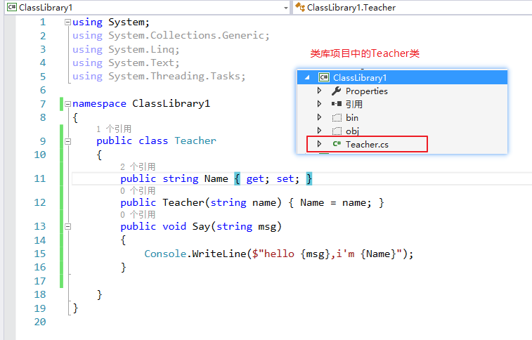
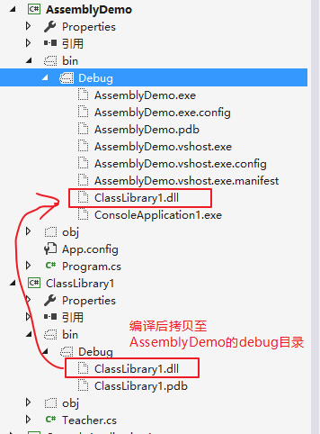
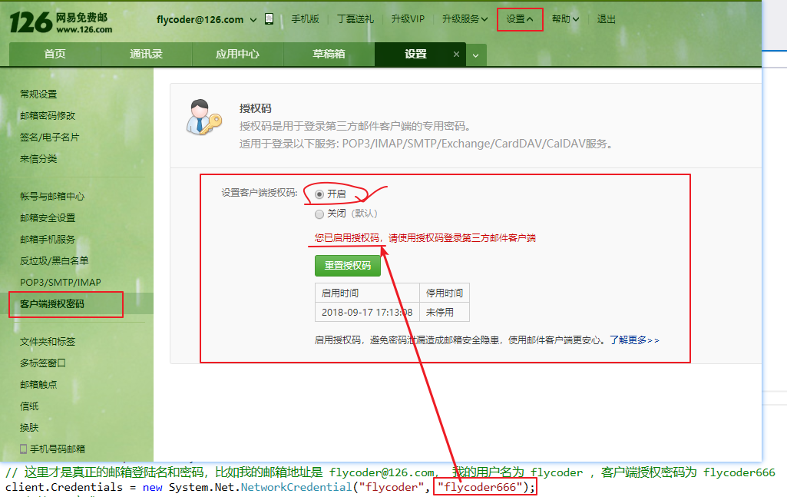
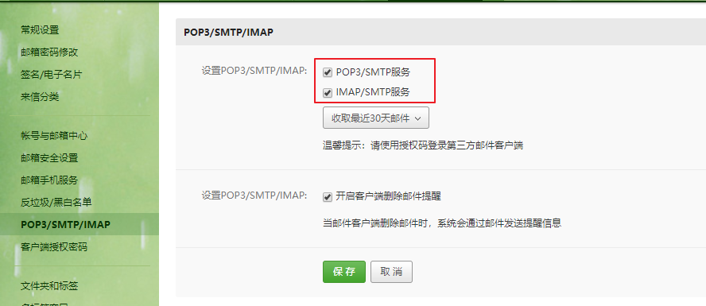
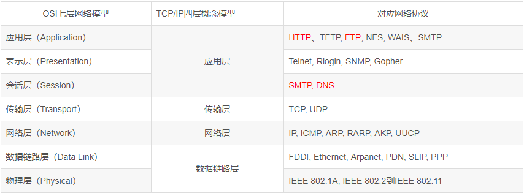
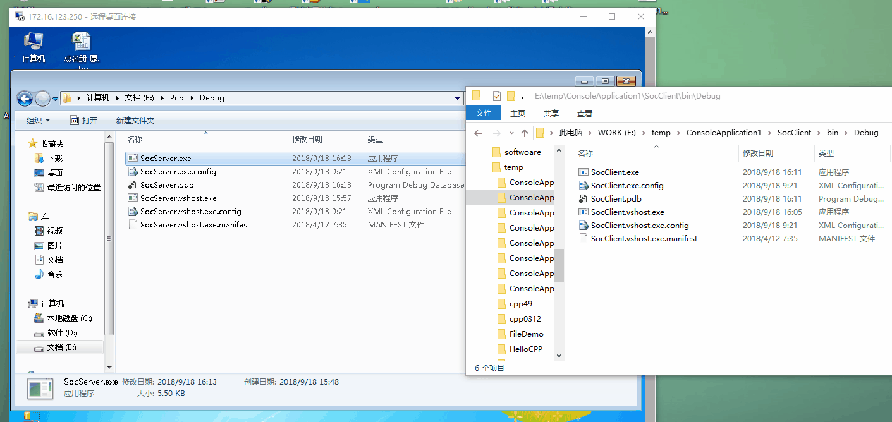
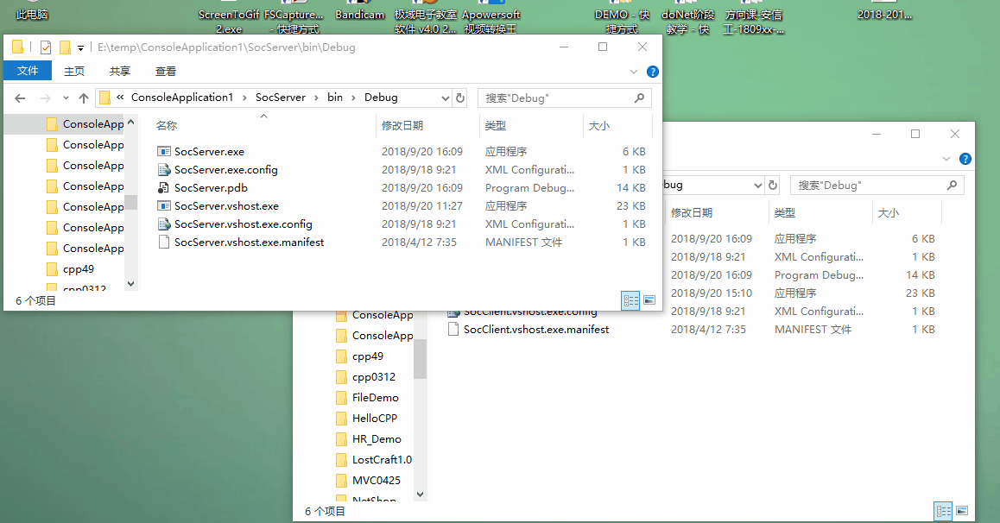

<!-- TOC -->

- [高级编程](#高级编程)
    - [委托、Lambda表达式和事件](#委托lambda表达式和事件)
        - [委托](#委托)
            - [泛型委托-Predicate](#泛型委托-predicate)
            - [泛型委托-Action](#泛型委托-action)
            - [泛型委托-Func](#泛型委托-func)
        - [Lambda表达式](#lambda表达式)
        - [事件](#事件)
    - [扩展方法](#扩展方法)
    - [反射](#反射)
        - [反射(Reflection)](#反射reflection)
            - [加载同程序集](#加载同程序集)
            - [加载不同程序集](#加载不同程序集)
        - [自定义特性(Attribute)](#自定义特性attribute)
            - [特性是什么](#特性是什么)
            - [作用](#作用)
            - [Attribute 与注释的区别](#attribute-与注释的区别)
            - [使用](#使用)
    - [同步异步](#同步异步)
    - [多线程](#多线程)
        - [什么是进程？](#什么是进程)
        - [什么是线程？](#什么是线程)
        - [线程创建](#线程创建)
        - [线程状态及属性](#线程状态及属性)
            - [Sleep()](#sleep)
            - [Join()](#join)
        - [前台线程与后台线程](#前台线程与后台线程)
        - [线程安全](#线程安全)
    - [邮件发送](#邮件发送)
        - [协议](#协议)
        - [邮件发送](#邮件发送-1)
    - [Socket编程](#socket编程)
        - [网络通讯协议](#网络通讯协议)
        - [TCP和UDP](#tcp和udp)
            - [UDP](#udp)
            - [TCP](#tcp)

<!-- /TOC -->
<a id="markdown-高级编程" name="高级编程"></a>
# 高级编程

<a id="markdown-委托lambda表达式和事件" name="委托lambda表达式和事件"></a>
## 委托、Lambda表达式和事件

<a id="markdown-委托" name="委托"></a>
### 委托
委托是安全封装方法的类型，类似于 C 和 C++ 中的函数指针。 与 C 函数指针不同的是，委托是面向对象的、类型安全的和可靠的。

说白了，委托是一个类，将方法作为实参传递，实际传递的是方法地址/引用。

```cs
//委托调用的方法和委托的定义必须保持一致，如下面的几个示例
void Say(){}
delegate void DelegateTalk();

string Say(){}
delegate string DelegateTalk();

bool Say(int value){}
delegate bool DelegateTalk(int vlaue);
```

方法作为参数进行传递
```cs
static void Main(string[] args)
{
    BackHome(BuyTicket);
    BackHome(Subway);

    Console.ReadKey();
}

/// <summary>
/// 无参，返回值为void的委托 和下面的Action等同
/// </summary>
//public delegate void DelegateBack();

static void BackHome(Action action)
{
    action();
}

static void BuyTicket()
{
    Console.WriteLine("买火车票");
}

static void Subway()
{
    Console.WriteLine("换乘地铁");
}
```

针对上例中的Main方法也可以修改为以下方式，以合并委托(多路广播委托)的方式实现
```cs
static void Main(string[] args)
{
    Action action = new Action(BuyTicket);
    action += Subway;

    BackHome(action);

    Console.ReadKey();
}
```

<a id="markdown-泛型委托-predicate" name="泛型委托-predicate"></a>
#### 泛型委托-Predicate

表示定义一组条件并确定指定对象是否符合这些条件的方法。

此委托由 Array 和 List 类的几种方法使用，用于在集合中搜索元素。

`public delegate bool Predicate<T>(T obj);`

类型参数介绍：
* T： 要比较的对象的类型。
* obj： 要按照由此委托表示的方法中定义的条件进行比较的对象。
* 返回值：bool，如果 obj 符合由此委托表示的方法中定义的条件，则为 true；否则为 false。

```cs
List<string> listStr = new List<string>() { "One", "Two", "Three", "Four", "Five", "Six", "Seven", "Eight", "Nine", "Ten" };
string[] arrStr = listStr.ToArray();

/*
筛选 长度小于3的元素
*/

//1、原始方法
foreach (var item in listStr)
{
    if (item.Length <= 3)
    {
        Console.WriteLine(item);
    }
}
foreach (var item in arrStr)
{
    if (item.Length <= 3)
    {
        Console.WriteLine(item);
    }
}

//2、使用Predicate
List<string> list1 = listStr.FindAll(t => t.Length <= 3);
Console.WriteLine(string.Join(",", list1));

string[] arr1 = Array.FindAll(arrStr, t => t.Length <= 3);
Console.WriteLine(string.Join(",", arr1));
```

<a id="markdown-泛型委托-action" name="泛型委托-action"></a>
#### 泛型委托-Action
Action泛型委托代表了一类方法：可以有0个到16个输入参数，输入参数的类型是不确定的，但不能有返回值。

```cs
//Action 等效
delegate void Delegate1();

//Action<int, string, bool, object> 等效
delegate void Delegate2(int num, string str, bool isa, object obj);
```

<a id="markdown-泛型委托-func" name="泛型委托-func"></a>
#### 泛型委托-Func
为了弥补Action泛型委托，不能返回值的不足，.net提供了Func泛型委托。

相同的是它也是最多0到16个输入参数，参数类型由使用者确定，不同的是它规定要有一个返回值，返回值的类型也由使用者确定。

```cs
//Func<string> 等效
delegate string Delegate1();

//Func<string, bool> 等效
delegate bool Delegate2(string name);

//Func<string, bool, object, int> 等效
delegate int Delegate3(string str, bool isa, object obj);
```

<a id="markdown-lambda表达式" name="lambda表达式"></a>
### Lambda表达式
Lambda 表达式是一种可用于创建 委托 或 表达式目录树 类型的 匿名函数 。 

通过使用 lambda 表达式，可以写入可作为参数传递或作为函数调用值返回的本地函数。 

Lambda 表达式对于编写 LINQ 查询表达式特别有用。

[Lambda 表达式(C# 编程指南)](https://docs.microsoft.com/zh-cn/dotnet/csharp/programming-guide/statements-expressions-operators/lambda-expressions)

在 2.0 之前的 C# 版本中，声明委托的唯一方法是使用命名方法。  C# 2.0 引入了匿名方法，而在 C# 3.0 及更高版本中。

Lambda 表达式取代了匿名方法，作为编写内联代码的首选方式。

在C#2.0之前就有委托了，在2.0之后又引入了匿名方法，C#3.0之后，又引入了Lambda表达式。

他们三者之间的顺序是：委托->匿名表达式->Lambda表达式。

以下分别是三种对应不同的实现：
```cs
/// <summary>
/// 计算委托的类型
/// </summary>
/// <param name="x"></param>
/// <param name="y"></param>
/// <returns></returns>
delegate int Calculate(int x, int y);

/// <summary>
/// 执行计算方法
/// </summary>
/// <param name="fun">委托传入的方法</param>
/// <param name="x">操作数1</param>
/// <param name="y">操作数2</param>
static void DoCalc(Calculate fun, int x, int y)
{
    fun.Invoke(x, y);
}

/// <summary>
/// 加法
/// </summary>
/// <param name="x"></param>
/// <param name="y"></param>
/// <returns></returns>
static int Add(int x, int y)
{
    return x + y;
}

static void Main(string[] args)
{
    /*
    委托
    加法运算，最简单的委托方式，先定义方法Add，再进行传入
    */
    DoCalc(Add, 1, 2);

    /*
    匿名方法
    减法运算，使用匿名方法形式传入
    */
    DoCalc(delegate (int x, int y)
    {
        return x - y;
    }, 1, 2);

    /*
    Lambda表达式
    乘法运算，【=>】左侧(x,y)为参数，【=>】右侧为代码块
    若要创建 Lambda 表达式，需要在 Lambda 运算符 => 左侧指定输入参数(如果有)，然后在另一侧输入表达式或语句块。
    */
    DoCalc((x, y) =>
    {
        return x * y;
    }, 2, 3);

    //上述乘法运算也可以简写为：
    DoCalc((x, y) => x * y, 2, 3);
}
```

Lambda表达式"是一个特殊的匿名函数，是一种高效的类似于函数式编程的表达式，Lambda简化了开发中需要编写的代码量。

它可以包含表达式和语句，并且可用于创建委托或表达式目录树类型，支持带有可绑定到委托或表达式树的输入参数的内联表达式。

所有Lambda表达式都使用Lambda运算符=>，该运算符读作"goes to"。

Lambda运算符的左边是输入参数(如果有)，右边是表达式或语句块。

Lambda表达式x => x * x读作"x goes to x times x"。

上述示例也可以使用.NET预定义的委托Func<>进行替代，不需要新定义Calculate委托，如下：
```cs
/// <summary>
/// 计算委托的类型
/// 注释该委托，使用Func<>委托代替
/// </summary>
/// <param name="x"></param>
/// <param name="y"></param>
/// <returns></returns>
//delegate int Calculate(int x, int y);

/// <summary>
/// 执行计算方法
/// Func<int,int,int>前两个int为参数，最后一个int为返回值类型
/// </summary>
/// <param name="fun">委托传入的方法 使用.NET预定义的委托</param>
/// <param name="x">操作数1</param>
/// <param name="y">操作数2</param>
static void DoCalc(Func<int, int, int> fun, int x, int y)
{
    fun.Invoke(x, y);
}
```

仅当 lambda 只有一个输入参数时，括号才是可选的；否则括号是必需的。 括号内的两个或更多输入参数使用逗号加以分隔：
```cs
(x, y) => x == y
x=> x*x
```

使用空括号指定零个输入参数：
```cs
() => SomeMethod()
```

<a id="markdown-事件" name="事件"></a>
### 事件
事件(Event) 基本上说是一个用户操作，如按键、点击、鼠标移动等等，或者是一些出现，如系统生成的通知。

应用程序需要在事件发生时响应事件。例如，中断。事件是用于进程间通信。

事件在类中声明且生成，且通过使用同一个类或其他类中的委托与事件处理程序关联。

包含事件的类用于发布事件。这被称为 **发布器(publisher) 类**。

其他接受该事件的类被称为 **订阅器(subscriber) 类**。

事件使用 **发布-订阅(publisher-subscriber) 模型**。

**发布器(publisher)** 是一个包含事件和委托定义的对象。事件和委托之间的联系也定义在这个对象中。发布器(publisher)类的对象调用这个事件，并通知其他的对象。

**订阅器(subscriber)** 是一个接受事件并提供事件处理程序的对象。在发布器(publisher)类中的委托调用订阅器(subscriber)类中的方法(事件处理程序)。

```cs
/// <summary>
/// 定义一个无返回值有参委托
/// </summary>
/// <param name="name"></param>
public delegate void MyEventHandler(string name);

public class Student
{
    /*
    定义委托实例(事件)
    使用event关键字为了避免直接在对象上进行委托实例的调用，如【stu1.Introduce("xxx");】
    */
    public event MyEventHandler Introduce;
    public string Name { get; set; }
    public Student(string name)
    {
        Name = name;
    }
    public void Say()
    {
        Console.WriteLine($"{Name}的自我介绍...");
        if (null != Introduce)
        {
            Introduce.Invoke(Name);
        }
    }
}

class Program
{
    static void Main(string[] args)
    {
        Student stu1 = new Student("jack");

        // 1、注册方法到事件
        stu1.Introduce += SayByChn;

        // 2、匿名方法
        stu1.Introduce += delegate (string s)
        {
            Console.WriteLine("ni hao, wo shi " + s);
        };

        // 3、lambda表达式方式，注册事件
        stu1.Introduce += (v) =>
        {
            Console.WriteLine("hello,i'm " + v);
        };

        // 调用，触发对象上注册的所有方法
        stu1.Say();

        Console.WriteLine("==============移除SayByChn方法的注册==============");
        stu1.Introduce -= SayByChn;
        stu1.Say();

        // 因为 Introduce 定义为event，不允许直接进行调用
        //stu1.Introduce("xxx");
    }

    static void SayByChn(string name)
    {
        Console.WriteLine("中文版，你好!" + name);
    }
}
```

<a id="markdown-扩展方法" name="扩展方法"></a>
## 扩展方法
如果想给一个类型增加行为，一定要通过继承的方式实现吗？不一定的！

比如我们想要给String类添加打印输出到控制台的方法，可以通过如下方式实现：
```cs
static class Program
{
    /// <summary>
    /// 扩展方法，针对string类型增加打印输出到控制台的方法
    /// 注意，扩展方法必须放在非泛型静态类中，方法也需要声明为静态方法
    /// </summary>
    /// <param name="source"></param>
    public static void PrintConsole(this string source)
    {
        Console.WriteLine(source);
    }

    static void Main(string[] args)
    {
        string name = "不识美妻刘强东";
        //扩展方法的调用
        name.PrintConsole();
    }
}
```

<a id="markdown-反射" name="反射"></a>
## 反射
在运行期间处理和检测代码，反射指程序可以访问、检测和修改它本身状态或行为的一种能力。

程序集包含模块，而模块包含类型，类型又包含成员。反射则提供了封装程序集、模块和类型的对象。

使用反射动态地创建类型的实例，将类型绑定到现有对象，或从现有对象中获取类型。然后，可以调用类型的方法或访问其字段和属性。

<a id="markdown-反射reflection" name="反射reflection"></a>
### 反射(Reflection)
<a id="markdown-加载同程序集" name="加载同程序集"></a>
#### 加载同程序集

```cs
public class Student
{
    public Student(string name)
    {
        Name = name;
    }
    public string Name { get; set; }
    public int Age { get; set; }
    public string Course { get; set; }
    public void Say(string name)
    {
        Console.WriteLine("hi {0},how do u do,i'm {1}", name, Name);
    }
}

static void Main(string[] args)
{
    //以下的type1、type2、type3的是相同的
    Student stu1 = new Student("");
    Type type1 = stu1.GetType();

    Type type2 = typeof(Student);

    Type type3 = Type.GetType("Reflection.Student");

    /*
    加载程序集中类型，并打印显示到控制台
    */
    Assembly a = Assembly.LoadFrom("Reflection.exe");
    Type[] types = a.GetTypes();
    foreach (Type item in types)
    {
        Console.WriteLine("类型名称为：" + item.Name);
    }

    /*
    反射查看类内的成员
    */
    Type type = typeof(Student);
    //获取类内的所有公开字段
    FieldInfo[] fieldInfos = type.GetFields();
    //获取类内所有公开属性
    PropertyInfo[] propInfos = type.GetProperties();
    //获取类内所有公开方法
    MethodInfo[] methodInfos = type.GetMethods();
    //获取类内所有公开成员，包含了字段、属性、方法等
    MemberInfo[] memInfos = type.GetMembers();
    foreach (MemberInfo item in memInfos)
    {
        Console.WriteLine("MemberType:{0},Name:{1}", item.MemberType, item.Name);
    }

    /*
    通过反射构造对象，调用方法
    */
    //使用指定类型的默认构造函数来创建该类型的实例，实例化一个对象
    object obj = Activator.CreateInstance(type, new object[] { "宋小宝" });
    //获取指定的方法 
    MethodInfo sayMethod = type.GetMethod("Say");
    //执行Student类中的Say方法
    var result = sayMethod.Invoke(obj, new object[] { "王富贵" });
}
```
看了上面的代码，也许会有疑问，既然在开发时就能够写好代码，干嘛还放到运行期去做，不光繁琐，而且效率也受影响。

很多设计模式是基于反射实现的，设计模式的好处是复用解决方案，可靠性高等。如何取舍是一个见仁见智的问题。。。

<a id="markdown-加载不同程序集" name="加载不同程序集"></a>
#### 加载不同程序集
通过加载其他程序集中的类，进行实例化对象和调用方法：

新建类库项目，默认命名【ClassLibrary1】，然后创建【Teacher】类，结构内容如下：


```cs
namespace ClassLibrary1
{
    public class Teacher
    {
        public string Name { get; set; }
        public Teacher(string name) { Name = name; }
        public void Say(string msg)
        {
            Console.WriteLine($"hello {msg},i'm {Name}");
        }
    }
}
```

新增控制台应用程序项目，编译上一步中的类库项目，并拷贝【ClassLibrary1.dll】文件至控制台应用程序的【debug】目录



在控制台应用程序的【Main】方法中进行加载程序集并调用，代码如下：
```cs
// 装载程序集 ClassLibrary1.dll，在当前目录中
Assembly ass = Assembly.LoadFrom("ClassLibrary1.dll");

// 获取该程序集中定义的 Teacher类，注意要写全名FullName，如 ClassLibrary1.Teacher
Type t = ass.GetType("ClassLibrary1.Teacher");

// 需要考虑找不到该类型的情况
if (null != t)
{
    object jack = Activator.CreateInstance(t, "宋小宝");
    MethodInfo method = t.GetMethod("Say");
    method.Invoke(jack, new object[] { "这是通过assembly反射进行调用的方法" });
}
```

<a id="markdown-自定义特性attribute" name="自定义特性attribute"></a>
### 自定义特性(Attribute)
<a id="markdown-特性是什么" name="特性是什么"></a>
#### 特性是什么
Attribute 是一种可由用户自由定义的修饰符(Modifier)，可以用来修饰各种需要被修饰的目标。

简单的说，Attribute就是一种“附着物” —— 就像牡蛎吸附在船底或礁石上一样。

这些附着物的作用是为它们的附着体追加上一些额外的信息(这些信息就保存在附着物的体内)—— 比如这个属性对应数据库中哪个字段，这个类对应数据库中哪张表等等。

<a id="markdown-作用" name="作用"></a>
#### 作用
特性Attribute 的作用是添加元数据。

元数据可以被工具支持，比如：编译器用元数据来辅助编译，调试器用元数据来调试程序。

<a id="markdown-attribute-与注释的区别" name="attribute-与注释的区别"></a>
#### Attribute 与注释的区别
- 注释是对程序源代码的一种说明，主要目的是给人看的，在程序被编译的时候会被编译器所丢弃，因此，它丝毫不会影响到程序的执行。
- Attribute是程序代码的一部分，不但不会被编译器丢弃，而且还会被编译器编译进程序集(Assembly)的元数据(Metadata)里，在程序运行的时候，你随时可以从元数据里提取出这些附加信息来决策程序的运行。

<a id="markdown-使用" name="使用"></a>
#### 使用
自定义特性的定义：
```cs
public sealed class FieldChNameAttribute : Attribute
{
    public string ChName { get; set; }
    public FieldChNameAttribute() { }
    public FieldChNameAttribute(string chName)
    {
        ChName = chName;
    }
}
```

如何使用自定义特性：
```cs
[FieldChName(ChName = "学生实体")]
public class Student
{
    [FieldChName(ChName = "姓名")]
    public string Name { get; set; }

    [FieldChName(ChName = "年龄")]
    public int Age { get; set; }
    public string Course { get; set; }
}
```

检查类、属性是否有标记特性，以及获取特性的属性值：
```cs
static void Main(string[] args)
{
    Type type = typeof(Student);

    // 获取Student类上自定义特性
    FieldChNameAttribute attr = type.GetCustomAttribute(typeof(FieldChNameAttribute), false) as FieldChNameAttribute;

    //该类有FieldChaNameAttribute自定义特性，则获取设置的属性值ChName
    if (null != attr)
    {
        // 学生类上的标签注解
        Console.WriteLine(attr.ChName);
    }

    // 获取类型的所有公开属性
    PropertyInfo[] props = type.GetProperties();
    
    // 遍历公开属性
    foreach (PropertyInfo pp in props)
    {
        // 获取属性上的自定义特性
        FieldChNameAttribute ppAttr = pp.GetCustomAttribute(typeof(FieldChNameAttribute), false) as FieldChNameAttribute;
        // 如属性有自定义特性，则获取设置的属性值ChName
        if (null != ppAttr)
        {
            Console.WriteLine(ppAttr.ChName);
        }
    }
}
```

<a id="markdown-同步异步" name="同步异步"></a>
## 同步异步
//todo...

<a id="markdown-多线程" name="多线程"></a>
## 多线程
<a id="markdown-什么是进程" name="什么是进程"></a>
### 什么是进程？
当一个程序开始运行时，它就是一个进程，进程包括运行中的程序和程序所使用到的内存和系统资源。而一个进程又是由多个线程所组成的。

<a id="markdown-什么是线程" name="什么是线程"></a>
### 什么是线程？
线程是程序中的一个执行流，每个线程都有自己的专有寄存器(栈指针、程序计数器等)，但代码区是共享的，即不同的线程可以执行同样的函数。

线程初体验：
```cs
static void Main(string[] args)
{
    //设置当前线程名称，默认为null
    Thread.CurrentThread.Name = "My Thread Demo";
    Console.WriteLine(Thread.CurrentThread.Name);//打印当前线程名称
    Console.WriteLine(Thread.CurrentThread.ThreadState);//打印当前线程状态
}
```

多线程的优点：
* 可以同时完成多个任务；
* 可以使程序的响应速度更快；
* 可以让占用大量处理时间的任务或当前没有进行处理的任务定期将处理时间让给别的任务；
* 可以随时停止任务；
* 可以设置每个任务的优先级以优化程序性能。

然而，多线程虽然有很多优点，但是也必须认识到多线程可能存在影响系统性能的不利方面，才能正确使用线程。弊端主要有如下几点：
* 线程也是程序，所以线程需要占用内存，线程越多，占用内存也越多。
* 多线程需要协调和管理，所以需要占用CPU时间以便跟踪线程[时间空间转换，简称时空转换]。
* 线程之间对共享资源的访问会相互影响，必须解决争用共享资源的问题。
* 线程太多会导致控制太复杂，最终可能造成很多程序缺陷。

<a id="markdown-线程创建" name="线程创建"></a>
### 线程创建
调用线程Thread类的构造函数进行创建：
```cs
static void Main(string[] args)
{
    /*
    ThreadStart是一个线程委托，可以理解为一个方法指针，指向一个方法的地址
    注意这个ThreadStart委托是无返回值无参，传递的方法也应该无返回值无参
    public delegate void ThreadStart();
    */
    Thread threadVoid = new Thread(new ThreadStart(Say));
    //启动该线程
    threadVoid.Start();

    /*
    同样的，ParameterizedThreadStart也是一个线程委托，无返回值，参数为object，传递的方法也需要满足这个条件
    public delegate void ParameterizedThreadStart(object obj);
    */
    Thread threadParam = new Thread(new ParameterizedThreadStart(Talk));
    //启动有参数线程
    threadParam.Start("王富贵");
}

static void Say()
{
    for (int i = 0; i < 100; i++)
    {
        Console.WriteLine("Say Hi,time:" + DateTime.Now.ToString("mm:ss.fff"));
    }
}

static void Talk(object obj)
{
    for (int i = 0; i < 100; i++)
    {
        Console.WriteLine(obj.ToString() + "'s Talk Show,time:" + DateTime.Now.ToString("mm:ss.fff"));
    }
}
```

上述线程的执行结果反映了线程的无序性质。

通过执行结果我们会看到，主线程和子线程不是一味的执行，是兼续的。也就是说主线程和子线程在执行过程中是互相抢CPU资源进行计算的。

一旦开始，一个线程的IsAlive属性返回true,直到这个线程结束。

当传递给线程的构造函数的委托完成执行时，这个线程结束。一旦结束，该线程无法重新启动。

<a id="markdown-线程状态及属性" name="线程状态及属性"></a>
### 线程状态及属性
线程常用属性：

属性名称 | 说明
-----|---
CurrentContext | 获取线程正在其中执行的当前上下文。
CurrentThread | 获取当前正在运行的线程。
ExecutionContext | 获取一个 ExecutionContext 对象，该对象包含有关当前线程的各种上下文的信息。
IsAlive | 获取一个值，该值指示当前线程的执行状态。
IsBackground | 获取或设置一个值，该值指示某个线程是否为后台线程。
IsThreadPoolThread | 获取一个值，该值指示线程是否属于托管线程池。
ManagedThreadId | 获取当前托管线程的唯一标识符。
Name | 获取或设置线程的名称。
Priority | 获取或设置一个值，该值指示线程的调度优先级。
ThreadState | 获取一个值，该值包含当前线程的状态。

Thread 中包括了多个方法来控制线程的创建、挂起、停止、销毁

方法名称 | 说明
-----|---
Abort()　　　　 | 终止本线程。
GetDomain() | 返回当前线程正在其中运行的当前域。
GetDomainId() | 返回当前线程正在其中运行的当前域Id。
Interrupt() | 中断处于 WaitSleepJoin 线程状态的线程。
Join() | 已重载。 阻塞调用线程，直到某个线程终止时为止。
Resume() | 继续运行已挂起的线程。
Start()　　 | 执行本线程。
Suspend() | 挂起当前线程，如果当前线程已属于挂起状态则此不起作用
Sleep()　　 | 把正在运行的线程挂起一段时间。

<a id="markdown-sleep" name="sleep"></a>
#### Sleep()
Thread.Sleep暂停当前线程一段指定的时间：

```cs
static void Main()
{
    for (int i = 0; i < 5; i++)
    {
        Console.WriteLine("Sleep for 2 seconds.");
        Thread.Sleep(2000);
    }

    Console.WriteLine("Main thread exits.");
}

/* This example produces the following output:

Sleep for 2 seconds.
Sleep for 2 seconds.
Sleep for 2 seconds.
Sleep for 2 seconds.
Sleep for 2 seconds.
Main thread exits.
 */
```

<a id="markdown-join" name="join"></a>
#### Join()
Join() 实例方法，阻塞调用线程，直到某个线程终止时为止。

```cs
static void Main(string[] args)
{
    Thread th1 = new Thread(new ThreadStart(HearBeat));
    Console.WriteLine("Start...");
    th1.Start();

    // 调用Join()方法，阻塞调用线程，直到子线程执行完成
    th1.Join();

    Console.WriteLine("Done!");
    Console.ReadLine();
}

static void HearBeat()
{
    int index = 0;
    while (index < 10)
    {
        Thread.Sleep(500);
        Console.WriteLine(index + "我还活着。。。");
        index++;
    }
}
```

结果如图所示：


主线程会被阻塞， 直到子线程执行完成。如果去掉Join()方法，主线程则不会阻塞，如图：


<a id="markdown-前台线程与后台线程" name="前台线程与后台线程"></a>
### 前台线程与后台线程
线程本身并不是任何高级语言的概念，本身是计算机的概念，只是高级语言给予封装了一层。

前台线程：窗体Ui主线程退出（销毁）以后，子线程必须计算完成才能退出。

后台线程：窗体Ui主线程退出（销毁）以后，子线程就会退出。

新建一个Windows窗体应用程序，打开项目中【Properties】属性窗口，将项目的输出类型修改为【控制台应用程序】，如下图示例：


Form1中添加一个按钮，并且新增处理事件，代码如下：
```cs
private void button1_Click(object sender, EventArgs e)
{
    Console.WriteLine("开始心跳...");
    Thread th1 = new Thread(new ThreadStart(HeartBeat));
    /* 
    是否设置为后台线程
    默认为false，即主线程退出后会等待子线程执行结束
    为true时，关闭主线程则子线程也会退出
    */
    th1.IsBackground = true;
    th1.Start();
}

void HeartBeat()
{
    int index = 0;
    while (index < 10)
    {
        Thread.Sleep(1000);
        Console.WriteLine(index + "我还活着。。。");
        index++;
    }
}
```

是否设置为后台线程，如下图所示：


后台线程一般用于处理不重要的事情，应用程序结束时，后台线程是否执行完成对整个应用程序没有影响。

如果要执行的事情很重要，需要将线程设置为前台线程。

<a id="markdown-线程安全" name="线程安全"></a>
### 线程安全
```cs
/// <summary>
/// 用于多线程操作时锁，火车票有余票100张，多个线程同时进行买票操作，如何保证同时操作的时候余票的显示正确的
/// </summary>
static object lockObj = new object();

static int ticketCount = 100;

//随机对象，用于随机买票
static Random random = new Random();

static void Main(string[] args)
{
    Thread buyWork1 = new Thread(BuyTicket);
    buyWork1.Name = "王富贵";
    Thread buyWork2 = new Thread(BuyTicket);
    buyWork2.Name = "赵有才";
    Thread buyWork3 = new Thread(BuyTicket);
    buyWork3.Name = "郑钱花";

    buyWork1.Start();
    buyWork2.Start();
    buyWork3.Start();
}

/// <summary>
/// 买票操作，用于多线程委托
/// </summary>
static void BuyTicket()
{
    /*
    每个线程循环买票，一直买到没票为止
    while包含lock，每次循环间隙其他线程可以介入操作共享资源
    */
    while (ticketCount > 0)
    {
        lock (lockObj)
        {
            //生成一个[1,5]的随机数
            int cnt = random.Next(1, 5);
            Console.WriteLine("{0}需要购买{1}张票", Thread.CurrentThread.Name, cnt);
            if (ticketCount < cnt)
            {
                Console.WriteLine("!!!系统余票不足，请重新输入需要购买的票数!!!");
                return;
            }
            ticketCount -= cnt;
            Console.WriteLine("##余票提示##购买{0}张，剩余{1}张", cnt, ticketCount);
        }
    }
}
```

注意：在多线程中，共享数据是造成复杂原因的主要，而且会产生让人费解的错误。尽管很基本但还是要尽可能保持简单。

<a id="markdown-邮件发送" name="邮件发送"></a>
## 邮件发送
Internet电子邮件系统是基于客户机/服务器方式：
1. 客户端，即用户代理，负责邮件的编写、发送和接收。
2. 服务器端，即传输代理，负责邮件的传输。

<a id="markdown-协议" name="协议"></a>
### 协议
电子邮件在发送和接收的过程中还要遵循一些基本协议和标准，这些协议主要有SMTP、POP3、IMAP、MIME等。

SMTP（Simple Mail Transfer Protocol，简单邮件传输协议）用于主机与主机之间的电子邮件交换。

如果想要从邮件服务器读取或下载邮件时必须要有邮件读取协议。现在常用的邮件读取协议有两个：

1. POP3协议（Post Office Protocol 3，邮局协议的第三版本），但是在客户端的操作（如移动邮件、标记已读等），不会反馈到服务器上。
2. IMAP协议（Internet Mail Access Protocol，交互式邮件访问协议），客户端的操作都会反馈到服务器上，对邮件进行的操作，服务器上的邮件也会做相应的动作。


简单来说，SMTP协议主要是用于发邮件，POP和IMAP协议用于读取、删除、下载邮件。

<a id="markdown-邮件发送-1" name="邮件发送-1"></a>
### 邮件发送
首先需要添加引用【using System.Net.Mail;】

```cs
// 创建一封邮件对象
MailMessage mail = new MailMessage();
// 发件人地址，发件人需要与设置的邮件发送服务器的邮箱一致
mail.From = new MailAddress("flycoder@126.com", "飞翔的代码");
// 邮件主题
mail.Subject = "C# smtp 发送邮件测试";
// 邮件正文
mail.Body = $@"
    {DateTime.Now.ToString()}
    using System;
    using System.Collections.Generic;
    using System.Configuration;
    using System.IO;
    using System.Linq;
    using System.Net.Mail;
    using System.Runtime.Serialization.Formatters.Binary;
    using System.Text;
    using System.Threading;
    using System.Threading.Tasks;
    using System.Xml;
    using System.Xml.Linq;
    ";

// 添加接收人，接收人是一个列表 （收件人：你邮件里的话就是直接讲给这个人听的）
mail.To.Add(new MailAddress("ywwang5@iflytek.com"));

// 添加抄送人，接收人是一个列表 （抄送人：只是让被抄送人知悉这件事情，但被抄送人无需做任何动作）
mail.CC.Add(new MailAddress("now_way@126.com"));

// 网易的SMTP校验很严格，有时候会报 DT:SPM 发送的邮件内容包含了未被许可的信息，或被系统识别为垃圾邮件。
// 添加对自己的抄送即可
mail.CC.Add(new MailAddress("flycoder@126.com"));

using (SmtpClient client = new SmtpClient())
{
    // 设置用于 SMTP 事务的主机的名称，此处为126邮箱。qq邮箱则为 smtp.qq.com
    client.Host = "smtp.126.com";
    // 这里才是真正的邮箱登陆名和密码，比如我的邮箱地址是 flycoder@126.com， 我的用户名为 flycoder ，客户端授权密码为 flycoder666
    client.Credentials = new System.Net.NetworkCredential("flycoder", "flycoder666");
    // 邮件处理方式
    client.DeliveryMethod = SmtpDeliveryMethod.Network;

    client.Send(mail);

    Console.WriteLine("发送成功！");
}
```

使用网易邮箱smtp发送邮件，需要开启【客户端授权密码】，这里设置的授权码即发送邮件验证【Credentials】的密码，如下：



同时，不要忘记开启服务，如下：



网易邮箱的SMTP发送校验较为严格，关于发送邮件的相关帮助如下：

> http://help.163.com/09/1224/17/5RAJ4LMH00753VB8.html

<a id="markdown-socket编程" name="socket编程"></a>
## Socket编程

网络上的两个程序通过一个双向的通信连接实现数据的交换，这个连接的一端称为一个socket。

建立网络通信连接至少要一对端口号(socket)。

socket本质是编程接口(API)，对TCP/IP的封装，TCP/IP也要提供可供程序员做网络开发所用的接口，这就是Socket编程接口；

HTTP是轿车，提供了封装或者显示数据的具体形式；Socket是发动机，提供了网络通信的能力。

<a id="markdown-网络通讯协议" name="网络通讯协议"></a>
### 网络通讯协议
关于网络通讯协议模型，通常会说到两种：OSI和TCP/IP

开放式系统互联通信参考模型（英语：Open System Interconnection Reference Model，缩写为OSI），简称为OSI模型（OSI model），一种概念模型，由国际标准化组织（ISO）提出，一个试图使各种计算机在世界范围内互连为网络的标准框架。被TCP/IP淘汰，没有大规模应用。

Transmission Control Protocol/Internet Protocol的简写，中译名为传输控制协议/因特网互联协议，又名网络通讯协议，是Internet最基本的协议、Internet国际互联网络的基础，由网络层的IP协议和传输层的TCP协议组成。

OSI七层和TCP/IP四层的关系：
1. OSI引入了服务、接口、协议、分层的概念，TCP/IP借鉴了OSI的这些概念建立TCP/IP模型。
2. OSI先有模型，后有协议，先有标准，后进行实践；而TCP/IP则相反，先有协议和应用再提出了模型，且是参照的OSI模型。
3. OSI是一种理论下的模型，而TCP/IP已被广泛使用，成为网络互联事实上的标准。




<a id="markdown-tcp和udp" name="tcp和udp"></a>
### TCP和UDP
TCP与UDP基本区别:
1. TCP面向连接（如打电话要先拨号建立连接）;UDP是无连接的，即发送数据之前不需要建立连接
2. TCP提供可靠的服务。也就是说，通过TCP连接传送的数据，无差错，不丢失，不重复，且按序到达;UDP尽最大努力交付，即不保   证可靠交付
3. TCP面向字节流，实际上是TCP把数据看成一连串无结构的字节流;UDP是面向报文的UDP没有拥塞控制，因此网络出现拥塞不会使源主机的发送速率降低（对实时应用很有用，如IP电话，实时视频会议等）
4. 每一条TCP连接只能是点到点的;UDP支持一对一，一对多，多对一和多对多的交互通信
5. TCP首部开销20字节;UDP的首部开销小，只有8个字节
6. TCP的逻辑通信信道是全双工的可靠信道，UDP则是不可靠信道

UDP应用场景：
1. 面向数据报方式
2. 网络数据大多为短消息 
3. 拥有大量Client
4. 对数据安全性无特殊要求
5. 网络负担非常重，但对响应速度要求高

具体编程时的区别:
1. socket()的参数不同 
2. UDP Server不需要调用listen和accept 
3. UDP收发数据用sendto/recvfrom函数 
4. TCP：地址信息在connect/accept时确定 
5. UDP：在sendto/recvfrom函数中每次均 需指定地址信息 
6. UDP：shutdown函数无效

```cs
// TCP协议，创建基于流的tcp协议套接字对象
Socket tcpClient = new Socket(AddressFamily.InterNetwork, SocketType.Stream, ProtocolType.Tcp);

// UDP协议，创建基于数据报的udp套接字对象
Socket udpClient = new Socket(AddressFamily.InterNetwork, SocketType.Dgram, ProtocolType.Udp);
```

相关类及方法：

类/方法 | 说明
-----|-----
IPAddress类 | 包含了一个IP地址
IPEndPoint类 | 包含了一对IP地址和端口号
socket.Bind() | 绑定一个本地的IP和端口号(IPEndPoint)
socket.Listen() | 让 Socket侦听传入的连接尝试，并指定侦听队列容量
socket.Connect() | 初始化与另一个Socket的连接
socket.Accept() | 接收连接并返回一个新的socket
socket.Send() | 输出数据到Socket
socket.Receive() | 从Socket中读取数据
socket.Close() | 关闭Socket

<a id="markdown-udp" name="udp"></a>
#### UDP
客户端代码：
```cs
class Program
{
    // 服务端 ip地址
    static IPAddress ipServer = IPAddress.Parse("127.0.0.1");
    // 服务端 监听端口
    static int port = 10050;

    static void Main(string[] args)
    {
        // 创建客户端基于数据报的UDP套接字对象。
        using (Socket client = new Socket(AddressFamily.InterNetwork, SocketType.Dgram, ProtocolType.Udp))
        {
            // 建立远程服务端的地址，用于将消息发送到该地址上（端口要和服务端监听的端口保持一致，此例中端口号为10050）。
            IPEndPoint serverEp = new IPEndPoint(ipServer, port);

            while (true)
            {
                Console.WriteLine("发送消息：");
                string msg = Console.ReadLine();

                if (msg.ToLower() == "exit")
                {
                    break;
                }

                // 发送消息给远程服务端。
                byte[] buffer = Encoding.UTF8.GetBytes(msg);
                client.SendTo(buffer, serverEp);
            }
        }
    }
}
```

服务端代码：
```cs
class Program
{
    // 服务端 ip地址
    static IPAddress ipServer = IPAddress.Any;
    // 服务端 监听端口
    static int port = 10050;

    static void Main(string[] args)
    {
        Thread thReceive = new Thread(new ThreadStart(Receive));
        thReceive.IsBackground = true;
        thReceive.Start();

        Console.ReadLine();
    }

    static void Receive()
    {
        // 创建服务端基于数据报的UDP套接字对象。
        using (Socket server = new Socket(AddressFamily.InterNetwork, SocketType.Dgram, ProtocolType.Udp))
        {
            // 将该套接字对象绑定到本机端口上。
            IPEndPoint serverEp = new IPEndPoint(ipServer, port);
            server.Bind(serverEp);

            while (true)
            {
                // 创建空的IP节点，用于保存发给本机消息的远程客户端
                EndPoint clientEp = new IPEndPoint(IPAddress.Any, 0);

                // 循环监听该端口，如果有客户端发来的消息则直接显示，关键代码见下面。
                byte[] buffer = new byte[1024];
                int count = server.ReceiveFrom(buffer, ref clientEp);
                string msg = Encoding.UTF8.GetString(buffer, 0, count);

                // 消息输出
                Console.WriteLine((clientEp as IPEndPoint).Address.ToString() + ">>" + msg);
            }
        }
    }
}
```

将服务端程序拷贝至另外一台机器进行模拟测试，使用远程登录查看通讯，结果如下：



以上只需设置好本地和远程的IP和端口号，很容易就实现了UDP的通信,同理，双向通讯也是一样的。

虽然UDP数据包不能保证可靠传输，网络繁忙、拥塞等因素，都有可能阻止数据包到达指定的目的地。

在即时通信上常有应用，如QQ就是是利用UDP进行即时通信的。

<a id="markdown-tcp" name="tcp"></a>
#### TCP
服务器端的步骤如下：
1. 建立服务器端的Socket，开始侦听整个网络中的连接请求。
2. 当检测到来自客户端的连接请求时，向客户端发送收到连接请求的信息，并建立与客户端之间的连接。
3. 当完成通信后，服务器关闭与客户端的Socket连接。

客户端的步骤如下：
1. 建立客户端的Socket，确定要连接的服务器的主机名和端口。
2. 发送连接请求到服务器，并等待服务器的回馈信息。
3. 连接成功后，与服务器进行数据的交互。
4. 数据处理完毕后，关闭自身的Socket连接。

服务端代码如下：
```cs
class Program
{
    // 服务端ip地址，或者设置为一个固定的ip地址
    /*
    static string ip = "127.0.0.1";
    static IPAddress ipServer = IPAddress.Parse(ip);
    */

    // 指示服务器必须侦听所有网络接口上的客户端活动。
    static IPAddress ipServer = IPAddress.Any;
    // 服务端监听端口
    static int port = 10050;
    // 字节数据 1KB大小 1024字节
    static byte[] buffer = new byte[1024];
    // 服务端socket，用于监听是否有客户端连接
    static Socket serverSocket;

    static void Main(string[] args)
    {
        // 实例化tcp socket连接
        serverSocket = new Socket(AddressFamily.InterNetwork, SocketType.Stream, ProtocolType.Tcp);
        // 绑定IP地址：端口
        serverSocket.Bind(new IPEndPoint(ipServer, port));
        //设定最多32个排队连接请求
        serverSocket.Listen(32);

        Console.WriteLine($"启动监听{serverSocket.LocalEndPoint}成功");

        Thread thListen = new Thread(new ThreadStart(ListenClientConnect));
        thListen.Start();

        Console.ReadLine();
    }

    /// <summary>
    /// 监听客户端是否有连接请求
    /// </summary>
    static void ListenClientConnect()
    {
        while (true)
        {
            // 一旦发现有客户端连接，实例化一个该通信的套接字
            Socket clientSocket = serverSocket.Accept();
            // 向连接的客户端问好
            clientSocket.Send(Encoding.UTF8.GetBytes("Server Say Hello To U"));
            // 开辟线程，循环监听接受数据
            Thread receiveThread = new Thread(ReceiveMessage);
            receiveThread.Start(clientSocket);

            // 每500ms监听一次是否有客户端请求
            Thread.Sleep(500);
        }
    }

    static void ReceiveMessage(object clientSocket)
    {
        Socket myClientSocket = (Socket)clientSocket;
        while (myClientSocket.Connected)
        {
            try
            {
                //通过myClientSocket接收数据
                int length = myClientSocket.Receive(buffer);
                if (length > 0)
                {
                    Console.WriteLine($"接收客户端{myClientSocket.RemoteEndPoint}消息{Encoding.UTF8.GetString(buffer, 0, length)}");
                }
                else
                {
                    //  当length为0时，为关闭连接
                    Console.WriteLine($"客户端{myClientSocket.RemoteEndPoint}已断开连接。。。");
                    myClientSocket.Shutdown(SocketShutdown.Both);
                    myClientSocket.Close();
                }
            }
            catch (Exception ex)
            {
                Console.WriteLine(ex.Message);
                myClientSocket.Shutdown(SocketShutdown.Both);
                myClientSocket.Close();
            }
        }
    }
}
```

客户端代码：
```cs
class Program
{
    // 服务端ip地址
    static IPAddress ipServer = IPAddress.Parse("127.0.0.1");

    // 服务端监听端口
    static int port = 10050;
    // 字节数据 1KB大小 1024字节
    static byte[] buffer = new byte[1024];

    static void Main(string[] args)
    {
        Socket clientSocket = new Socket(AddressFamily.InterNetwork, SocketType.Stream, ProtocolType.Tcp);
        try
        {
            clientSocket.Connect(new IPEndPoint(ipServer, port));
            Console.WriteLine("连接服务器成功");
        }
        catch (SocketException ex)
        {
            Console.WriteLine(ex);
        }

        //通过clientSocket接收数据
        int receiveLength = clientSocket.Receive(buffer);
        Console.WriteLine("接收服务器消息：{0}", Encoding.UTF8.GetString(buffer, 0, receiveLength));

        try
        {
            while (true)
            {
                Console.Write("发送消息：");
                string message = Console.ReadLine();
                if (message == "exit")
                {
                    break;
                }
                clientSocket.Send(Encoding.UTF8.GetBytes(message));
            }
        }
        catch (Exception ex)
        {
            Console.WriteLine(ex);
        }
        finally
        {
            // 关闭连接
            clientSocket.Shutdown(SocketShutdown.Both);
            clientSocket.Close();
        }
    }
}
```

运行效果如下：



---

参考引用：

[C# 中自定义Attribute值的获取与优化](http://kb.cnblogs.com/page/87531/)

[关于C# 中的Attribute 特性](http://blog.csdn.net/hegx2001/article/details/50352225)

[Microsoft-“锁定”语句(C# 参考)](https://docs.microsoft.com/zh-cn/dotnet/csharp/language-reference/keywords/lock-statement)

[5天不再惧怕多线程系列](http://www.cnblogs.com/huangxincheng/archive/2012/03/14/2395279.html)

[.net 多线程的使用（Thread）](https://www.cnblogs.com/wangbaicheng1477865665/p/async2.html)

[C#多线程之旅](http://www.cnblogs.com/jackson0714/p/5100372.html#_label0)

[c#Socket Tcp服务端编程](https://www.cnblogs.com/kellen451/p/7127670.html)

[C#使用Socket实现服务器与多个客户端通信(简单的聊天系统)](https://blog.csdn.net/luming666/article/details/79125453)

[C# socket连接断开问题](https://blog.csdn.net/u014722754/article/details/51318583)