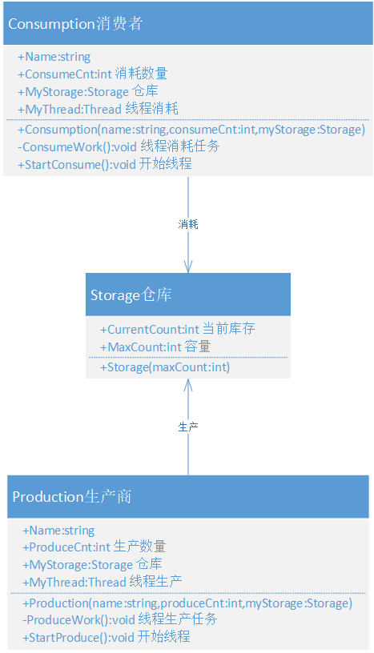

<!-- TOC -->

- [多线程](#多线程)
    - [基本概念](#基本概念)
        - [什么是进程？](#什么是进程)
        - [什么是线程？](#什么是线程)
        - [多线程](#多线程-1)
            - [Thread构造及成员](#thread构造及成员)
            - [Thread优先级](#thread优先级)
            - [Thread状态及操作](#thread状态及操作)
            - [Threading命名空间](#threading命名空间)
        - [线程创建](#线程创建)
            - [命名方法创建](#命名方法创建)
            - [lambda表达式创建](#lambda表达式创建)
            - [前台线程和后台线程](#前台线程和后台线程)
        - [线程操作](#线程操作)
            - [线程挂起](#线程挂起)
            - [Join()](#join)
            - [Suspend 与 Resume （慎用）](#suspend-与-resume-慎用)
        - [线程安全](#线程安全)
        - [生产消费者模式](#生产消费者模式)
    - [同步异步](#同步异步)
        - [概念](#概念)
        - [区别体现](#区别体现)
        - [同步案例](#同步案例)
        - [异步案例](#异步案例)
    - [线程池](#线程池)
        - [QueueUserWorkItem异步线程](#queueuserworkitem异步线程)
        - [委托异步线程](#委托异步线程)
        - [IAsyncResult](#iasyncresult)
        - [回调函数](#回调函数)
    - [System.Threading.Tasks](#systemthreadingtasks)
        - [Parallel.For和Parallel.Foreach](#parallelfor和parallelforeach)
        - [Parallel.Invoke](#parallelinvoke)
        - [Task-创建](#task-创建)
        - [Task-取消](#task-取消)
        - [Task-返回值](#task-返回值)

<!-- /TOC -->

<a id="markdown-多线程" name="多线程"></a>
# 多线程

<a id="markdown-基本概念" name="基本概念"></a>
## 基本概念
<a id="markdown-什么是进程" name="什么是进程"></a>
### 什么是进程？
进程（Process）是Windows系统中的一个基本概念，它包含着一个运行程序所需要的资源。

一个正在运行的应用程序在操作系统中被视为一个进程，进程可以包括一个或多个线程。

线程是操作系统分配处理器时间的基本单元，在进程中可以有多个线程同时执行代码。

<a id="markdown-什么是线程" name="什么是线程"></a>
### 什么是线程？
线程是程序中的一个执行流，每个线程都有自己的专有寄存器(栈指针、程序计数器等)，但代码区是共享的，即不同的线程可以执行同样的函数。

在【任务管理器】中我们可以明显的看到：


<a id="markdown-多线程-1" name="多线程-1"></a>
### 多线程
多线程指的是进程同时有多个线程活动。

当启动一个可执行程序时，将创建一个主线程。

在默认的情况下，C#程序具有一个线程，此线程执行程序中以Main方法开始和结束的代码，

`Main()`方法直接或间接执行的每一个命令都有默认线程（主线程）执行，当`Main()`方法返回时此线程也将终止。

线程初体验：
```cs
static void Main(string[] args)
{
    //设置当前线程名称，默认为null
    Thread.CurrentThread.Name = "My Thread Demo";
    Console.WriteLine(Thread.CurrentThread.Name);//打印当前线程名称
    Console.WriteLine(Thread.CurrentThread.ThreadState);//打印当前线程状态
}
```

多线程的优点：
* 可以同时完成多个任务；
* 可以使程序的响应速度更快；
* 可以让占用大量处理时间的任务或当前没有进行处理的任务定期将处理时间让给别的任务；
* 可以随时停止任务；
* 可以设置每个任务的优先级以优化程序性能。

然而，多线程虽然有很多优点，但是也必须认识到多线程可能存在影响系统性能的不利方面，才能正确使用线程。弊端主要有如下几点：
* 线程也是程序，所以线程需要占用内存，线程越多，占用内存也越多。
* 多线程需要协调和管理，所以需要占用CPU时间以便跟踪线程[时间空间转换，简称时空转换]。
* 线程之间对共享资源的访问会相互影响，必须解决争用共享资源的问题。
* 线程太多会导致控制太复杂，最终可能造成很多程序缺陷。

<a id="markdown-thread构造及成员" name="thread构造及成员"></a>
#### Thread构造及成员
System.Threading.Thread类是是控制线程的基础类，有4个构造方法：

名称 | 说明
---|---
Thread(ParameterizedThreadStart) | 初始化 Thread 类的新实例，指定允许对象在线程启动时传递给线程的委托。要执行的方法是有参的。
Thread(ParameterizedThreadStart,?Int32) | 初始化 Thread 类的新实例，指定允许对象在线程启动时传递给线程的委托，并指定线程的最大堆栈大小
Thread(ThreadStart) | 初始化 Thread 类的新实例。要执行的方法是无参的。
Thread(ThreadStart,?Int32) | 初始化 Thread 类的新实例，指定线程的最大堆栈大小。

常用属性：

属性名称 | 说明
-----|---
CurrentContext | 获取线程正在其中执行的当前上下文
**CurrentThread** | 获取当前正在运行的线程
ExecutionContext | 获取一个 ExecutionContext 对象，该对象包含有关当前线程的各种上下文的信息。
IsAlive | 获取一个值，该值指示当前线程的执行状态
IsBackground | 获取或设置一个值，该值指示某个线程是否为后台线程
IsThreadPoolThread | 获取一个值，该值指示线程是否属于托管线程池
**ManagedThreadId** | 获取当前托管线程的唯一标识符，程序在大部分情况下都是通过Thread.ManagedThreadId来辨别线程的。而Name是一个可变值，在默认时候，Name为一个空值 Null，开发人员可以通过程序设置线程的名称，但这只是一个辅助功能。
Name | 获取或设置线程的名称
Priority | 获取或设置一个值，该值指示线程的调度优先级
ThreadState | 获取一个值，该值包含当前线程的状态

<a id="markdown-thread优先级" name="thread优先级"></a>
#### Thread优先级

当线程之间争夺CPU时间时，CPU按照线程的优先级给予服务。高优先级的线程可以完全阻止低优先级的线程执行。

.NET为线程设置了Priority属性来定义线程执行的优先级别，里面包含5个选项，其中Normal是默认值。

除非系统有特殊要求，否则不应该随便设置线程的优先级别。

成员名称 | 说明
-----|---
Lowest | 可以将 Thread 安排在具有任何其他优先级的线程之后
BelowNormal | 可以将 Thread 安排在具有 Normal 优先级的线程之后，在具有 Lowest 优先级的线程之前
Normal | 默认选择。可以将 Thread 安排在具有 AboveNormal 优先级的线程之后，在具有 BelowNormal 优先级的线程之前
AboveNormal | 可以将 Thread 安排在具有 Highest 优先级的线程之后，在具有 Normal 优先级的线程之前
Highest | 可以将 Thread 安排在具有任何其他优先级的线程之前

<a id="markdown-thread状态及操作" name="thread状态及操作"></a>
#### Thread状态及操作
通过ThreadState可以检测线程是处于Unstarted、Sleeping、Running 等等状态


Thread 中包括了多个方法来控制线程的创建、挂起、停止、销毁

方法名称 | 说明
-----|---
Abort() | 终止本线程
GetDomain() | 返回当前线程正在其中运行的当前域
GetDomainId() | 返回当前线程正在其中运行的当前域Id
Interrupt() | 中断处于 WaitSleepJoin 线程状态的线程
Join() | 已重载。 阻塞调用线程，直到某个线程终止时为止
~~Resume()~~ | 继续运行已挂起的线程
Start() | 执行本线程
~~Suspend()~~ | 挂起当前线程，如果当前线程已属于挂起状态则此不起作用
Sleep() | 把正在运行的线程挂起一段时间

<a id="markdown-threading命名空间" name="threading命名空间"></a>
#### Threading命名空间
在System.Threading命名空间内提供多个方法来构建多线程应用程序,其中ThreadPool与Thread是多线程开发中最常用到的

类 | 说明
--|---
AutoResetEvent | 通知正在等待的线程已发生事件。无法继承此类
ExecutionContext | 管理当前线程的执行上下文。无法继承此类
Interlocked | 为多个线程共享的变量提供原子操作
Monitor | 提供同步对对象的访问的机制
Mutex | 一个同步基元，也可用于进程间同步
**Thread** | 创建并控制线程，设置其优先级并获取其状态
ThreadAbortException | 在对 Abort 方法进行调用时引发的异常。无法继承此类
**ThreadPool** | 提供一个线程池，该线程池可用于发送工作项、处理异步 I/O、代表其他线程等待以及处理计时器
Timeout | 包含用于指定无限长的时间的常数。无法继承此类
Timer | 提供以指定的时间间隔执行方法的机制。无法继承此类
WaitHandle | 封装等待对共享资源的独占访问的操作系统特定的对象


在System.Threading中的包含了下表中的多个常用委托，其中ThreadStart、ParameterizedThreadStart是最常用到的委托。

委托 | 说明
---|---
ContextCallback | 表示要在新上下文中调用的方法
**ParameterizedThreadStart** | 表示在 Thread 上执行的方法
ThreadExceptionEventHandler | 表示将要处理 Application 的 ThreadException 事件的方法
**ThreadStart** | 表示在 Thread 上执行的方法
TimerCallback | 表示处理来自 Timer 的调用的方法
WaitCallback | 表示线程池线程要执行的回调方法
WaitOrTimerCallback | 表示当 WaitHandle 超时或终止时要调用的方法

<a id="markdown-线程创建" name="线程创建"></a>
### 线程创建

<a id="markdown-命名方法创建" name="命名方法创建"></a>
#### 命名方法创建
调用线程Thread类的构造函数进行创建：
```cs
static void Main(string[] args)
{
    /*
    ThreadStart是一个线程委托，可以理解为一个方法指针，指向一个方法的地址
    注意这个ThreadStart委托是无返回值无参，传递的方法也应该无返回值无参
    public delegate void ThreadStart();
    */
    Thread threadVoid = new Thread(new ThreadStart(Say));
    //启动该线程
    threadVoid.Start();

    /*
    同样的，ParameterizedThreadStart也是一个线程委托，无返回值，参数为object，传递的方法也需要满足这个条件
    public delegate void ParameterizedThreadStart(object obj);
    */
    Thread threadParam = new Thread(new ParameterizedThreadStart(Talk));
    //启动有参数线程
    threadParam.Start("王富贵");
}

static void Say()
{
    for (int i = 0; i < 100; i++)
    {
        Console.WriteLine("Say Hi,time:" + DateTime.Now.ToString("mm:ss.fff"));
    }
}

static void Talk(object obj)
{
    for (int i = 0; i < 100; i++)
    {
        Console.WriteLine(obj.ToString() + "'s Talk Show,time:" + DateTime.Now.ToString("mm:ss.fff"));
    }
}
```

上述线程的执行结果反映了线程的无序性质。

通过执行结果我们会看到，主线程和子线程不是一味的执行，是兼续的。也就是说主线程和子线程在执行过程中是互相抢CPU资源进行计算的。

一旦开始，一个线程的IsAlive属性返回true,直到这个线程结束。

当传递给线程的构造函数的委托完成执行时，这个线程结束。一旦结束，该线程无法重新启动。

<a id="markdown-lambda表达式创建" name="lambda表达式创建"></a>
#### lambda表达式创建

如果为了简单，也可以通过**匿名委托或Lambda表达式**来为Thread的构造方法赋值。

```cs
// lambda表达式方式添加方法注册
Thread threadLambda = new Thread((o) =>
{
    for (int i = 0; i < 100; i++)
    {
        Console.WriteLine($"{o}-{DateTime.Now.ToString("mm:ss.fff")}");
    }
});
// 让现场Start()开始
threadLambda.Start("安徽信息工程学院");
```

<a id="markdown-前台线程和后台线程" name="前台线程和后台线程"></a>
#### 前台线程和后台线程

* 前台线程：只有所有的前台线程都结束，应用程序才能结束。默认情况下创建的线程都是前台线程
* 后台线程：只要所有的前台线程结束，后台线程自动结束。通过Thread.IsBackground设置后台线程。

必须在调用Start方法之前设置线程的类型，否则一旦线程运行，将无法改变其类型。

新建一个Windows窗体应用程序，打开项目中【Properties】属性窗口，将项目的输出类型修改为【控制台应用程序】，如下图示例：


Form1中添加一个按钮，并且新增处理事件，代码如下：
```cs
private void button1_Click(object sender, EventArgs e)
{
    Console.WriteLine("开始心跳...");
    Thread th1 = new Thread(new ThreadStart(HeartBeat));
    /* 
    是否设置为后台线程
    默认为false，即主线程退出后会等待子线程执行结束
    为true时，关闭主线程则子线程也会退出
    */
    th1.IsBackground = true;
    th1.Start();
}

void HeartBeat()
{
    int index = 0;
    while (index < 10)
    {
        Thread.Sleep(1000);
        Console.WriteLine(index + "我还活着。。。");
        index++;
    }
}
```

是否设置为后台线程，如下图所示：


后台线程一般用于处理不重要的事情，应用程序结束时，后台线程是否执行完成对整个应用程序没有影响。

如果要执行的事情很重要，需要将线程设置为前台线程。

若有前台线程，则主线程会等待前台线程执行完成再退出。

若全部都是后台线程，则主线程直接退出，不会等待。

后台线程一般用于处理不重要的事情，应用程序结束时，后台线程是否执行完成对整个应用程序没有影响。

如果要执行的事情很重要，需要将线程设置为前台线程。

<a id="markdown-线程操作" name="线程操作"></a>
### 线程操作

<a id="markdown-线程挂起" name="线程挂起"></a>
#### 线程挂起
Thread.Sleep暂停当**前线程**一段指定的时间：

```cs
static void Main(string[] args)
{
    Thread th = new Thread(() =>
    {
        for (int i = 0; i < 20; i++)
        {
            Console.WriteLine("子线程 0.5s ");
            Thread.Sleep(500);
        }
    });
    th.Start();

    for (int i = 0; i < 5; i++)
    {
        Console.WriteLine("主线程 for 2 seconds.");
        Thread.Sleep(2000);
    }

    Console.WriteLine("主线程退出");
}

/* This example produces the following output:
主线程 for 2 seconds.
子线程 0.5s
子线程 0.5s
子线程 0.5s
子线程 0.5s
主线程 for 2 seconds.
子线程 0.5s
子线程 0.5s
子线程 0.5s
子线程 0.5s
。。。。。。
 */
```

<a id="markdown-join" name="join"></a>
#### Join()
Join() 实例方法，阻塞调用线程，直到某个线程终止时为止。

```cs
static void Main(string[] args)
{
    Thread th1 = new Thread(new ThreadStart(HearBeat));
    Console.WriteLine("Start...");
    th1.Start();

    // 调用Join()方法，阻塞调用线程，直到子线程执行完成
    th1.Join();

    Console.WriteLine("Done!");
    Console.ReadLine();
}

static void HearBeat()
{
    int index = 0;
    while (index < 10)
    {
        Thread.Sleep(500);
        Console.WriteLine(index + "我还活着。。。");
        index++;
    }
}
```

结果如图所示：


主线程会被阻塞， 直到子线程执行完成。如果去掉Join()方法，主线程则不会阻塞，如图：


<a id="markdown-suspend-与-resume-慎用" name="suspend-与-resume-慎用"></a>
#### Suspend 与 Resume （慎用）
Thread.Suspend（）与 Thread.Resume（）是在Framework1.0 就已经存在的老方法了，它们分别可以挂起、恢复线程。

但在Framework2.0中就已经明确排斥这两个方法。

一旦某个线程占用了已有的资源，再使用Suspend（）使线程长期处于挂起状态，当在其他线程调用这些资源的时候就会引起死锁！

所以在没有必要的情况下应该避免使用这两个方法。

<a id="markdown-线程安全" name="线程安全"></a>
### 线程安全
多个线程访问同变量可能会出现一些意想不到的情况，线程安全问题都是由全局变量及静态变量引起的。

以下为多线程买票的案例，我们无法保证余票递减。

```cs
static int ticketCount = 100;

static void Main(string[] args)
{
    Thread th1 = new Thread(BuyTicket);
    Thread th2 = new Thread(BuyTicket);
    Thread th3 = new Thread(BuyTicket);
    Thread th4 = new Thread(BuyTicket);
    th1.Name = "王富贵";
    th2.Name = "赵有才";
    th3.Name = "郑钱花";

    th1.Start();
    th2.Start();
    th3.Start();
}

static void BuyTicket()
{
    while (ticketCount > 0)
    {
        ticketCount -= 5;
        Console.WriteLine($"{Thread.CurrentThread.Name}买票{5}张，剩余票数：{ticketCount}");
    }
}
```

若每个线程中对全局变量、静态变量只有读操作，而无写操作，一般来说，这个全局变量是线程安全的；

若有多个线程同时对一个变量执行读写操作，一般都需要考虑线程同步，否则就可能影响线程安全。

```cs
static object lockObj = new object();

static int ticketCount = 100;

static void Main(string[] args)
{
    Thread th1 = new Thread(BuyTicket);
    Thread th2 = new Thread(BuyTicket);
    Thread th3 = new Thread(BuyTicket);
    Thread th4 = new Thread(BuyTicket);
    th1.Name = "王富贵";
    th2.Name = "赵有才";
    th3.Name = "郑钱花";

    th1.Start();
    th2.Start();
    th3.Start();
}

static void BuyTicket()
{
    while (ticketCount > 0)
    {
        lock (lockObj)
        {
            if (ticketCount - 5 >= 0)
            {
                ticketCount -= 5;
                Console.WriteLine($"{Thread.CurrentThread.Name}买票{5}张，剩余票数：{ticketCount}");
            }
            else
            {
                Console.WriteLine("余票不足!!!");
            }
        }
    }
}
```

注意：在多线程中，共享数据是造成复杂原因的主要，而且会产生让人费解的错误。尽管很基本但还是要尽可能保持简单。

<a id="markdown-生产消费者模式" name="生产消费者模式"></a>
### 生产消费者模式
在实际的软件开发过程中，经常会碰到如下场景：

某个模块负责产生数据，这些数据由另一个模块来负责处理（此处的模块是广义的，可以是类、函数、线程、进程等）。

产生数据的模块，就形象地称为生产者；而处理数据的模块，就称为消费者。

单单抽象出生产者和消费者，还够不上是生产者／消费者模式。

该模式还需要有一个缓冲区处于生产者和消费者之间，作为一个中介。

生产者把数据放入缓冲区，而消费者从缓冲区取出数据。大概的结构如下图。


我们举一个寄信的例子（虽说这年头寄信已经不时兴，但这个例子还是比较贴切的）。假设你要寄一封平信，大致过程如下：

1. 你把信写好——相当于生产者制造数据
2. 你把信放入邮筒——相当于生产者把数据放入缓冲区
3. 邮递员把信从邮筒取出——相当于消费者把数据取出缓冲区
4. 邮递员把信拿去邮局做相应的处理——相当于消费者处理数据

设计优点：
1. 解耦
2. 支持并发
3. 忙闲不均

设计生产者【Production】，消费者【Consumption】类，仓库【Storage】类模拟过程：



【Storage】类：
```cs
/// <summary>
/// 仓库
/// </summary>
public class Storage
{
    public Storage(int maxCount)
    {
        MaxCount = maxCount;
    }

    public int MaxCount { get; set; }
    public int CurrentCount { get; set; }
}
```

【Production】类：
```cs
/// <summary>
/// 生产者
/// </summary>
public class Production
{
    public Production(string name, int produceCnt, Storage myStorage)
    {
        Name = name;
        ProduceCnt = produceCnt;
        MyStorage = myStorage;
        MyThread = new Thread(ProduceWork);
    }

    public string Name { get; set; }
    public int ProduceCnt { get; set; }
    public Storage MyStorage { get; set; }
    public Thread MyThread { get; set; }
    /// <summary>
    /// 生产操作
    /// </summary>
    void ProduceWork()
    {
        while (true)
        {
            // 1s 生产一次
            Thread.Sleep(1000);
            lock (MyStorage)
            {
                // 不能爆仓
                if (MyStorage.CurrentCount + ProduceCnt < MyStorage.MaxCount)
                {
                    MyStorage.CurrentCount += ProduceCnt;
                    Console.WriteLine($"生产者：{Name}生产了{ProduceCnt}个产品，现库存为：{MyStorage.CurrentCount}");
                }
            }
        }
    }
    /// <summary>
    /// 开始生产任务
    /// </summary>
    public void StartProduce()
    {
        MyThread.Start();
    }
}
```

【Consumption】类：
```cs
/// <summary>
/// 消费者
/// </summary>
public class Consumption
{
    public Consumption(string name, int consumeCnt, Storage myStorage)
    {
        Name = name;
        ConsumeCnt = consumeCnt;
        MyStorage = myStorage;
        MyThread = new Thread(ConsumeWork);
    }

    public string Name { get; set; }
    public int ConsumeCnt { get; set; }
    public Storage MyStorage { get; set; }
    public Thread MyThread { get; set; }
    void ConsumeWork()
    {
        while (true)
        {
            // 0.5s 消费一次
            Thread.Sleep(500);
            lock (MyStorage)
            {
                if (MyStorage.CurrentCount > ConsumeCnt)
                {
                    MyStorage.CurrentCount -= ConsumeCnt;
                    Console.WriteLine($"消费者：{Name}消耗了{ConsumeCnt}个产品，现库存为：{MyStorage.CurrentCount}");
                }
            }
        }
    }

    /// <summary>
    /// 开始消费任务
    /// </summary>
    public void StartConsume()
    {
        MyThread.Start();
    }
}
```

模拟调用如下：
```cs
static void Main(string[] args)
{
    Storage st = new Storage(100);

    List<Production> produceList = new List<Production>();
    produceList.Add(new Production("合肥", 10, st));
    produceList.Add(new Production("芜湖", 8, st));
    produceList.Add(new Production("南京", 15, st));

    List<Consumption> consumeList = new List<Consumption>();
    consumeList.Add(new Consumption("高校", 10, st));
    consumeList.Add(new Consumption("政府", 5, st));
    consumeList.Add(new Consumption("企业", 3, st));

    foreach (var item in produceList)
    {
        item.StartProduce();
    }
    foreach (var item in consumeList)
    {
        item.StartConsume();
    }
}
```

<a id="markdown-同步异步" name="同步异步"></a>
## 同步异步
<a id="markdown-概念" name="概念"></a>
### 概念

**同步方法**调用一旦开始，调用者必须等到方法调用返回后，才能继续后续的行为。

**异步方法**调用更像一个消息传递，一旦开始，方法调用就会立即返回，调用者就可以继续后续的操作。

异步方法通常会在另外一个线程中，“真实”地执行着。整个过程，不会阻碍调用者的工作。

举个生活中烧开水的案例，用普通铁锅和用电热水壶的区别体现：

用铁锅进行烧水，我们在锅前坐等水烧开，这种方式就是同步通信方式。

用电热水壶烧水，按下开关后则不会管了，等水烧开会有提示并自动断电，这体现了异步通信方式。

<a id="markdown-区别体现" name="区别体现"></a>
### 区别体现
了体现同步和异步的区别，准备一本10MB的小说，以文件流的方式进行读取并打印在控制台显示

<a id="markdown-同步案例" name="同步案例"></a>
### 同步案例

新建【Windows窗体应用程序】，并修改属性输出类型为【控制台应用程序】，在窗体【Form1.cs】中添加按钮，如下：


```cs
private void button1_Click(object sender, EventArgs e)
{
    // 同步方式调用
    ReadBook();
}

void ReadBook()
{
    using (StreamReader sr = new StreamReader(@"..\..\斗破苍穹.txt", Encoding.Default))
    {
        string content;
        while ((content = sr.ReadLine()) != null)
        {
            Console.WriteLine(content);
        }
        Console.WriteLine("读完了！！！");
    }
}
```

运行程序，点击【开始读取】按钮，在小说打印显示完成之前，窗体是无法进行拖动和操作的。

这种方式体现了同步通信的方式，前台线程会一直在【button1_Click】方法中执行等待。。。

<a id="markdown-异步案例" name="异步案例"></a>
### 异步案例
在上述案例中，修改【button1_Click】方法中执行【ReadBook】的方式，如下：

```cs
private void button1_Click(object sender, EventArgs e)
{
    // 多线程方式进行异步调用
    Thread thBook = new Thread(new ThreadStart(ReadBook));
    thBook.Start();
}

void ReadBook()
{
    using (StreamReader sr = new StreamReader(@"..\..\斗破苍穹.txt", Encoding.Default))
    {
        string content;
        while ((content = sr.ReadLine()) != null)
        {
            Console.WriteLine(content);
        }
        Console.WriteLine("读完了！！！");
    }
}
```

以异步的方式进行执行耗时的操作时，UI主线程并不会因为执行耗时操作而卡死，可以带来更好的体验。

<a id="markdown-线程池" name="线程池"></a>
## 线程池
使用ThreadStart与ParameterizedThreadStart建立新线程非常简单，但通过此方法建立的线程难于管理，若建立过多的线程反而会影响系统的性能。

线程池维护一个请求队列，线程池的代码从队列提取任务，然后委派给线程池的一个线程执行，

线程执行完不会被立即销毁，这样既可以在后台执行任务，又可以减少线程创建和销毁所带来的开销。

线程池线程默认为后台线程（IsBackground）。

使用CLR线程池的工作者线程一般有两种方式：
1. 直接通过 ThreadPool.QueueUserWorkItem() 方法
2. 通过委托方式

<a id="markdown-queueuserworkitem异步线程" name="queueuserworkitem异步线程"></a>
### QueueUserWorkItem异步线程

QueueUserWorkItem添加线程任务，分为无参和有参：
1. ThreadPool.QueueUserWorkItem(WaitCallback)
2. ThreadPool.QueueUserWorkItem(WaitCallback,Object)

下面以有参调用举例：
```cs
static void Main(string[] args)
{
    // 添加任务至线程池
    ThreadPool.QueueUserWorkItem(new WaitCallback(LoopMessage), "wait call back");
    // 由于默认为后台线程，必须保持等待，否则退出程序后线程也退出了
    Console.ReadKey();
}

static void LoopMessage(object obj)
{
    for (int i = 0; i < 100; i++)
    {
        Thread.Sleep(20);
        Console.WriteLine(obj + DateTime.Now.ToString("mm:ss.fff"));
    }
}
```

WaitCallback委托指向的必须是一个带有Object参数的无返回值方法，这无疑是一种限制。

若方法需要有返回值，或者带有多个参数，这将多费周折。

<a id="markdown-委托异步线程" name="委托异步线程"></a>
### 委托异步线程

利用委托类BeginInvoke与EndInvoke完成异步委托方法，解决了线程任务无法返回值的问题。

```cs
delegate string MyDelegate(string name);

static void Main(string[] args)
{
    MyDelegate myDele = new MyDelegate(Hello);
    // 异步调用委托，获取计算结果
    IAsyncResult result = myDele.BeginInvoke("jack", null, null);
    
    // 完成主线程其他工作....
    for (int i = 0; i < 10; i++)
    {
        Thread.Sleep(500);
        Console.WriteLine("主线程任务进行中。。。");
    }
    
    // 调用EndInvoke(IAsyncResult)获取运行结果，取决于异步线程的耗时，若仍未完成则阻塞等待返回值
    string content = myDele.EndInvoke(result);
    Console.WriteLine(content);

    // 由于默认为后台线程，必须保持等待，否则退出程序后线程也退出了
    Console.ReadKey();
}

static string Hello(string name)
{
    string res = string.Empty;
    for (int i = 0; i < 10; i++)
    {
        Thread.Sleep(100);
        res += $"{name}-{DateTime.Now.ToString("mm:ss.fff")}{Environment.NewLine}";
    }
    return res;
}
```

上例中，如果在使用myDele.BeginInvoke后立即调用myDele.EndInvoke，那在异步线程未完成工作以前主线程将处于阻塞状态，

等到异步线程结束获取计算结果后，主线程才能继续工作，这明显无法展示出多线程的优势。

<a id="markdown-iasyncresult" name="iasyncresult"></a>
### IAsyncResult

通过IAsyncResult提高性能，IAsyncResult有以下成员：
```cs
public interface IAsyncResult
{
    object AsyncState {get;}            //获取用户定义的对象，它限定或包含关于异步操作的信息。
    WailHandle AsyncWaitHandle {get;}   //获取用于等待异步操作完成的 WaitHandle。
    bool CompletedSynchronously {get;}  //获取异步操作是否同步完成的指示。
    bool IsCompleted {get;}             //获取异步操作是否已完成的指示。
}
```

WaitHandle里面包含有一个方法WaitOne（int timeout），它可以判断委托是否完成工作，在工作未完成前主线程可以继续其他工作。

上例中主线程调用可以优化如下：
```cs
static void Main(string[] args)
{
    MyDelegate myDele = new MyDelegate(Hello);
    // 异步调用委托，获取计算结果
    IAsyncResult result = myDele.BeginInvoke("jack", null, null);
    
    // 异步线程未完成，主线程可以保持继续工作，当异步线程完成时，WaitOne返回true
    while (!result.AsyncWaitHandle.WaitOne(200))
    {
        Console.WriteLine("主线程任务进行中。。。");
    }
    
    // 调用EndInvoke(IAsyncResult)获取运行结果，取决于异步线程的耗时，若仍未完成则阻塞等待返回值
    string content = myDele.EndInvoke(result);
    Console.WriteLine(content);

    // 由于默认为后台线程，必须保持等待，否则退出程序后线程也退出了
    Console.ReadKey();
}
```

当要监视多个运行对象的时候，使用IAsyncResult.WaitHandle.WaitOne可就派不上用场了。

.NET为WaitHandle准备了另外两个静态方法：WaitAny（waitHandle[], int）与WaitAll (waitHandle[] , int)。

其中WaitAll在等待所有waitHandle完成后再返回一个bool值。

而WaitAny是等待其中一个waitHandle完成后就返回一个int，这个int是代表已完成waitHandle在waitHandle[]中的数组索引。

```cs
static void Main(string[] args)
{
    MyDelegate myDele = new MyDelegate(Hello);
    // 异步调用委托，获取计算结果
    IAsyncResult result = myDele.BeginInvoke("jack", null, null);
    IAsyncResult result1 = myDele.BeginInvoke("lucy", null, null);
    IAsyncResult result2 = myDele.BeginInvoke("smith", null, null);

    // 异步线程未完成，主线程可以保持继续工作，当所有异步线程任务完成时，WaitAll返回true
    WaitHandle[] waitHandleList = new WaitHandle[]
        { result.AsyncWaitHandle, result1.AsyncWaitHandle, result2.AsyncWaitHandle };
    while (!WaitHandle.WaitAll(waitHandleList, 200))
    {
        Console.WriteLine("主线程任务进行中。。。");
    }

    // 调用EndInvoke(IAsyncResult)获取运行结果，取决于异步线程的耗时，若仍未完成则阻塞等待返回值
    string content = myDele.EndInvoke(result);
    Console.WriteLine(content);

    // 由于默认为后台线程，必须保持等待，否则退出程序后线程也退出了
    Console.ReadKey();
}
```

<a id="markdown-回调函数" name="回调函数"></a>
### 回调函数
不管是QueueUserWorkItem添加异步线程，或是委托异步线程，都是属于轮训方式来检测异步线程任务是否执行完成。

 IAsyncResult BeginInvoke（AsyncCallback , object）准备了一个回调函数。

 ```cs
delegate string MyDelegate(string name);
static void Main(string[] args)
{
    MyDelegate myDele = new MyDelegate(Hello);

    // 异步调用委托，异步线程任务完成后自动调用Completed方法（回调）
    IAsyncResult result = myDele.BeginInvoke("jack", new AsyncCallback(Completed), null);

    // 主线程任务不受干扰
    for (int i = 0; i < 10; i++)
    {
        Thread.Sleep(500);
        Console.WriteLine("主线程任务进行中。。。");
    }

    // 由于默认为后台线程，必须保持等待，否则退出程序后线程也退出了
    Console.ReadKey();
}

/// <summary>
/// 异步线程任务完成后的回调
/// </summary>
/// <param name="ar"></param>
static void Completed(IAsyncResult ar)
{
    AsyncResult result = ar as AsyncResult;
    MyDelegate myDele = (result.AsyncDelegate as MyDelegate);
    string content = myDele.EndInvoke(result);
    Console.WriteLine(content);
}

static string Hello(string name)
{
    string res = string.Empty;
    for (int i = 0; i < 10; i++)
    {
        Thread.Sleep(100);
        res += $"{name}-{DateTime.Now.ToString("mm:ss.fff")}{Environment.NewLine}";
    }
    return res;
}
 ```

<a id="markdown-systemthreadingtasks" name="systemthreadingtasks"></a>
## System.Threading.Tasks
要使用多线程开发，必须非常熟悉Thread的使用，而且在开发过程中可能会面对很多未知的问题。

为了简化开发，.NET 4.0 特别提供一个并行编程库System.Threading.Tasks

此外，.NET还提供了新的一组扩展方法PLINQ，它具有自动分析查询功能，如果并行查询能提高系统效率，则同时运行，如果查询未能从并行查询中受益，则按原顺序查询。

System.Threading.Tasks中的类被统称为任务并行库（Task Parallel Library，TPL）

TPL使用CLR线程池把工作分配到CPU，并能自动处理工作分区、线程调度、取消支持、状态管理以及其他低级别的细节操作，极大地简化了多线程的开发。

**注意：TPL比Thread更具智能性，当它判断任务集并没有从并行运行中受益，就会选择按顺序运行。**

**但并非所有的项目都适合使用并行开发，创建过多并行任务可能会损害程序的性能，降低运行效率。**

<a id="markdown-parallelfor和parallelforeach" name="parallelfor和parallelforeach"></a>
### Parallel.For和Parallel.Foreach
通过这两个方法可以并行处理System.Func<>、System.Action<>委托。

假设使用单线程同步方式查询6个Person对象，需要用时大约12秒，在使用并行方式，只需使用2秒就能完成查询，而且能够避开Thread的繁琐处理。

```cs
class Person
{
    public Person(string name, int age)
    {
        Name = name;
        Age = age;
    }
    public string Name { get; set; }
    public int Age { get; set; }
    public override string ToString()
    {
        return $"name:{Name},age:{Age}";
    }
}
class Program
{
    /// <summary>
    /// 测试数据
    /// </summary>
    readonly static List<Person> PersonList = new List<Person>() {
        new Person("jack",1), new Person("lucy",9),
        new Person("john",2),new Person("jim",8),
        new Person("Rose",5),new Person("trump",8)
    };
    static void Main(string[] args)
    {
        /*
        fromInclusive：起始索引（包含）
        toExclusive:结束索引（不包含）
        body：迭代委托
        */
        Parallel.For(0, PersonList.Count, n =>
            {
                FindPerson(n);
            });

        /*
        source：迭代集合数据源
        body：迭代集合
        */
        Parallel.ForEach(PersonList, p => { FindPerson(p); });
    }

    /// <summary>
    /// 模拟查询耗时操作
    /// </summary>
    /// <param name="index"></param>
    static void FindPerson(int index)
    {
        Thread.Sleep(2000);
        Console.WriteLine(PersonList[index]);
    }

    static void FindPerson(Person p)
    {
        Thread.Sleep(2000);
        Console.WriteLine(p);
    }
}
```

委托的ParallelLoopState参数当中包含有Stop()方法都可以使迭代停止。

当找到某个值时，终止其他异步线程，修改上例Main方法如下：
```cs
static void Main(string[] args)
{
    /*
    source：迭代集合数据源
    body：迭代集合
    */
    Parallel.ForEach(PersonList,
        (p, state) =>
        {
            // 当找到lucy后终止所有异步线程
            if (p.Name == "lucy")
            {
                state.Stop();
            }
            FindPerson(p);
        });
}
```

当要在多个线程中调用本地变量，可以使用该方法重载：
```cs
public static ParallelLoopResult ForEach<TSource, TLocal>(
    IEnumerable<TSource> source, 
    Func<TLocal> localInit, 
    Func<TSource, ParallelLoopState, TLocal, TLocal> body, 
    Action<TLocal> localFinally);
```

改方法需要确定两个泛型类型，TSource和TLocal：

其中第一个参数为数据集;

第二个参数是一个Func委托，用于在每个线程执行前进行初始化;

第三个参数是委托Func,它能对数据集的每个成员进行迭代，当中T1是数据集的成员，T2是一个ParallelLoopState对象，它可以控制迭代的状态，T3是线程中的本地变量;

第四个参数是一个Action委托，用于对每个线程的最终状态进行最终操作。

<a id="markdown-parallelinvoke" name="parallelinvoke"></a>
### Parallel.Invoke
在TPL当中还可以使用Parallel.Invoke方法触发多个异步任务,其中 actions 中可以包含多个方法或者委托，parallelOptions用于配置Parallel类的操作。

```cs
public static void Invoke(Action[] actions )
public static void Invoke(ParallelOptions parallelOptions, Action[] actions )
```

尽可能并行执行所提供的每个委托操作，除非用户取消了操作，修改Main方法如下：

```cs
static void Main(string[] args)
{
    ParallelOptions option = new ParallelOptions();
    option.MaxDegreeOfParallelism = 2;// 最大并行任务

    Parallel.Invoke(option, () => { FindPerson(1); },
        () => { FindPerson(2); },
        () => { FindPerson(0); });
}
```

<a id="markdown-task-创建" name="task-创建"></a>
### Task-创建

在我们了解Task之前，如果我们要使用多核的功能可能就会自己来开线程，

然而这种线程模型在.net 4.0之后被一种称为基于“任务的编程模型”所冲击，

因为task会比thread具有更小的性能开销，不过大家肯定会有疑惑，任务和线程到底有什么区别？

1. 任务是架构在线程之上的，也就是说任务最终还是要抛给线程去执行。
2. 任务跟线程不是一对一的关系，比如开10个任务并不是说会开10个线程，这一点任务有点类似线程池，但是任务相比线程池有很小的开销和精确的控制。

实例化和工厂方法创建task任务：
```cs
static void Main(string[] args)
{
    // 实例化方式创建task
    var task1 = new Task(() =>
    {
        Run1();// 耗时操作
    });
    task1.Start();

    // 工厂方式创建task，实例化后自动开始，不需要再次调用Start
    var task2 = Task.Factory.StartNew(() =>
    {
        Run2();
    });

    // 由于Task创建的任务是基于后台线程的，所以增加主线阻塞等待
    Console.ReadKey();
}

static void Run1()
{
    Thread.Sleep(1000);
    Console.WriteLine("我是任务一");
}

static void Run2()
{
    Thread.Sleep(2000);
    Console.WriteLine("我是任务二");
}
```

task实例的简略生命周期：

* Created：表示默认初始化任务，但是我们发现"工厂创建的"实例直接跳过。
* WaitingToRun: 这种状态表示等待任务调度器分配线程给任务执行。
* RanToCompletion：任务执行完毕。

<a id="markdown-task-取消" name="task-取消"></a>
### Task-取消

Token是一个令牌。当我们对Token执行Cancel()操作时，所有Token的宿主线程（或任务）都将收到取消通知，然后做出线程（或任务）中止执行的操作。

```cs
static void Main(string[] args)
{
    // CancelToken的生产者
    CancellationTokenSource cts = new CancellationTokenSource();
    CancellationToken ct = cts.Token;

    Task task1 = new Task(() => { Run1(ct); }, ct);

    Task task2 = new Task(Run2);

    try
    {
        task1.Start();
        task2.Start();

        Thread.Sleep(1000);

        // 调用TokenSource的取消，通知所有Token取消任务
        cts.Cancel();

        // 主线程等待两个任务完成
        Task.WaitAll(task1, task2);
    }
    catch (AggregateException ex)
    {
        Console.WriteLine($"发生异常：{ex.InnerException.Message}");

        //task1是否取消
        Console.WriteLine("task1是不是被取消了？ {0}", task1.IsCanceled);
        Console.WriteLine("task2是不是被取消了？ {0}", task2.IsCanceled);
    }

    Console.Read();
}

static void Run1(CancellationToken ct)
{
    // 检查 取消信号，一旦取消则抛出 OperationCanceledException
    ct.ThrowIfCancellationRequested();

    Console.WriteLine("我是任务1");

    Thread.Sleep(2000);

    // 检查 取消信号，一旦取消则抛出 OperationCanceledException
    ct.ThrowIfCancellationRequested();

    Console.WriteLine("我是任务1的第二部分信息");
}

static void Run2()
{
    Console.WriteLine("我是任务2");
}
```

<a id="markdown-task-返回值" name="task-返回值"></a>
### Task-返回值

采用Task<TResult>方法，通过泛型定义返回类型：

```cs
static void Main(string[] args)
{
    List<string> strList = new List<string>() { "12", "66", "56" };

    // 定义返回值为 int
    var task1 = new Task<int>(() =>
    {
        int res = 0;
        foreach (var item in strList)
        {
            res += int.Parse(item);
        }
        return res;
    });
    task1.Start();

    // 等待任务执行完成
    Task.WaitAll();
    Console.WriteLine(task1.Result);

    Console.Read();
}
```

采用ContinueWith方法，在运行完task后，会执行task.ContinueWith(XX)中的XX语句，但是是否执行、如何执行等需要看task的运行情况

```cs
static void Main(string[] args)
{
    List<string> strList = new List<string>() { "12", "66", "56" };

    // 定义返回值为 int
    var task1 = new Task<int>(() =>
    {
        int res = 0;
        foreach (var item in strList)
        {
            res += int.Parse(item);
        }
        return res;
    });
    task1.Start();

    // task1 任务完成后执行委托方法，t即为任务本身
    task1.ContinueWith((t) =>
    {
        Console.WriteLine(t.Result);
    });

    Console.Read();
}
```


---

参考引用：

[Microsoft-“锁定”语句(C# 参考)](https://docs.microsoft.com/zh-cn/dotnet/csharp/language-reference/keywords/lock-statement)

[5天不再惧怕多线程系列](http://www.cnblogs.com/huangxincheng/archive/2012/03/14/2395279.html)

[.NET多线程的使用（Thread）](https://www.cnblogs.com/wangbaicheng1477865665/p/async2.html)

[C#多线程之旅](http://www.cnblogs.com/jackson0714/p/5100372.html#_label0)

[生产者/消费者模式](https://blog.csdn.net/kaiwii/article/details/6758942)

[C# 多线程（1）多线程基础](https://blog.csdn.net/num197/article/details/80307592)

[C# 多线程（2）多线程同步](https://blog.csdn.net/num197/article/details/80312998)

[C# 多线程（3）CLR线程池](https://blog.csdn.net/num197/article/details/80315328)

[C# 多线程（4）Task的使用](https://blog.csdn.net/num197/article/details/80320819)

[C#多线程和异步](https://blog.csdn.net/nishijibama/article/details/80086737)

[开始接触 async/await](https://www.cnblogs.com/liqingwen/p/5831951.html)

[8天玩转并行开发](https://www.cnblogs.com/huangxincheng/archive/2012/04/02/2429543.html)

[5天玩转C#并行和多线程编程](https://www.cnblogs.com/yunfeifei/p/3993401.html)