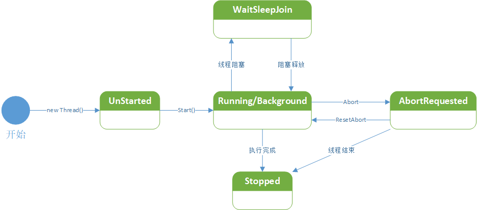

<!-- TOC -->

- [多线程](#多线程)
    - [基本概念](#基本概念)
        - [什么是进程？](#什么是进程)
        - [什么是线程？](#什么是线程)
        - [多线程](#多线程-1)
            - [Thread构造及成员](#thread构造及成员)
            - [Thread优先级](#thread优先级)
            - [Thread状态及操作](#thread状态及操作)
            - [Threading命名空间](#threading命名空间)
        - [线程创建](#线程创建)
            - [命名方法创建](#命名方法创建)
            - [lambda表达式创建](#lambda表达式创建)
            - [前台线程和后台线程](#前台线程和后台线程)
        - [线程操作](#线程操作)
            - [线程挂起](#线程挂起)
            - [Join()](#join)
            - [Suspend 与 Resume （慎用）](#suspend-与-resume-慎用)
        - [线程安全](#线程安全)
    - [同步异步](#同步异步)
        - [概念](#概念)
        - [区别体现](#区别体现)
        - [同步案例](#同步案例)
        - [异步案例](#异步案例)

<!-- /TOC -->

<a id="markdown-多线程" name="多线程"></a>
# 多线程

<a id="markdown-基本概念" name="基本概念"></a>
## 基本概念
<a id="markdown-什么是进程" name="什么是进程"></a>
### 什么是进程？
进程（Process）是Windows系统中的一个基本概念，它包含着一个运行程序所需要的资源。

一个正在运行的应用程序在操作系统中被视为一个进程，进程可以包括一个或多个线程。

线程是操作系统分配处理器时间的基本单元，在进程中可以有多个线程同时执行代码。

<a id="markdown-什么是线程" name="什么是线程"></a>
### 什么是线程？
线程是程序中的一个执行流，每个线程都有自己的专有寄存器(栈指针、程序计数器等)，但代码区是共享的，即不同的线程可以执行同样的函数。

在【任务管理器】中我们可以明显的看到：


<a id="markdown-多线程-1" name="多线程-1"></a>
### 多线程
多线程指的是进程同时有多个线程活动。

当启动一个可执行程序时，将创建一个主线程。

在默认的情况下，C#程序具有一个线程，此线程执行程序中以Main方法开始和结束的代码，

`Main()`方法直接或间接执行的每一个命令都有默认线程（主线程）执行，当`Main()`方法返回时此线程也将终止。

线程初体验：
```cs
static void Main(string[] args)
{
    //设置当前线程名称，默认为null
    Thread.CurrentThread.Name = "My Thread Demo";
    Console.WriteLine(Thread.CurrentThread.Name);//打印当前线程名称
    Console.WriteLine(Thread.CurrentThread.ThreadState);//打印当前线程状态
}
```

多线程的优点：
* 可以同时完成多个任务；
* 可以使程序的响应速度更快；
* 可以让占用大量处理时间的任务或当前没有进行处理的任务定期将处理时间让给别的任务；
* 可以随时停止任务；
* 可以设置每个任务的优先级以优化程序性能。

然而，多线程虽然有很多优点，但是也必须认识到多线程可能存在影响系统性能的不利方面，才能正确使用线程。弊端主要有如下几点：
* 线程也是程序，所以线程需要占用内存，线程越多，占用内存也越多。
* 多线程需要协调和管理，所以需要占用CPU时间以便跟踪线程[时间空间转换，简称时空转换]。
* 线程之间对共享资源的访问会相互影响，必须解决争用共享资源的问题。
* 线程太多会导致控制太复杂，最终可能造成很多程序缺陷。

<a id="markdown-thread构造及成员" name="thread构造及成员"></a>
#### Thread构造及成员
System.Threading.Thread类是是控制线程的基础类，有4个构造方法：

名称 | 说明
---|---
Thread(ParameterizedThreadStart) | 初始化 Thread 类的新实例，指定允许对象在线程启动时传递给线程的委托。要执行的方法是有参的。
Thread(ParameterizedThreadStart,?Int32) | 初始化 Thread 类的新实例，指定允许对象在线程启动时传递给线程的委托，并指定线程的最大堆栈大小
Thread(ThreadStart) | 初始化 Thread 类的新实例。要执行的方法是无参的。
Thread(ThreadStart,?Int32) | 初始化 Thread 类的新实例，指定线程的最大堆栈大小。

常用属性：

属性名称 | 说明
-----|---
CurrentContext | 获取线程正在其中执行的当前上下文
**CurrentThread** | 获取当前正在运行的线程
ExecutionContext | 获取一个 ExecutionContext 对象，该对象包含有关当前线程的各种上下文的信息。
IsAlive | 获取一个值，该值指示当前线程的执行状态
IsBackground | 获取或设置一个值，该值指示某个线程是否为后台线程
IsThreadPoolThread | 获取一个值，该值指示线程是否属于托管线程池
**ManagedThreadId** | 获取当前托管线程的唯一标识符，程序在大部分情况下都是通过Thread.ManagedThreadId来辨别线程的。而Name是一个可变值，在默认时候，Name为一个空值 Null，开发人员可以通过程序设置线程的名称，但这只是一个辅助功能。
Name | 获取或设置线程的名称
Priority | 获取或设置一个值，该值指示线程的调度优先级
ThreadState | 获取一个值，该值包含当前线程的状态

<a id="markdown-thread优先级" name="thread优先级"></a>
#### Thread优先级

当线程之间争夺CPU时间时，CPU按照线程的优先级给予服务。高优先级的线程可以完全阻止低优先级的线程执行。

.NET为线程设置了Priority属性来定义线程执行的优先级别，里面包含5个选项，其中Normal是默认值。

除非系统有特殊要求，否则不应该随便设置线程的优先级别。

成员名称 | 说明
-----|---
Lowest | 可以将 Thread 安排在具有任何其他优先级的线程之后
BelowNormal | 可以将 Thread 安排在具有 Normal 优先级的线程之后，在具有 Lowest 优先级的线程之前
Normal | 默认选择。可以将 Thread 安排在具有 AboveNormal 优先级的线程之后，在具有 BelowNormal 优先级的线程之前
AboveNormal | 可以将 Thread 安排在具有 Highest 优先级的线程之后，在具有 Normal 优先级的线程之前
Highest | 可以将 Thread 安排在具有任何其他优先级的线程之前

<a id="markdown-thread状态及操作" name="thread状态及操作"></a>
#### Thread状态及操作
通过ThreadState可以检测线程是处于Unstarted、Sleeping、Running 等等状态



Thread 中包括了多个方法来控制线程的创建、挂起、停止、销毁

方法名称 | 说明
-----|---
Abort() | 终止本线程
GetDomain() | 返回当前线程正在其中运行的当前域
GetDomainId() | 返回当前线程正在其中运行的当前域Id
Interrupt() | 中断处于 WaitSleepJoin 线程状态的线程
Join() | 已重载。 阻塞调用线程，直到某个线程终止时为止
Resume() | 继续运行已挂起的线程
Start() | 执行本线程
Suspend() | 挂起当前线程，如果当前线程已属于挂起状态则此不起作用
Sleep() | 把正在运行的线程挂起一段时间

<a id="markdown-threading命名空间" name="threading命名空间"></a>
#### Threading命名空间
在System.Threading命名空间内提供多个方法来构建多线程应用程序,其中ThreadPool与Thread是多线程开发中最常用到的

类 | 说明
--|---
AutoResetEvent | 通知正在等待的线程已发生事件。无法继承此类
ExecutionContext | 管理当前线程的执行上下文。无法继承此类
Interlocked | 为多个线程共享的变量提供原子操作
Monitor | 提供同步对对象的访问的机制
Mutex | 一个同步基元，也可用于进程间同步
**Thread** | 创建并控制线程，设置其优先级并获取其状态
ThreadAbortException | 在对 Abort 方法进行调用时引发的异常。无法继承此类
**ThreadPool** | 提供一个线程池，该线程池可用于发送工作项、处理异步 I/O、代表其他线程等待以及处理计时器
Timeout | 包含用于指定无限长的时间的常数。无法继承此类
Timer | 提供以指定的时间间隔执行方法的机制。无法继承此类
WaitHandle | 封装等待对共享资源的独占访问的操作系统特定的对象


在System.Threading中的包含了下表中的多个常用委托，其中ThreadStart、ParameterizedThreadStart是最常用到的委托。

委托 | 说明
---|---
ContextCallback | 表示要在新上下文中调用的方法
**ParameterizedThreadStart** | 表示在 Thread 上执行的方法
ThreadExceptionEventHandler | 表示将要处理 Application 的 ThreadException 事件的方法
**ThreadStart** | 表示在 Thread 上执行的方法
TimerCallback | 表示处理来自 Timer 的调用的方法
WaitCallback | 表示线程池线程要执行的回调方法
WaitOrTimerCallback | 表示当 WaitHandle 超时或终止时要调用的方法

<a id="markdown-线程创建" name="线程创建"></a>
### 线程创建

<a id="markdown-命名方法创建" name="命名方法创建"></a>
#### 命名方法创建
调用线程Thread类的构造函数进行创建：
```cs
static void Main(string[] args)
{
    /*
    ThreadStart是一个线程委托，可以理解为一个方法指针，指向一个方法的地址
    注意这个ThreadStart委托是无返回值无参，传递的方法也应该无返回值无参
    public delegate void ThreadStart();
    */
    Thread threadVoid = new Thread(new ThreadStart(Say));
    //启动该线程
    threadVoid.Start();

    /*
    同样的，ParameterizedThreadStart也是一个线程委托，无返回值，参数为object，传递的方法也需要满足这个条件
    public delegate void ParameterizedThreadStart(object obj);
    */
    Thread threadParam = new Thread(new ParameterizedThreadStart(Talk));
    //启动有参数线程
    threadParam.Start("王富贵");
}

static void Say()
{
    for (int i = 0; i < 100; i++)
    {
        Console.WriteLine("Say Hi,time:" + DateTime.Now.ToString("mm:ss.fff"));
    }
}

static void Talk(object obj)
{
    for (int i = 0; i < 100; i++)
    {
        Console.WriteLine(obj.ToString() + "'s Talk Show,time:" + DateTime.Now.ToString("mm:ss.fff"));
    }
}
```

上述线程的执行结果反映了线程的无序性质。

通过执行结果我们会看到，主线程和子线程不是一味的执行，是兼续的。也就是说主线程和子线程在执行过程中是互相抢CPU资源进行计算的。

一旦开始，一个线程的IsAlive属性返回true,直到这个线程结束。

当传递给线程的构造函数的委托完成执行时，这个线程结束。一旦结束，该线程无法重新启动。

<a id="markdown-lambda表达式创建" name="lambda表达式创建"></a>
#### lambda表达式创建

如果为了简单，也可以通过**匿名委托或Lambda表达式**来为Thread的构造方法赋值。

```cs
// lambda表达式方式添加方法注册
Thread threadLambda = new Thread((o) =>
{
    for (int i = 0; i < 100; i++)
    {
        Console.WriteLine($"{o}-{DateTime.Now.ToString("mm:ss.fff")}");
    }
});
// 让现场Start()开始
threadLambda.Start("安徽信息工程学院");
```

<a id="markdown-前台线程和后台线程" name="前台线程和后台线程"></a>
#### 前台线程和后台线程

* 前台线程：只有所有的前台线程都结束，应用程序才能结束。默认情况下创建的线程都是前台线程
* 后台线程：只要所有的前台线程结束，后台线程自动结束。通过Thread.IsBackground设置后台线程。

必须在调用Start方法之前设置线程的类型，否则一旦线程运行，将无法改变其类型。

新建一个Windows窗体应用程序，打开项目中【Properties】属性窗口，将项目的输出类型修改为【控制台应用程序】，如下图示例：


Form1中添加一个按钮，并且新增处理事件，代码如下：
```cs
private void button1_Click(object sender, EventArgs e)
{
    Console.WriteLine("开始心跳...");
    Thread th1 = new Thread(new ThreadStart(HeartBeat));
    /* 
    是否设置为后台线程
    默认为false，即主线程退出后会等待子线程执行结束
    为true时，关闭主线程则子线程也会退出
    */
    th1.IsBackground = true;
    th1.Start();
}

void HeartBeat()
{
    int index = 0;
    while (index < 10)
    {
        Thread.Sleep(1000);
        Console.WriteLine(index + "我还活着。。。");
        index++;
    }
}
```

是否设置为后台线程，如下图所示：


后台线程一般用于处理不重要的事情，应用程序结束时，后台线程是否执行完成对整个应用程序没有影响。

如果要执行的事情很重要，需要将线程设置为前台线程。

若有前台线程，则主线程会等待前台线程执行完成再退出。

若全部都是后台线程，则主线程直接退出，不会等待。

后台线程一般用于处理不重要的事情，应用程序结束时，后台线程是否执行完成对整个应用程序没有影响。

如果要执行的事情很重要，需要将线程设置为前台线程。

<a id="markdown-线程操作" name="线程操作"></a>
### 线程操作

<a id="markdown-线程挂起" name="线程挂起"></a>
#### 线程挂起
Thread.Sleep暂停当**前线程**一段指定的时间：

```cs
static void Main(string[] args)
{
    Thread th = new Thread(() =>
    {
        for (int i = 0; i < 20; i++)
        {
            Console.WriteLine("子线程 0.5s ");
            Thread.Sleep(500);
        }
    });
    th.Start();

    for (int i = 0; i < 5; i++)
    {
        Console.WriteLine("主线程 for 2 seconds.");
        Thread.Sleep(2000);
    }

    Console.WriteLine("主线程退出");
}

/* This example produces the following output:
主线程 for 2 seconds.
子线程 0.5s
子线程 0.5s
子线程 0.5s
子线程 0.5s
主线程 for 2 seconds.
子线程 0.5s
子线程 0.5s
子线程 0.5s
子线程 0.5s
。。。。。。
 */
```

<a id="markdown-join" name="join"></a>
#### Join()
Join() 实例方法，阻塞调用线程，直到某个线程终止时为止。

```cs
static void Main(string[] args)
{
    Thread th1 = new Thread(new ThreadStart(HearBeat));
    Console.WriteLine("Start...");
    th1.Start();

    // 调用Join()方法，阻塞调用线程，直到子线程执行完成
    th1.Join();

    Console.WriteLine("Done!");
    Console.ReadLine();
}

static void HearBeat()
{
    int index = 0;
    while (index < 10)
    {
        Thread.Sleep(500);
        Console.WriteLine(index + "我还活着。。。");
        index++;
    }
}
```

结果如图所示：


主线程会被阻塞， 直到子线程执行完成。如果去掉Join()方法，主线程则不会阻塞，如图：


<a id="markdown-suspend-与-resume-慎用" name="suspend-与-resume-慎用"></a>
#### Suspend 与 Resume （慎用）
Thread.Suspend（）与 Thread.Resume（）是在Framework1.0 就已经存在的老方法了，它们分别可以挂起、恢复线程。

但在Framework2.0中就已经明确排斥这两个方法。

一旦某个线程占用了已有的资源，再使用Suspend（）使线程长期处于挂起状态，当在其他线程调用这些资源的时候就会引起死锁！

所以在没有必要的情况下应该避免使用这两个方法。

<a id="markdown-线程安全" name="线程安全"></a>
### 线程安全
```cs
/// <summary>
/// 用于多线程操作时锁，火车票有余票100张，多个线程同时进行买票操作，如何保证同时操作的时候余票的显示正确的
/// </summary>
static object lockObj = new object();

static int ticketCount = 100;

//随机对象，用于随机买票
static Random random = new Random();

static void Main(string[] args)
{
    Thread buyWork1 = new Thread(BuyTicket);
    buyWork1.Name = "王富贵";
    Thread buyWork2 = new Thread(BuyTicket);
    buyWork2.Name = "赵有才";
    Thread buyWork3 = new Thread(BuyTicket);
    buyWork3.Name = "郑钱花";

    buyWork1.Start();
    buyWork2.Start();
    buyWork3.Start();
}

/// <summary>
/// 买票操作，用于多线程委托
/// </summary>
static void BuyTicket()
{
    /*
    每个线程循环买票，一直买到没票为止
    while包含lock，每次循环间隙其他线程可以介入操作共享资源
    */
    while (ticketCount > 0)
    {
        lock (lockObj)
        {
            //生成一个[1,5]的随机数
            int cnt = random.Next(1, 5);
            Console.WriteLine("{0}需要购买{1}张票", Thread.CurrentThread.Name, cnt);
            if (ticketCount < cnt)
            {
                Console.WriteLine("!!!系统余票不足，请重新输入需要购买的票数!!!");
                return;
            }
            ticketCount -= cnt;
            Console.WriteLine("##余票提示##购买{0}张，剩余{1}张", cnt, ticketCount);
        }
    }
}
```

注意：在多线程中，共享数据是造成复杂原因的主要，而且会产生让人费解的错误。尽管很基本但还是要尽可能保持简单。

<a id="markdown-同步异步" name="同步异步"></a>
## 同步异步
<a id="markdown-概念" name="概念"></a>
### 概念

**同步方法**调用一旦开始，调用者必须等到方法调用返回后，才能继续后续的行为。

**异步方法**调用更像一个消息传递，一旦开始，方法调用就会立即返回，调用者就可以继续后续的操作。

异步方法通常会在另外一个线程中，“真实”地执行着。整个过程，不会阻碍调用者的工作。

举个生活中烧开水的案例，用普通铁锅和用电热水壶的区别体现：

用铁锅进行烧水，我们在锅前坐等水烧开，这种方式就是同步通信方式。

用电热水壶烧水，按下开关后则不会管了，等水烧开会有提示并自动断电，这体现了异步通信方式。

<a id="markdown-区别体现" name="区别体现"></a>
### 区别体现
了体现同步和异步的区别，准备一本10MB的小说，以文件流的方式进行读取并打印在控制台显示

<a id="markdown-同步案例" name="同步案例"></a>
### 同步案例

新建【Windows窗体应用程序】，并修改属性输出类型为【控制台应用程序】，在窗体【Form1.cs】中添加按钮，如下：


```cs
private void button1_Click(object sender, EventArgs e)
{
    // 同步方式调用
    ReadBook();
}

void ReadBook()
{
    using (StreamReader sr = new StreamReader(@"..\..\斗破苍穹.txt", Encoding.Default))
    {
        string content;
        while ((content = sr.ReadLine()) != null)
        {
            Console.WriteLine(content);
        }
        Console.WriteLine("读完了！！！");
    }
}
```

运行程序，点击【开始读取】按钮，在小说打印显示完成之前，窗体是无法进行拖动和操作的。

这种方式体现了同步通信的方式，前台线程会一直在【button1_Click】方法中执行等待。。。

<a id="markdown-异步案例" name="异步案例"></a>
### 异步案例
在上述案例中，修改【button1_Click】方法中执行【ReadBook】的方式，如下：

```cs
private void button1_Click(object sender, EventArgs e)
{
    // 多线程方式进行异步调用
    Thread thBook = new Thread(new ThreadStart(ReadBook));
    thBook.Start();
}

void ReadBook()
{
    using (StreamReader sr = new StreamReader(@"..\..\斗破苍穹.txt", Encoding.Default))
    {
        string content;
        while ((content = sr.ReadLine()) != null)
        {
            Console.WriteLine(content);
        }
        Console.WriteLine("读完了！！！");
    }
}
```

以异步的方式进行执行耗时的操作时，UI主线程并不会因为执行耗时操作而卡死，可以带来更好的体验。


---

参考引用：

[Microsoft-“锁定”语句(C# 参考)](https://docs.microsoft.com/zh-cn/dotnet/csharp/language-reference/keywords/lock-statement)

[5天不再惧怕多线程系列](http://www.cnblogs.com/huangxincheng/archive/2012/03/14/2395279.html)

[.NET多线程的使用（Thread）](https://www.cnblogs.com/wangbaicheng1477865665/p/async2.html)

[C#多线程之旅](http://www.cnblogs.com/jackson0714/p/5100372.html#_label0)

[C# 多线程（1）多线程基础](https://blog.csdn.net/num197/article/details/80307592)

[C# 多线程（2）多线程同步](https://blog.csdn.net/num197/article/details/80312998)

[C# 多线程（3）CLR线程池](https://blog.csdn.net/num197/article/details/80315328)

[C# 多线程（4）Task的使用](https://blog.csdn.net/num197/article/details/80320819)

