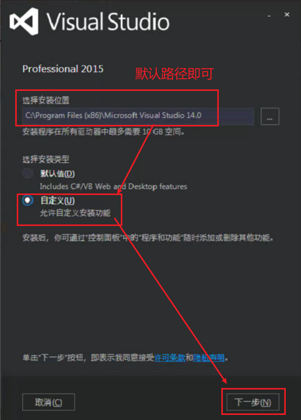
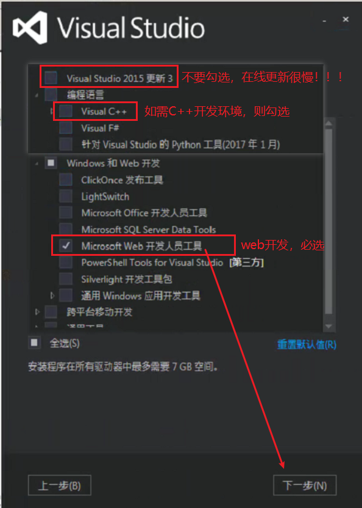
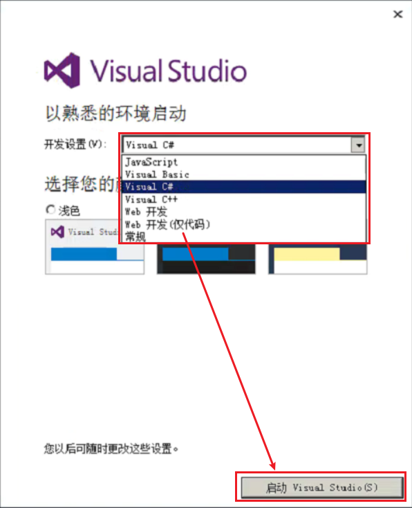
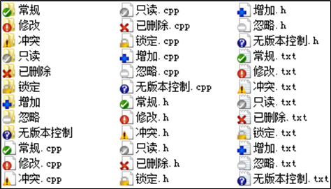
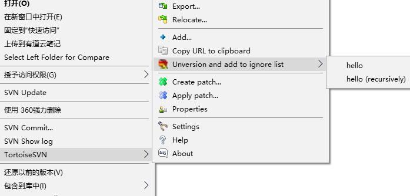
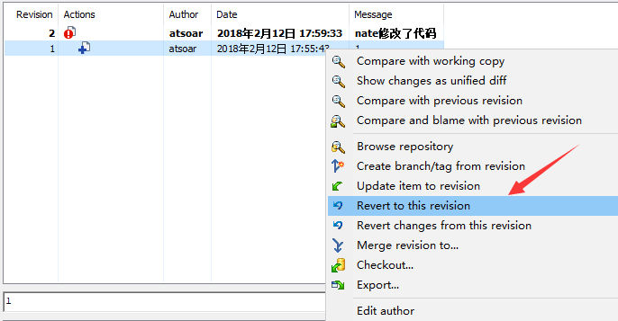

<!-- TOC -->

- [工具篇](#工具篇)
    - [VisualStudio](#visualstudio)
        - [VS2015](#vs2015)
    - [SVN](#svn)
        - [简介](#简介)
        - [概念](#概念)
        - [控制图标](#控制图标)
        - [Checkout同步代码](#checkout同步代码)
        - [Update更新代码](#update更新代码)
        - [Commit提交代码](#commit提交代码)
        - [忽略文件](#忽略文件)
        - [撤销本地修改](#撤销本地修改)
        - [撤销已经提交的代码](#撤销已经提交的代码)
        - [svn pre-commit](#svn-pre-commit)
    - [Visual Studio Code](#visual-studio-code)
        - [列模式](#列模式)

<!-- /TOC -->

<a id="markdown-工具篇" name="工具篇"></a>
# 工具篇
<a id="markdown-visualstudio" name="visualstudio"></a>
## VisualStudio

<a id="markdown-vs2015" name="vs2015"></a>
### VS2015
通常我们进行C#开发时，选择自定义安装，保持默认路径即可。如下图：



指定必要的组件即可，其余的组件再安装完成后还可以继续添加，如下图所示：



静静等待安装完成，启动环境即可。



<a id="markdown-svn" name="svn"></a>
## SVN

<a id="markdown-简介" name="简介"></a>
### 简介
Subversion(SVN) 是一个开源的版本控制系統, 也就是说 Subversion 管理着随时间改变的数据。 这些数据放置在一个中央资料档案库(repository) 中。 这个档案库很像一个普通的文件服务器, 不过它会记住每一次文件的变动。 这样你就可以把档案恢复到旧的版本, 或是浏览文件的变动历史。

其最主要的功能是：目录版本控制和版本历史。

<a id="markdown-概念" name="概念"></a>
### 概念
- repository（源代码库）:源代码仓库
- checkout（签出）:首次从仓库获取代码时，需要从respository checkout
- commit（提交）:本地代码有修改时，需要将本地的变更commit到repository，即将改动上传
- update (更新):在本地仓库进行更新，即从reponsitory进行下载代码

首次从仓库获取代码时进行checkout即可，不用每次使用都进行checkout。

1. 适当频率进行update。通常每天开始第一件事是进行更新(update)
2. 当本地有代码变更时，一定要编译通过再进行提交(commit)，且commit前最好进行update

**update->编译通过->commit**

<a id="markdown-控制图标" name="控制图标"></a>
### 控制图标



<a id="markdown-checkout同步代码" name="checkout同步代码"></a>
### Checkout同步代码
在你需要保存代码的地方右键选择“SVN Chekout...”

填写仓库地址，例如：svn://svnbucket.com/nate/hello/trunk。

点击确定就能同步代码到本地了，适用于首次下载仓库项目。

<a id="markdown-update更新代码" name="update更新代码"></a>
### Update更新代码
右键“SVN Update”就能更新到别人提交的代码了。

<a id="markdown-commit提交代码" name="commit提交代码"></a>
### Commit提交代码
在提交代码前我们应该update下代码，并确保项目可以编译通过，这是个好习惯，可以避免覆盖别人代码和代码冲突。

提交代码也很简单，右键“SVN Commit...”，填入提交描述，就可以把本地提交的代码提交到服务器了。

提交代码的日志应该具有一定的意义，简单描述本次提交修改的主要内容。

同时，一般单次提交不建议包含多个业务的修改。

<a id="markdown-忽略文件" name="忽略文件"></a>
### 忽略文件
有时候某些目录或者文件我们不想提交到SVN服务器，这时我们可以忽略这些文件。

比如我们需要忽略hello这个目录，选中需要忽略的文件夹或者文件，右键，依次选择下面的菜单，就添加一条忽略了，

recursively表示递归忽略，会忽略掉这个目录下的所有东西。



<a id="markdown-撤销本地修改" name="撤销本地修改"></a>
### 撤销本地修改
有时候我们本地修改了一些文件，但是突然又不需要了，想丢弃本地的修改回去SVN上最新的版本怎么操作呢？

右键选中需要撤销的文件，TortoiseSVN->Revert就可以丢弃本地修改了。

<a id="markdown-撤销已经提交的代码" name="撤销已经提交的代码"></a>
### 撤销已经提交的代码
已经提交到SVN仓库的代码发现改错了，还能后悔撤回吗？

1.TortoiseSVN==>show log查看提交记录

2.选择我们需要回去的版本，假设版本号2是我们的错误提交，这里选择提交1，右键选择"Revert to this version"，这样就回去了版本号1的版本，版本号2的提交就被撤销了

3.最后你还需要commit下撤销后的代码到SVN仓库，才是真正的丢弃了版本号2的提交



<a id="markdown-svn-pre-commit" name="svn-pre-commit"></a>
### svn pre-commit
提交前预处理，在服务端进行设置，一般用来限定提交必须要写入提交日志，禁止空提交！

在仓库右键选中Properties->Hooks->pre-commit，设置提交前验证，必须填写提交日志：

```bat

 setlocal 

 set REPOS=%1  
 set TXN=%2          

rem 保证输入8个字符 
 svnlook log %REPOS% -t %TXN% | findstr "........" > nul 
 if %errorlevel% gtr 0 goto :err_action

rem 过滤空格字符 
svnlook log %REPOS% -t %TXN% | findstr /ic:"        " > nul 
 if %errorlevel% gtr 0 goto :success 
  
 :err_action 
 echo 你本次版本提交未填写任何变更的日志说明信息.      >&2 
 echo 请补充日志说明信息后再提交代码,例如:功能说明等.  >&2 
 echo 输入的日志信息不少于8个字符说明(或4个汉字),谢谢! >&2 
 echo *******************禁止空格数据***************** >&2

 goto :err_exit

:err_exit 
 exit 1 

 :success 
 exit 0
```

<a id="markdown-visual-studio-code" name="visual-studio-code"></a>
## Visual Studio Code

<a id="markdown-列模式" name="列模式"></a>
### 列模式
列模式选择

为所有相同的字符串实例添加光标：将光标移动到某一字符串（字符串出现灰色背景），按Ctrl+Shift+L（字符串出现蓝色背景）【批量修改变量名】


